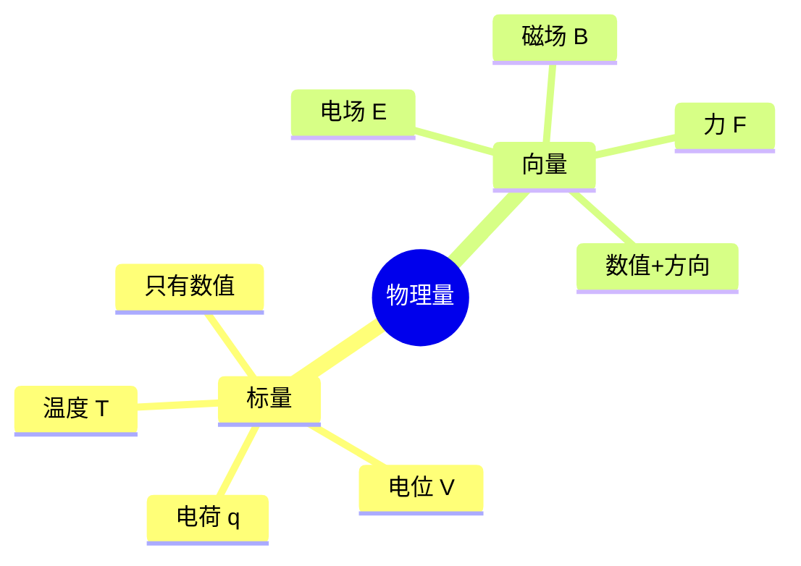

# 向量与标量的本质区别
**关键词**：向量, 标量, 加减法, 数乘, 数学基础

## 概念定义

- **标量**：只有**大小**，没有方向。比如：温度 25°C、质量 5kg、时间 10 秒。
- **向量**：同时有**大小和方向**。比如：向东走 100 米、以 5m/s 的速度向北跑。

> 关键区别：向量问你"往哪边？"，标量不关心方向。

## 类比与直觉

想象你是一个外卖骑手：
- **标量** = "距离 3 公里"（只知道有多远，不知道怎么走）
- **向量** = "向东走 2 公里，再向北走 1 公里"（知道怎么走）

在电磁场中：
- **标量**：电位 V = 5V（只有数值，像地图上的海拔高度）
- **向量**：电场强度 E = 10 V/m 指向东（有力的大小和方向）

## 核心公式

$$\vec{A} = A_x \hat{x} + A_y \hat{y} + A_z \hat{z}$$

| 符号 | 含义 |
|------|------|
| $\vec{A}$ | 向量（有箭头→） |
| $A_x, A_y, A_z$ | 向量在 x, y, z 方向上的分量 |
| $\hat{x}, \hat{y}, \hat{z}$ | 单位方向向量（长度为1，只表示方向） |

向量的大小（模）：$|\vec{A}| = \sqrt{A_x^2 + A_y^2 + A_z^2}$

## 为什么电磁场需要向量

电磁场本质上是**矢量场**——每个空间点上有三个数值 (Ex, Ey, Ez)，不是只有一个。

## 推导脉络

## 常见误区

1. **"大小"和"方向"不是分开的**：不能说"电场强度是5"而不说方向
2. **标量可以为负**：负号不是方向，是数值标记
3. **向量的模是标量**：|E|=5 V/m 是标量，E=(0,0,5) V/m 是向量

## 概念导航
- 前置概念：无
- 后续概念：[[向量的加减法与数乘]]、[[标量与矢量的定义及区别]]
- 关联概念：[[矢量的几何表示与单位矢量]]

---

## 费曼深度讲解

### 从零开始构建直觉

学习电磁场最忌讳的就是"先把公式背下来再说"。费曼的学习方法告诉我们：**先有直觉，后有公式**。公式只是直觉的数学翻译。

以本章内容为例：在翻开教科书之前，先想象你手里有一个可以"看见"电场和磁场的魔法眼镜。戴上这副眼镜后，你会看到空间中到处充满了看不见的"力线"：
- 正电荷周围，力线向外辐射（像刺猬的刺）
- 磁铁周围，力线从N极出发到S极，在内部闭合
- 变化的磁场周围，力线是闭合的漩涡

所有的公式——∇·D=ρ、∇×E=0、∇×H=J——都是这些视觉图像的精确数学描述。

### 三种理解层次

费曼提出，对一个概念的理解有三个层次：

**第一层——符号层**：能写出公式，会套公式计算。例如知道 ∇×E=0 表示"电场旋度为零"。

**第二层——直觉层**：能不用公式解释概念。例如："旋度为零意味着你沿着任何闭合路径走一圈，电场对你做的净功为零——就像在一个没有漩涡的湖里划船，绕岛一圈回到原点，顺流逆流恰好抵消。"

**第三层——创造层**：能根据直觉预测新情况。例如："既然旋度为零，那电场一定可以写成某个标量函数的梯度 E=-∇φ。如果这个标量函数在边界上固定了，内部的场也就唯一确定了——这就是唯一性定理。"

大多数学生停留在第一层，考试能过但遇到新问题就无从下手。**本笔记的目标是帮你达到第二层，向第三层迈进。**

### 如何检验自己的理解

每次学完一个概念后，做下面这个测试：
1. 合上笔记本
2. 找一张白纸
3. 用大白话写出这个概念的核心思想（不许用任何数学符号！）
4. 画一幅图表示这个概念
5. 想一个生活中类似的例子

如果第3步卡住了，说明你还没有真正理解——回去重新看类比和直觉部分。如果第5步做出来了，恭喜你，你已经超越90%的同学。

### 公式记忆的核心技巧

不要死记公式，要记住**推导的故事线**：
- ∇·D=ρ：高斯定律——"流出封闭面的总量=内部源的产量"（散度定理+库仑定律）
- ∇×E=0：静电场保守性——"走一圈不做功"（源自1/r² 力的中心对称性）
- ∇×H=J：安培定律——"电流周围磁场旋转"（比奥-萨伐尔定律的微分形式）
- ∇·B=0：磁通连续性——"磁力线没有起点和终点"（实验事实）

**每个公式背后都有一个物理故事。记住了故事，公式自然就记住了。**

## 费曼深度讲解

向量与标量最根本的区别不在于"有没有方向"，而在于它们在不同坐标系变换下的行为。标量在坐标旋转下保持不变（旋转坐标轴，温度T的数值不变）。向量在坐标旋转下按确定的方式变换分量（V′ = R·V，R为旋转矩阵），但向量的物理本质（长度和方向）保持不变——这与向量符号V相对于坐标系"独立"的深层哲学一致。这是微分几何中"张量"概念的雏形：标量是零阶张量（0个方向指标），向量是一阶张量（1个方向指标）。

为什么电磁场中大多数核心物理量是向量？因为电磁现象是"相互作用"——电荷在什么地方产生电场？答案是所有方向——所以需要用"发散"概念的数学工具。电流产生磁场——在电流的什么方向？答案是垂直于电流方向——所以需要用叉积。波沿着什么方向传播？答案是垂直于E和H的方向——所以波矢量k是用来确定方向的三维向量。电磁学的每个关键方程都依赖于方向性——四个麦克斯韦方程中有三个直接涉及向量运算（散度×2 + 旋度×2）。

伪向量（轴向量）与真向量（极向量）的区别：极向量在坐标反射（镜面反射）下反向（如位置向量r、速度v、电场E），而轴向量在镜面反射下不反向（如角速度ω、磁场B、旋度∇×F——因为叉积中两个极向量同时反向，叉积不变）。这就是为什么你在镜子中看到的左手的磁场方向与真实方向一致，但位置方向相反——B是伪向量（由电荷运动方向和位置的叉积产生）。

## 更多费曼检验

1. "速度是向量，速率是标量"——这个区分在物理上有什么操作意义？一个汽车仪表盘显示的是什么？GPS导航给出的是什么？

2. 磁场B是极向量还是轴向量？实验上如何判断——你在镜子中看到的B方向与真实B方向是相同还是相反？

