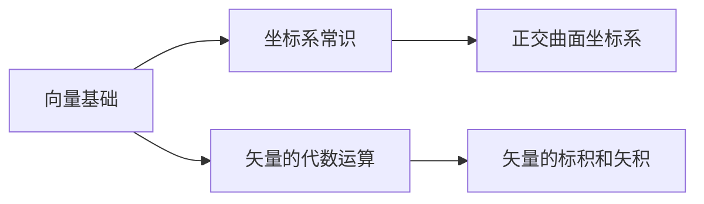

# 向量基础 MOC

## 教科书原文

> 📖 参见：[[§1-1 标量与矢量]], [[§1-2 矢量的代数运算]], [[§1-3 矢量的标积和矢积]]

## 概念综述（费曼第1步）
向量是数学中用来描述"既有方向又有大小"的量的语言——就像告诉你"向北走5公里"而不只是"走5公里"。

## 学习目标
掌握向量的基本概念（大小、方向、分量表示）和基本运算（加法、减法、数乘），为后续矢量分析打下基础。

## 核心概念速览
| 概念 | 定义 | 关键公式 |
|------|------|----------|
| 向量 | 有大小和方向的量 | $\mathbf{A} = A_x\mathbf{e}_x + A_y\mathbf{e}_y + A_z\mathbf{e}_z$ |
| 标量 | 仅有大小的量 | $T, \rho, \Phi$ |
| 向量加法 | 平行四边形法则 | $\mathbf{C} = \mathbf{A} + \mathbf{B}$ |
| 向量数乘 | 改变大小，方向不变/反 | $k\mathbf{A}$ |

## 学习状态
- [ ] [[向量与标量的本质区别]]
- [ ] [[向量的加减法与数乘]]

## 原子笔记索引
- [[向量与标量的本质区别]] -- 理解向量与标量的根本差异
- [[向量的加减法与数乘]] -- 掌握向量基本运算

## 常见误区（费曼第3步）
1. **混淆向量和标量**：很多人以为"速度"和"速率"是一回事。速率是标量（只说快慢），速度是向量（还得说方向）。
2. **向量相等条件不全**：两个向量相等需要大小相同且方向相同——只满足一个不行。
3. **坐标系依赖混淆**：向量本身是独立于坐标系的几何对象——同一个向量在不同坐标系中分量不同，但向量本身不变。

## 费曼检验（费曼第4步）
1. 如果你对一个不会中文的朋友用画图解释"速度"和"速率"的区别，你能做到吗？
2. 一个标量能不能"变成"向量？如果可以，怎么做？（提示：数乘）

## 概念导航
- 前置概念：无（这是数学基础的最起点）
- 后续概念：[[矢量分析与场论基础/矢量的代数运算/矢量的代数运算 MOC|矢量的代数运算]]
- 关联概念：[[坐标系常识/坐标系常识 MOC|坐标系常识]]、[[微积分直觉/微积分直觉 MOC|微积分直觉]]

## 学习路径

## 自己理解（费曼复述）
> 学完本节后，用自己的大白话写一段解释。
> 不要照搬上面的文字——想象你在给一个完全不懂的同学讲。
> （在这里写你的理解）

## 费曼深度讲解

向量这个概念之所以被发明，是因为自然界中许多量不能仅用一个数字描述。风是一个绝佳的例子——"今天的风速是5米每秒"是不完整的，你还需要知道风向。电磁场中的电场强度E和磁场强度H也是如此：它们既有大小（由电荷或电流决定），又有方向（从正电荷指向外，或由右手定则决定）。

为什么向量加法用平行四边形法则而不是简单地"首尾相加"？这源于物理世界的叠加原理。两个力同时作用在一个物体上，效果等同于一个合力——这个合力恰好是两力向量的向量和。电场也遵循同样的叠加原理：多个电荷在某点产生的总电场，等于各电荷单独产生的电场向量之和。这不是数学游戏，而是实验事实——大自然选择了向量加法作为场叠加的规则。

当你看到向量分解为分量（$A_x\mathbf{e}_x + A_y\mathbf{e}_y + A_z\mathbf{e}_z$）时，你实际上在做一件深刻的事情：把空间的三个独立方向分离开来。这意味着在直角坐标系中，x方向的运动不影响y和z方向——这就是"正交"的威力。电磁波能在空间中传播，正是因为它可以分解为互相垂直的电场振动和磁场振动，两者互不干扰但协同推进。

## 跨章关联

向量基础直接通向矢量分析的核心三件套——梯度、散度、旋度。梯度$\nabla\Phi$将标量场（电位）转化为向量场（电场强度$E = -\nabla\Phi$）；散度$\nabla\cdot D$将向量场压缩为一个标量（电荷密度$\rho$）；旋度$\nabla\times E$将向量场的旋转特性提取出来。这三个运算都建立在向量代数的基石之上。

在静电场的计算中（第2章），你每时每刻都在使用向量加法——多个电荷的电场等于各电场向量的矢量和。在电磁感应中（第6章），法拉第定律$\nabla\times E = -\partial B/\partial t$涉及叉积运算，而叉积正是向量代数的延伸。可以说，整个电磁场理论的大厦，第一块砖就是向量的基本概念。

## 更多类比

1. **快递地址**：标量就像只告诉你"距离3公里"——你根本不知道往哪走。向量则是"向东走3公里"——明确的目的地和方向。在电磁场中，电位V是标量（只知道高低），电场E是向量（知道推力的方向和大小），两者配合才能完整描述静电场。

2. **食谱与GPS**：标量像食谱中的食材重量（纯粹的数字），向量像GPS导航（距离+方向）。麦克斯韦方程组之所以是向量方程组，是因为电磁场的相互作用不仅有强度关系，更有方向关系——变化的电场在哪个方向产生磁场？答案是垂直于电场变化的方向，这得用叉积（向量运算）来描述。

## 更多费曼检验

1. 假设你在一个完全均匀的电场中放一个正电荷。你能说出电荷受到的力的方向吗？如果把电场方向反过来呢？这个力是标量还是向量？

2. 两个电场向量E1和E2在某点大小相等但方向相反。该点的总电场是多少？这与两个标量（如温度T1和T2）的叠加有什么本质区别？

