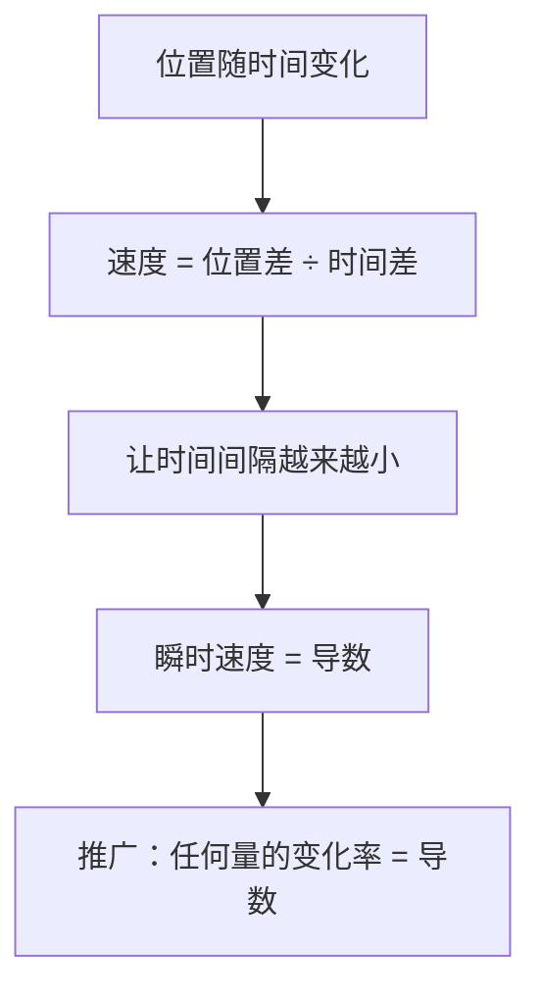

# 导数：从切线斜率到变化率
**关键词**：微积分, 导数, 偏导, 积分, 数学基础

## 概念定义

**导数就是变化率。** 它告诉你：当一个东西改变时，另一个东西跟着变了多少。

比如：你在开车，速度表显示的就是导数——位置随时间变化的速率。

## 类比与直觉

想象你在爬山：
- **导数** = 你脚下的**坡度**
- 坡陡（导数大）→ 每走一步高度变化很多
- 坡缓（导数小）→ 每走一步高度几乎不变
- 平地（导数为零）→ 高度完全不变

## 核心公式

$$f'(x) = \lim_{\Delta x \to 0} \frac{f(x+\Delta x) - f(x)}{\Delta x}$$

| 符号 | 含义 |
|------|------|
| f'(x) | 导数（变化率） |
| Δx | x 的一个微小变化量 |
| f(x+Δx) - f(x) | 函数值的变化量 |
| lim(Δx→0) | 让 Δx 越来越小趋近于零 |

## 为什么电磁场需要导数

电磁场中到处是变化率：
- **梯度** = 电场强度随距离的变化率 → 就是导数在多维空间的推广
- **∂B/∂t** = 磁场随时间的变化率 → 就是导数

## 推导脉络

## MATLAB 可视化提示词

请生成一段完整的、可运行的 MATLAB 代码，实现以下功能：

### 功能描述
绘制 f(x)=x² 的函数图像及其导函数 f'(x)=2x，直观展示导数作为切线斜率的几何含义。在 x=1 处绘制切线，验证斜率 = 2。

### 输入参数
- x_range: x 轴范围 (默认 -3 到 3)
- tangent_point: 切线位置 (默认 x=1)

### 输出要求
- 使用 subplot(1,2,1) 显示原函数 + 切线，subplot(1,2,2) 显示导函数
- 图形窗口尺寸 1200×500
- 标注切线方程 y=2x-1 和切线斜率值
- grid on

### 代码结构要求
1. clear all; close all; clc;
2. 参数定义区
3. 使用 linspace 生成 x 数据
4. 计算导函数
5. 绘制并标注切线

### 注释要求
- 每行核心代码附带中文注释
- 解释切线斜率和导数值的关系

### 错误处理
- 检查 x_range 是否为升序

### 示例预期输出
左侧：抛物线 y=x² 在 x=1 处有切线接触；右侧：直线 y=2x 通过原点。

## 概念导航
- [[偏导数：把其他变量当常数的导数]]
- [[积分：从面积累加到反导数]]
- [[梯度的物理意义]]
- [[微积分直觉 MOC]]

---

## 费曼深度讲解

### 从零开始构建直觉

学习电磁场最忌讳的就是"先把公式背下来再说"。费曼的学习方法告诉我们：**先有直觉，后有公式**。公式只是直觉的数学翻译。

以本章内容为例：在翻开教科书之前，先想象你手里有一个可以"看见"电场和磁场的魔法眼镜。戴上这副眼镜后，你会看到空间中到处充满了看不见的"力线"：
- 正电荷周围，力线向外辐射（像刺猬的刺）
- 磁铁周围，力线从N极出发到S极，在内部闭合
- 变化的磁场周围，力线是闭合的漩涡

所有的公式——∇·D=ρ、∇×E=0、∇×H=J——都是这些视觉图像的精确数学描述。

### 三种理解层次

费曼提出，对一个概念的理解有三个层次：

**第一层——符号层**：能写出公式，会套公式计算。例如知道 ∇×E=0 表示"电场旋度为零"。

**第二层——直觉层**：能不用公式解释概念。例如："旋度为零意味着你沿着任何闭合路径走一圈，电场对你做的净功为零——就像在一个没有漩涡的湖里划船，绕岛一圈回到原点，顺流逆流恰好抵消。"

**第三层——创造层**：能根据直觉预测新情况。例如："既然旋度为零，那电场一定可以写成某个标量函数的梯度 E=-∇φ。如果这个标量函数在边界上固定了，内部的场也就唯一确定了——这就是唯一性定理。"

大多数学生停留在第一层，考试能过但遇到新问题就无从下手。**本笔记的目标是帮你达到第二层，向第三层迈进。**

### 如何检验自己的理解

每次学完一个概念后，做下面这个测试：
1. 合上笔记本
2. 找一张白纸
3. 用大白话写出这个概念的核心思想（不许用任何数学符号！）
4. 画一幅图表示这个概念
5. 想一个生活中类似的例子

如果第3步卡住了，说明你还没有真正理解——回去重新看类比和直觉部分。如果第5步做出来了，恭喜你，你已经超越90%的同学。

### 公式记忆的核心技巧

不要死记公式，要记住**推导的故事线**：
- ∇·D=ρ：高斯定律——"流出封闭面的总量=内部源的产量"（散度定理+库仑定律）
- ∇×E=0：静电场保守性——"走一圈不做功"（源自1/r² 力的中心对称性）
- ∇×H=J：安培定律——"电流周围磁场旋转"（比奥-萨伐尔定律的微分形式）
- ∇·B=0：磁通连续性——"磁力线没有起点和终点"（实验事实）

**每个公式背后都有一个物理故事。记住了故事，公式自然就记住了。**
