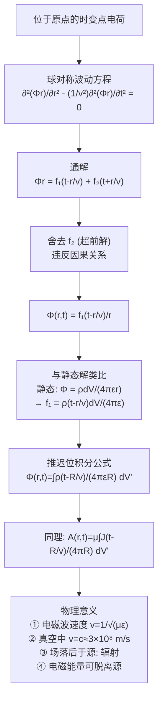

---
tags: [电磁场, 时变电磁场, 推迟位, 滞后位, 电磁辐射, 光速]
chapter: "第7章"
textbook_section: "§7-5"
textbook_page: "182-185"
type: core-concept
importance: 🟡
exam_frequency: ★★
exam_type: 计
difficulty: advanced
created: 2026-04-27
updated: 2026-04-28
---

# 推迟位与延迟时间
**关键词**：位函数, 亥姆霍兹方程, 复矢量位, k²+∇²

📌 **一句话本质**：推迟位说明远处源的电磁影响不是瞬时的——当前位置的场取决于R/c秒前源的状态
🏷️ **重要度**：🟡 | 考试：★★ | 题型：计

## 🔧工程场景

GPS定位——卫星信号到达地面接收机有时延，推迟位公式直接给出电磁波传播时延的精确计算

## 教科书原文

> 📖 参见：[[§7-5 位函数方程求解]]

## 概念定义

推迟位（滞后位）回答了这样一个问题：当你在北京打开一盏灯，上海的人什么时候能"感知"到？答案是——不是瞬间，而是大约 $$1000\text{ km} / 300000\text{ km/s} \approx 3.3\text{ ms}$$ 之后。电磁场的信息传播速度是有限的（光速c），所以场点"现在"感受到的场，其实是源在"过去"某一时刻产生的——那个"过去"的时刻恰好早于"现在"一个等于距离除以光速的时间。这就叫"推迟"——场的变化总是落后于源的变化。位函数$$\Phi$$和$$\mathbf{A}$$中那个 $$t - R/v$$ 的写法，就是把这个"信息传递需要时间"的事实编进了公式。

## 🧠类比与直觉

1. **太阳光与8分钟的延迟**：我们看到的太阳，其实是8分20秒之前的太阳。如果太阳突然熄灭，我们在地球上要等8分20秒后才会发现天变黑了。这不是我们的眼睛有问题，而是光从太阳传到地球需要8分20秒——这就是电磁辐射的"推迟"效应。推迟位公式中 $$(t - r/c)$$ 就是写这个延迟。

2. **雷声与闪电的时间差**：闪电和雷声同时发生，但你总是先看到闪电，几秒后才听到雷声。这是因为光速远大于声速。电磁场也一样——当场源突然改变时，远处的观测者要等 $$R/c$$ 的时间才能"知道"这件事。推迟位公式是把这个物理事实写成数学。

🔖 **口诀**：源在远方有时差，推迟时间R除以c

## 核心公式详释

**标量推迟位（体电荷）**：
$$\Phi(r,t) = \frac{1}{4\pi\varepsilon}\int_{V'} \frac{\rho(r', t - R/v)}{R} dV'$$

**矢量推迟位（体电流）**：
$$\mathbf{A}(r,t) = \frac{\mu}{4\pi}\int_{V'} \frac{\mathbf{J}(r', t - R/v)}{R} dV'$$

其中 $$R = |r - r'|$$，$$v = 1/\sqrt{\mu\varepsilon}$$

**光速**：
$$c = \frac{1}{\sqrt{\mu_0\varepsilon_0}} \approx 3 \times 10^8 \text{ m/s}$$

**延迟时间**：
$$\tau = \frac{R}{v} = \frac{|r - r'|}{v}$$

| 符号 | 含义 | 单位 |
|------|------|------|
| $\Phi$ | 标量电位 | V |
| $\mathbf{A}$ | 矢量磁位 | Wb/m |
| $R = |r-r'|$ | 源点到场点距离 | m |
| $\tau = R/v$ | 延迟时间 | s |
| $v$ | 电磁波传播速度 | m/s |
| $c$ | 真空中光速 | $3\times10^8$$ m/s |

**关键时间因子**：$$(t - R/v)$$ —— 不是此时此刻的源，而是 $$R/v$$ 秒之前的源。

## 📐推导脉络

## ⚠️常见误区

1. **推迟意味着电磁场传播很慢**：虽然光速不是无限大，但 $$3\times10^8$$ m/s 在人类的日常尺度上是极快的。推迟效应在电路板尺寸（几厘米）上只有约0.1纳秒的延迟——大多数低频电路可以忽略。但在长距离（卫星通信、雷达）和高频（GHz以上）中必须考虑。

2. **超前解 $$f_2(t+r/v)$$ 也有物理意义**：在自由空间中确实没有——它违反因果关系（果在因之前）。但在某些数学上下文中，超前解代表从无穷远处汇聚到源的波（时间反演解），在吸收边界条件设计中有应用。

3. **推迟位只对远场成立**：错误。推迟位积分公式对任意距离都成立（只要介质均匀）。在近场（$$R \ll \lambda$$），延迟效应很小，推迟位近似退化为静态场的解。

4. **推迟位公式中的积分是对源分布区域**：正确，但注意被积函数中的 $$(t - R/v)$$ 使积分变得复杂——不同位置（不同R）的源有不同的延迟时间！

## ❓费曼检验

1. 如果太阳突然消失，地球上的阳光会在多长时间后消失？从这个例子解释推迟位的物理意义。
2. 位于原点的一个点电荷 $$q(t) = q_0\cos(\omega t)$$，求距离为r处的标量位。
3. 证明：在静态极限下（$$\partial/\partial t = 0$$），推迟位公式退化为熟知的静电场和恒定磁场公式。
4. 为什么解 $$f_2(t+r/v)$$ 代表"超前"波？从物理因果律的角度解释为什么要舍去它。

## 🔗概念导航

- **前置概念**：[[标量位与矢量位 MOC]]、[[位函数方程求解 MOC]]、[[洛伦兹条件]]
- **后续概念**：[[位函数的复矢量形式 MOC]]、[[亥姆霍兹方程的导出]]、[[电磁辐射]]
- **关联概念**：[[推迟位与延迟时间R_div_v]]、[[似稳场与辐射场]]
- **历史背景**：[[麦克斯韦方程组 MOC]]

## 自己理解

推迟位是电磁学从"超距作用"到"场的传播"转变的核心公式。在牛顿力学的世界观中，引力是瞬时的——太阳对地球的引力不需要时间传递。但在麦克斯韦的电磁学中，电磁相互作用需要时间 $$R/c$$ 来传递——这是一个革命性的观念转变。推迟位公式中的 $$(t - R/v)$$ 看似只是一个时间参数的小调整，却蕴含了电磁场最深刻的本质：信息传播速度有限。这一认识最终导向了狭义相对论——如果电磁相互作用的传播速度是有限的，那么同时性也是相对的。一个简单的括号 $$(t - R/v)$$，改变了对时空的理解。

> 📖 参见：[[§7-5 位函数方程求解]]
