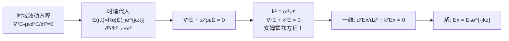

# 亥姆霍兹方程的导出
**关键词**：位函数, 亥姆霍兹方程, 复矢量位, k²+∇²

## 教科书原文

> 📖 参见：[[§7-10 位函数的复矢量形式]]

## 概念定义

亥姆霍兹方程 $$\nabla^2 \mathbf{E} + k^2 \mathbf{E} = 0$$ 是频域版本的波动方程。如果把波动方程（含时间二阶导数）比作一部电影，亥姆霍兹方程就是其中一帧的"静止照片"——它描述的是单个频率的电磁场在空间中的分布。它的推导只需一步：把时谐场的规则 $$\partial/\partial t \to j\omega$$ 代入波动方程。但这一步极其强大：波动方程是关于空间和时间的偏微分方程（难解），而亥姆霍兹方程只是关于空间的偏微分方程（好解得多）。

## 类比与直觉

1. **乐谱中的单个音符**：交响乐乐谱是所有音符的总和（时间域波动方程），而每个小节只有一个频率的音符在响（频域亥姆霍兹方程）。分析单个音符的频率和响度（$$k$$和$$\mathbf{E}_0$$），再把所有音符叠加起来（傅里叶反变换），就还原了整个乐曲。

2. **彩色光的三原色**：白光（任意时变电磁波）可以被棱镜分解为红绿蓝三种单色光（不同频率的亥姆霍兹方程解）。每种单色光在空间中独立传播，互不干扰，各自满足自己的亥姆霍兹方程。

## 核心公式详释

**从波动方程到亥姆霍兹方程**：
$$\nabla^2 \mathbf{E} - \mu\varepsilon\frac{\partial^2 \mathbf{E}}{\partial t^2} = 0$$
代入 $$\mathbf{E}(r,t) = \text{Re}[\dot{\mathbf{E}}(r)e^{j\omega t}]$$，$$\partial^2/\partial t^2 \to (j\omega)^2 = -\omega^2$$
$$\nabla^2 \dot{\mathbf{E}} + \omega^2\mu\varepsilon \dot{\mathbf{E}} = 0$$
令 $$k^2 = \omega^2\mu\varepsilon$$：
$$\boxed{\nabla^2 \dot{\mathbf{E}} + k^2 \dot{\mathbf{E}} = 0}$$

**位函数的亥姆霍兹方程**：
$$\nabla^2 \dot{\mathbf{A}} + k^2 \dot{\mathbf{A}} = -\mu \dot{\mathbf{J}}$$
$$\nabla^2 \dot{\Phi} + k^2 \dot{\Phi} = -\frac{\dot{\rho}}{\varepsilon}$$

**解（推迟位复矢量形式）**：
$$\dot{\mathbf{A}}(r) = \frac{\mu}{4\pi}\int \frac{\dot{\mathbf{J}}(r') e^{-jk|r-r'|}}{|r-r'|} dV'$$

| 符号 | 含义 |
|------|------|
| $k = \omega\sqrt{\mu\varepsilon}$ | 波数 |
| $\nabla^2 + k^2$ | 亥姆霍兹算子 |
| $e^{-jkR}$ | 空间相位滞后因子 |
| $\dot{\mathbf{E}}, \dot{\mathbf{A}}$ | 复矢量（有效值） |

## 推导脉络

## 常见误区

1. **亥姆霍兹方程和波动方程等价**：亥姆霍兹方程是波动方程在单频下的频域形式。波动方程适用于任意时变信号，亥姆霍兹方程只适用于单频时谐信号。但通过傅里叶变换，任意信号可分解为多个亥姆霍兹方程的解。

2. **亥姆霍兹方程中的$$+k^2$$和波动方程中的$$-\mu\varepsilon\partial^2/\partial t^2$$符号矛盾**：不矛盾。$$\partial^2/\partial t^2$$ 作用于 $$e^{j\omega t}$$ 得到 $$-\omega^2$$，所以 $$-\mu\varepsilon(-\omega^2) = +\omega^2\mu\varepsilon = +k^2$$。

3. **亥姆霍兹方程只用于电磁学**：亥姆霍兹方程在声学、弹性力学、量子力学（定态薛定谔方程本质上就是亥姆霍兹方程）中都有广泛应用。

## 费曼检验

1. 从时域波动方程出发，完整推导时谐亥姆霍兹方程。
2. 验证 $$E_x = E_0 e^{-jkz}$$ 是亥姆霍兹方程 $$\frac{d^2 E_x}{dz^2} + k^2 E_x = 0$$ 的解。
3. 非齐次亥姆霍兹方程中的源项代表什么物理含义？

## 概念导航

- **前置**：[[时谐电磁场 MOC]]、[[波动方程与平面波解 MOC]]、[[位函数的复矢量形式 MOC]]
- **后续**：[[理想介质中的平面电磁波 MOC]]、[[平面电磁波的反射与折射]]
- **关联**：[[推迟位与延迟时间]]、[[复坡印亭矢量 MOC]]

## 自己理解

亥姆霍兹方程是连接"麦克斯韦方程"和"一切电磁波应用"的桥梁。没有它，我们几乎无法解析求解任何实际的电磁波问题。它的美在于：将含时间的偏微分方程转化为纯空间的偏微分方程，从而可以使用分离变量法、格林函数法等一系列强大的数学工具。从手机天线到卫星通信，从MRI到射电望远镜——所有这些技术的基础分析都始于亥姆霍兹方程。这个方程的名字来自德国物理学家亥姆霍兹，他在声学和电磁学方面都做出了奠基性贡献。

> 📖 参见：[[§7-10 位函数的复矢量形式]]
