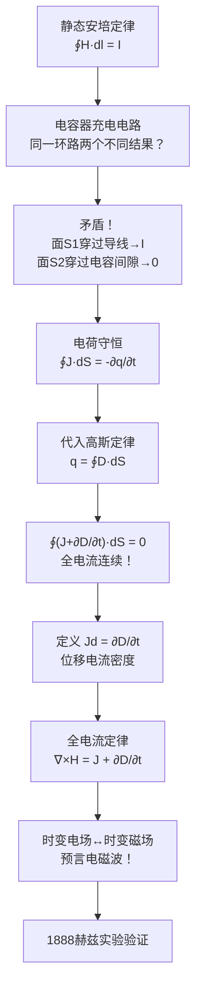

# 位移电流 MOC

## 教科书原文

> 📖 参见：[[§7-1 位移电流]]

## 概念定义

位移电流是麦克斯韦为了解决电容器充电电路中"电流不连续"的矛盾而提出的概念。想象一个水池：水从一根管子流入，从另一根管子流出。如果在管子中间放一个橡皮膜（电容器），虽然水分子不能穿过橡皮膜，但橡皮膜会鼓起和收缩，使得另一侧的水也被推动——仿佛水流从未中断。位移电流就是这个"橡皮膜的鼓起"，它不是真实的电荷流动，而是电场随时间变化产生的等效电流。麦克斯韦的伟大之处在于：他大胆地认为这种"等效电流"也能产生磁场，从而把电场和磁场完美地统一起来，并预言了电磁波的存在。

## 类比与直觉

1. **橡皮膜与水管**：想象一根水管中间夹了一片橡皮膜。当水从左侧涌入，橡皮膜向右鼓起，推动右侧的水流出。虽然水分子没有穿过橡皮膜，但从整体看水流似乎是连续的。橡皮膜的"鼓起速度"对应位移电流——它连接了传导电流的"断点"，使整个回路中的电流处处连续。

2. **旋转木马与磁场的传递**：想象你和朋友面对面站着一个旋转木马的两侧。你不能直接推动对面的朋友，但你可以推动木马（电场变化），木马的旋转（位移电流）又推动了你朋友（产生磁场）。位移电流就是那个传递"推"的中间环节——真正的电荷没有移动，但变化的效果传递过去了。

## 核心公式详释

**位移电流密度**：
$$J_d(r,t) = \frac{\partial D(r,t)}{\partial t} = \varepsilon \frac{\partial E(r,t)}{\partial t}$$

**全电流连续性原理**（积分形式）：
$$\oint_{S} (J + J_d) \cdot dS = 0$$

**全电流连续性原理**（微分形式）：
$$\nabla \cdot (J + J_d) = 0$$

**全电流定律**（修正后的安培环路定律，积分形式）：
$$\oint_{l} H \cdot dl = \int_{S} \left(J + \frac{\partial D}{\partial t}\right) \cdot dS$$

**全电流定律**（微分形式）：
$$\nabla \times H = J + \frac{\partial D}{\partial t}$$

| 符号 | 含义 | 单位 |
|------|------|------|
| $J_d$ | 位移电流密度 | A/m² |
| $D$ | 电通密度（电位移矢量） | C/m² |
| $E$ | 电场强度 | V/m |
| $J$ | 传导电流密度 | A/m² |
| $H$ | 磁场强度 | A/m |
| $\varepsilon$ | 介电常数 | F/m |
| $t$ | 时间 | s |

**关键数值比较**：在100 GHz时，铜中 $$\sigma/(\omega\varepsilon) \approx 10^8$$（传导电流占绝对主导），而海水中 $$\sigma/(\omega\varepsilon) \approx 0.1$$（位移电流与传导电流可比拟）。

## 推导脉络

## 常见误区

1. **位移电流是真实电荷运动**：错误。位移电流不是电荷运动，而是电场随时间变化率。它不产生焦耳热（$$\sigma E^2 = 0$$），但在产生磁场方面与传导电流等效。

2. **位移电流只在电容器中存在**：错误。只要有随时间变化的电场，就存在位移电流。在自由空间中传播的电磁波（没有导体，没有电容器）中，位移电流是维持波传播的关键——时变电场通过位移电流产生时变磁场。

3. **良导体中位移电流总是可以忽略**：不完全正确。这取决于频率和电导率的比值 $$\sigma/(\omega\varepsilon)$$。在极高频（如光频段），即使金属中位移电流也可能与传导电流可比拟。

4. **全电流定律只是安培定律加了个修正项而已**：不仅是修正——位移电流项 $$\partial D/\partial t$$ 使得麦克斯韦方程组在数学上自洽，物理上统一了电与磁，并直接导致电磁波的预言。这是物理学史上最重要的理论突破之一。

## 费曼检验

1. 一个平行板电容器连接在交流电源上，极板间的电介质是真空。极板间的位移电流密度是多少？它是否等于引线中的传导电流密度？请从麦克斯韦方程出发证明。
2. 如果你在太空中挥动一个带电的棒，会产生位移电流吗？这个位移电流会产生磁场吗？为什么？
3. 为什么说"位移电流"这个名字具有误导性？如果要你重新命名它，会叫什么？
4. 在一个$$\sigma = 0$$的理想介质中，位移电流如何维持电磁波传播？请追踪一个完整周期内电场能→磁场能→电场能的转化过程。

## 概念导航

- **前置概念**：[[安培环路定律]]、[[高斯定律]]、[[电荷守恒定律]]、[[电流连续性原理]]
- **后续概念**：[[麦克斯韦方程组 MOC]]、[[时谐电磁场 MOC]]、[[波动方程与平面波解 MOC]]
- **关联概念**：[[全电流定律]]、[[电磁辐射]]、[[平面电磁波]]
- **进阶阅读**：[[位移电流为什么是天才的创造]]、[[电容器充电悖论与位移电流的引入]]

## 自己理解

位移电流这个概念的美妙之处在于：麦克斯韦没有做任何新实验，他只是在数学上发现了一个不自洽（安培定律在时变场中给出的结果取决于积分面的选择），然后他大胆地加了一项 $$\partial D/\partial t$$ 来修复它。这个"数学修补"直接预言了电磁波的存在，并计算出波速恰好等于当时已知的光速。这不是巧合——光就是电磁波。一个纯粹的数学自洽性要求，揭示了一个全新的物理世界。这就是理论物理的威力：方程的对称性和自洽性本身就蕴含着深刻的物理规律。位移电流不是"发现"的，而是麦克斯韦"推导"出来的——但它的物理后果（电磁波、无线电、光）却是千真万确的。

> 📖 参见：[[§7-1 位移电流]]
