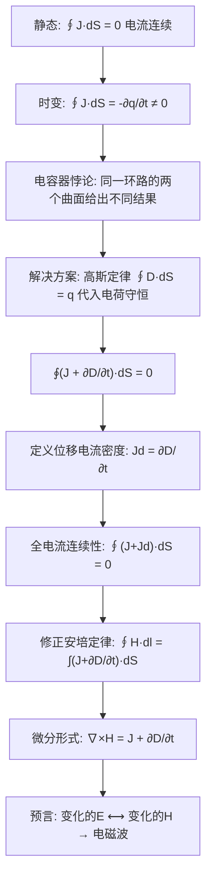

# 电容器充电悖论与位移电流的引入
**关键词**：电流密度, J=σE, 欧姆定律, 恒定电流场

📌 **一句话本质**：变化的电场等效为一种电流——麦克斯韦补上了安培定律缺失的这块拼图
🏷️ **重要度**：🔴 | 考试：★★★ | 题型：计

## 🔧工程场景

电容式触摸屏——手指靠近时改变极板间的位移电流，芯片检测这个变化来定位触摸。如果位移电流项漏算（用旧的安培定律），触摸检测算法完全失效。

## 概念定义

**位移电流**不是电荷运动形成的真实电流，而是麦克斯韦为恢复安培环路定律在时变场中的数学自洽性而**人为定义**的概念。位移电流密度等于电通密度（电位移矢量）的时间变化率：

$$J_d = \frac{\partial D}{\partial t} \quad \text{(7-1-5)}$$

在静电场中 $$\partial D/\partial t = 0$$，位移电流不存在。在时变电场中，电场变化越快，位移电流密度越大。位移电流同样可以产生磁场，这一假设直接预言了电磁波的存在。

## 🧠类比与直觉

**类比一：河流、湖泊与水位变化**

想象一条河流（导线中的传导电流 $$I$$）流入一个湖泊（电容器）。河水进入湖泊后，湖面**逐渐上升**。虽然湖水中没有水平方向的"流动"，但湖面的上升本身就是一种"等效于"水在流出的现象——因为湖的储水量在增加。下游的河流继续流淌，仿佛水"穿过"了湖泊一样。位移电流就是这种"水位上升"的电磁学版本：电容器极板之间的电场 $$E$$ 在增加 → 电位移 $$D = \varepsilon_0 E$$ 在增加 → $$\partial D/\partial t \neq 0$$ → **等效于有电流"穿过"电容器的绝缘间隙**。

**类比二：水箱的水位计**

一个封闭水箱有两个管道：进水口和出水口。进水口有水流入，出水口有水流出。水箱中间的横截面看起来没有水流过（水只是在箱内累积），但如果你只看进水口和出水口的流量，它们是一致的（忽略蒸发）。**从"连续性"的角度看**，中间必定有某种"等效流动"在发生——那就是水位上升导致的"体积增加率"。位移电流就是这种"体积增加率"概念的电磁对应物。

**类比三：旋转门的"空转区"**

商场旋转门有一个扇区，门叶转过去时这个扇区是空的——没有实体门叶穿过。但从连续性的角度看，进入旋转门的人数和走出的人数必须相等，即使中间的某一瞬间某个位置没有人。位移电流就是安培环路定律中"旋转门的空转区"——它填补了传导电流不连续的空隙，使得"电流"的概念在整个回路中保持连续。

🔖 **口诀**：变的电场就是电流，全电流定律才完整

## 📐推导脉络：逐步拆解

### 第1步：静态场中的电流连续性 —— 安培定律的原貌

在静态场中，电荷分布不随时间变化（$$\partial \rho/\partial t = 0$$），电流连续性原理为：

$$\oint_S \mathbf{J} \cdot d\mathbf{S} = 0, \quad \nabla \cdot \mathbf{J} = 0$$

其中 $$\mathbf{J}$$ 是传导电流密度（自由电子在导体中运动形成）与运流电流密度（电荷在气体中运动形成）之和。安培环路定律的原始形式为：

$$\oint_l \mathbf{H} \cdot d\mathbf{l} = I = \int_S \mathbf{J} \cdot d\mathbf{S}$$

这在静态场中是完全自洽的。

### 第2步：时变场中的悖论 —— 电容器充电的矛盾

考虑一个正在充电的平行板电容器。导线中有时变传导电流 $$i(t)$$ 流入电容器上极板。现在，围绕导线作一条安培环路 $$l$$，张在 $$l$$ 上的曲面 $$S$$ 有两种选择：

- **曲面 $$S_1$$**：穿过导线 → 通过 $$S_1$$ 的传导电流 $$I \neq 0$$ → $$\oint_l \mathbf{H} \cdot d\mathbf{l} \neq 0$$
- **曲面 $$S_2$$**：穿过电容器两极板之间的绝缘间隙 → 通过 $$S_2$$ 的传导电流 $$I = 0$$（间隙中是绝缘体/真空！）→ $$\oint_l \mathbf{H} \cdot d\mathbf{l} = 0$$

同一个环路 $$l$$ 却得到两个不同的环量值——这是一个**数学矛盾**，意味着安培环路定律在时变场中不再自洽！

### 第3步：电荷守恒定律与高斯定律的联动

教科书指出：对于时变电磁场，电荷随时间变化，不可能从电荷守恒定律直接推出电流连续性原理（$$\nabla \cdot \mathbf{J} \neq 0$$）。但电荷守恒是客观规律，必须以某种方式得到满足。

电荷守恒定律的积分形式和微分形式：

$$\oint_S \mathbf{J} \cdot d\mathbf{S} = -\frac{\partial q}{\partial t} \quad \text{(7-1-1)}$$

$$\nabla \cdot \mathbf{J} = -\frac{\partial \rho}{\partial t} \quad \text{(7-1-2)}$$

另一方面，静电场的高斯定律 $$\oint_S \mathbf{D} \cdot d\mathbf{S} = q$$ 同样适用于时变电场。将高斯定律代入电荷守恒定律 (7-1-1)：

$$\oint_S \mathbf{J} \cdot d\mathbf{S} = -\frac{\partial}{\partial t} \oint_S \mathbf{D} \cdot d\mathbf{S} = -\oint_S \frac{\partial \mathbf{D}}{\partial t} \cdot d\mathbf{S}$$

移项得：

$$\oint_S \left( \mathbf{J} + \frac{\partial \mathbf{D}}{\partial t} \right) \cdot d\mathbf{S} = 0 \quad \text{(7-1-3)}$$

相应的微分形式为：

$$\nabla \cdot \left( \mathbf{J} + \frac{\partial \mathbf{D}}{\partial t} \right) = 0 \quad \text{(7-1-4)}$$

### 第4步：位移电流密度的定义

式 (7-1-3) 中 $$\partial \mathbf{D}/\partial t$$ 这一项具有**电流密度的量纲**（$$\mathrm{A/m^2}$$）。麦克斯韦称其为**位移电流密度**（displacement current density），记作：

$$J_d = \frac{\partial \mathbf{D}}{\partial t} \quad \text{(7-1-5)}$$

代入后得到**全电流连续性原理**：

$$\oint_S (\mathbf{J} + \mathbf{J}_d) \cdot d\mathbf{S} = 0 \quad \text{(7-1-6a)}$$

$$\nabla \cdot (\mathbf{J} + \mathbf{J}_d) = 0 \quad \text{(7-1-6b)}$$

全电流（传导电流 + 运流电流 + 位移电流）在时变场中保持连续。这一结果完美地解决了电容器悖论：在电容器极板之间的绝缘间隙中，虽然没有传导电流（$$\mathbf{J} = 0$$），但有时变的电场 $$\partial \mathbf{D}/\partial t \neq 0$$，**位移电流接替了传导电流的角色**，使得全电流在整个回路中处处连续。

### 第5步：安培环路定律的修正 —— 全电流定律

有了位移电流的概念后，麦克斯韦大胆假设：**位移电流同样可以产生磁场**。因此，在安培环路定律中必须增加位移电流项：

$$\oint_l \mathbf{H} \cdot d\mathbf{l} = \int_S (\mathbf{J} + \mathbf{J}_d) \cdot d\mathbf{S} = \int_S \left( \mathbf{J} + \frac{\partial \mathbf{D}}{\partial t} \right) \cdot d\mathbf{S} \quad \text{(7-1-7)}$$

相应的微分形式为：

$$\nabla \times \mathbf{H} = \mathbf{J} + \frac{\partial \mathbf{D}}{\partial t} \quad \text{(7-1-8)}$$

这就是**全电流定律**（安培-麦克斯韦定律）——麦克斯韦方程组的第四方程。它表明：**时变磁场由传导电流、运流电流和位移电流共同产生**。

### 第6步：位移电流的物理性质总结

教科书总结了位移电流的几个关键性质：

1. **位移电流密度是电通密度的时间变化率**：$$\mathbf{J}_d = \partial \mathbf{D}/\partial t$$，与电场的时间变化率直接相关。
2. **在静电场中位移电流为零**：$$\partial \mathbf{D}/\partial t = 0$$，位移电流自然不存在。
3. **电场变化越快，位移电流密度越大**：若某时刻电场时间变化率为零（如峰值时刻），即使电场再强，位移电流也为零。
4. **在低电导率介质中，位移电流可能大于传导电流**；在良导体中，传导电流占主导地位，位移电流可以忽略。
5. **位移电流的命名是历史遗留**：麦克斯韦当时基于"以太位移"的机械模型创造了这一术语，但现代理解已与"位移"无关——它只是"变化的电场"的等效电流。

### 第7步：从位移电流到电磁波 —— 麦克斯韦的英明预见

教科书引用了麦克斯韦由此得出的重大预见：既然变化的电场可以产生磁场（$$\partial \mathbf{D}/\partial t \to \mathbf{H}$$），而变化磁场又可以产生电场（法拉第定律：$$\partial \mathbf{B}/\partial t \to \mathbf{E}$$），那么**时变电场和时变磁场可以相互转化，在空间中形成电磁波**。这一预见在 1888 年被德国物理学家赫兹（Hertz）的实验所证实，标志着经典电磁理论的完成。

## Mermaid推导流程图



## 💻MATLAB可视化提示词

- **功能描述**：动态模拟平行板电容器充电过程中位移电流的物理机制——展示导线中的传导电流 $$I_c(t)$$、极板间电场 $$E(t)$$ 的变化、位移电流密度 $$J_d = \varepsilon_0 \partial E/\partial t$$ 的分布，以及它们共同产生的磁场 $$\mathbf{H}$$（通过安培环路的环量验证全电流定律）。
- **输入参数**：电容 $$C$$，电阻 $$R$$（RC 充电回路），电源电压 $$V_0$$，时间范围 0 至 $$5\tau$$（$$\tau = RC$$），时间步长。
- **输出要求**：上下两个子图——(a) 上子图为电容器截面图，极板上标注累积电荷量，极板间用彩色箭头表示电场强度（箭头长度与 $$E$$ 成正比），用颜色填充标注位移电流密度的大小和方向，(b) 下子图为传导电流 $$i_c(t)$$ 和位移电流 $$i_d(t)$$ 随时间变化的双曲线图（验证它们始终相等）。
- **代码结构**：设置 RC 参数 → 计算时间序列 → 求解 $$V_c(t) = V_0(1-e^{-t/\tau})$$ → 计算 $$i_c(t)$$、$$E(t)$$、$$i_d(t)$$ → 上子图动画展示某一时刻的电场和位移电流 → 下子图绘制双曲线验证全电流连续性。
- **注释要求**：中文注释每一步的物理含义，标注位移电流公式，标注 $$i_c = i_d$$ 的验证结论。
- **错误处理**：检查时间步长合理性，若收敛电流和位移电流数值误差超过 1% 则发出警告。

## ⚠️常见误区

1. **位移电流不是真实电流**：没有电荷在运动——"位移电流"产生磁场的机制与传导电流完全不同（它不是运动的电荷，而是变化的电场）。教科书明确说这是"人为定义的概念"。

2. **真空中也有位移电流**：$$\mathbf{J}_d = \partial \mathbf{D}/\partial t = \varepsilon_0 \partial \mathbf{E}/\partial t$$。即使在真空中（没有任何物质），变化的电场也能产生磁场——这正是电磁波能在真空中传播的原因。

3. **"位移"的命名与物理实质无关**：麦克斯韦当时基于"以太弹性位移"的机械模型创造了这个术语。现代物理学早已抛弃以太概念，但"位移电流"的名字保留了下来。它实质上就是"电场的时间变化率"。

4. **传导电流和位移电流不能简单相加来求"总电流的热效应"**：位移电流不产生焦耳热（$$\mathbf{J}_d \cdot \mathbf{E}$$ 不代表欧姆损耗），它与传导电流在产生磁场方面等效，但在产生热效应方面完全不同。

5. **在时谐场中，位移电流和传导电流的相位差 90 度**：若 $$\mathbf{E} = E_0 \cos(\omega t)$$，则 $$\mathbf{J} = \sigma E_0 \cos(\omega t)$$（同相），而 $$\mathbf{J}_d = -\omega \varepsilon E_0 \sin(\omega t)$$（相位差 90°）。因此两者的相对重要性取决于频率 $$\omega$$ 和电导率 $$\sigma$$ 的比值。

## ❓费曼检验

1. 在一个 RC 充电回路中，导线中的传导电流 $$i(t) = (V_0/R)e^{-t/RC}$$。流过电容器"间隙"的位移电流是多少？为什么它们相等？（提示：因为 $$i(t) = dq/dt$$，而 $$q = CV_c$$，$$E = V_c/d$$，$$D = \varepsilon_0 E$$，所以 $$\partial D/\partial t \times$$ 面积 = $$dq/dt = i(t)$$。）

2. 如果电容器极板间填充了介电常数为 $$\varepsilon_r = 4$$ 的介质，传导电流不变，位移电流密度变为原来的多少倍？此时极板间电场是变强了还是变弱了？（提示：$$D = \varepsilon_0\varepsilon_r E$$ 不变（由极板上的自由电荷决定），$$E$$ 变为原来的 $$1/4$$，但 $$J_d = \partial D/\partial t$$ 不变——位移电流密度取决于 $$D$$ 的变化率，而非 $$E$$ 的大小。）

3. 一个平行板电容器在真空中，极板面积 $$A = 0.01\,\mathrm{m^2}$$，间距 $$d = 1\,\mathrm{mm}$$。极板间施加 $$v(t) = 100\sin(2\pi \times 10^6 t)\,\mathrm{V}$$ 的电压。位移电流密度和总位移电流各为多少？（提示：$$E = v/d$$，$$D = \varepsilon_0 E$$，$$J_d = \partial D/\partial t = \varepsilon_0(1/d)\cdot dv/dt$$，$$i_d = J_d \cdot A$$。）

## 🔗概念导航

- 前置概念：[[电位移矢量D的引入]]、[[安培环路定律]]、[[法拉第电磁感应定律的旋度形式]]
- 后续概念：[[麦克斯韦方程组/四大方程的积分形式与微分形式]]、[[从麦克斯韦到波动方程的推导]]
- 关联概念：[[全电流连续性原理]]、[[时谐电磁场/复数表示法的引入]]

✂️

> 📖 **教科书参考**：§7-1, p.172-174

## 可视化图表

```vega-lite
{
  "$schema": "https://vega.github.io/schema/vega-lite/v5.json",
  "description": "位移电流修正: ∇×H=J+∂D/∂t 电容器充放电场景",
  "width": 450,
  "height": 300,
  "layer": [
    {
      "mark": "line",
      "encoding": {
        "x": {"field": "time", "type": "quantitative", "title": "时间 [半周期]"},
        "y": {"field": "value", "type": "quantitative", "title": "电流密度 [A/m²]"},
        "color": {"field": "current_type", "type": "nominal", "scale": {
          "domain": ["传导电流 Jc", "位移电流 Jd=∂D/∂t", "全电流 Jc+Jd"],
          "range": ["#e74c3c", "#3498db", "#2ecc71"]
        }, "title": "电流类型"}
      }
    },
    {
      "mark": "rule",
      "encoding": {
        "y": {"field": "total_const", "type": "quantitative"},
        "color": {"value": "#2ecc71"}
      }
    }
  ],
  "data": {
    "values": [
      {"time": 0.0, "value": 0.0, "current_type": "传导电流 Jc", "total_const": 1.0},
      {"time": 0.125, "value": 0.38, "current_type": "传导电流 Jc", "total_const": 1.0},
      {"time": 0.25, "value": 0.71, "current_type": "传导电流 Jc", "total_const": 1.0},
      {"time": 0.5, "value": 1.0, "current_type": "传导电流 Jc", "total_const": 1.0},
      {"time": 0.75, "value": 0.71, "current_type": "传导电流 Jc", "total_const": 1.0},
      {"time": 1.0, "value": 0.0, "current_type": "传导电流 Jc", "total_const": 1.0},
      {"time": 0.0, "value": 1.0, "current_type": "位移电流 Jd=∂D/∂t", "total_const": 1.0},
      {"time": 0.125, "value": 0.92, "current_type": "位移电流 Jd=∂D/∂t", "total_const": 1.0},
      {"time": 0.25, "value": 0.71, "current_type": "位移电流 Jd=∂D/∂t", "total_const": 1.0},
      {"time": 0.5, "value": 0.0, "current_type": "位移电流 Jd=∂D/∂t", "total_const": 1.0},
      {"time": 0.75, "value": -0.71, "current_type": "位移电流 Jd=∂D/∂t", "total_const": 1.0},
      {"time": 1.0, "value": -1.0, "current_type": "位移电流 Jd=∂D/∂t", "total_const": 1.0},
      {"time": 0.0, "value": 1.0, "current_type": "全电流 Jc+Jd", "total_const": 1.0},
      {"time": 0.125, "value": 1.3, "current_type": "全电流 Jc+Jd", "total_const": 1.0},
      {"time": 0.25, "value": 1.42, "current_type": "全电流 Jc+Jd", "total_const": 1.0},
      {"time": 0.5, "value": 1.0, "current_type": "全电流 Jc+Jd", "total_const": 1.0},
      {"time": 0.75, "value": 0.0, "current_type": "全电流 Jc+Jd", "total_const": 1.0},
      {"time": 1.0, "value": -1.0, "current_type": "全电流 Jc+Jd", "total_const": 1.0}
    ]
  },
  "title": "位移电流修正: ∇×H=Jc+∂D/∂t  电容器回路电流连续 §7-1"
}

```


```wavedrom
{
  "signal": [
    {"name": "电压 u(t)", "wave": "sin", "period": 2},
    {"name": "传导电流 ic(t)", "wave": "cos", "period": 2},
    {"name": "位移电流 id(t)", "wave": "cos", "period": 2},
    {"name": "D(t)电通密度", "wave": "sin", "period": 2},
    {"name": "全电流 i_total", "wave": "2", "period": 2, "data": ["0", "0", "0", "0", "0"]}
  ],
  "head": {
    "text": "电容器充放电: 位移电流与传导电流 §7-1",
    "tick": 0
  },
  "foot": {
    "text": "全电流 = 传导电流 + 位移电流 = 恒定值(连续)"
  }
}

```
