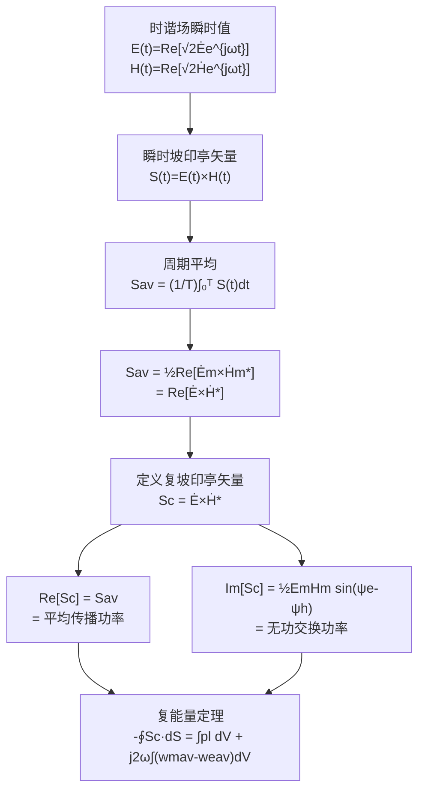

# 复坡印亭矢量 MOC

## 教科书原文

> 📖 参见：[[§7-11 复能流密度矢量]]

## 概念定义

复坡印亭矢量是一个双面间谍——它用一个复数同时报告两个信息：实部告诉你电磁能量在往哪个方向跑（平均传播功率），虚部告诉你电场和磁场之间有多少能量在来回交换而不真正传播（无功功率）。这就像你在商场里看到的人流——实部是真正从门口走到店铺的人数（净流量），虚部是在两个店铺之间来回逛、犹豫不决的人数（来回振荡）。在理想介质中，平面波的E和H同相，虚部为零——所有能量都坚定地向前传播。在导电介质中或驻波场中，E和H有相位差，虚部不为零——有一部分能量在"原地踏步"。

## 类比与直觉

1. **交流电路中的有功和无功功率**：在RLC交流电路中，复功率 $$P_c = UI^*$$ 的实部是电阻消耗的有功功率，虚部是电感电容储存的无功功率。复坡印亭矢量是电磁场版本的复功率——$$\mathbf{S}_c = \mathbf{E} \times \mathbf{H}^*$$，实部是传播的功率（像电阻消耗），虚部是在电场和磁场之间振荡的功率（像电感电容交换）。

2. **潮汐中的水流和波浪**：观察涨潮时的海水：有些水真正从外海流进了港湾（实部——净输运），有些水只是在原地随着波浪上下起伏（虚部——原地振荡）。复坡印亭矢量把这两部分清楚地分开：实部告诉你能量真正传播了多少，虚部告诉你还有多少能量在原地"做无用功"。

## 核心公式详释

**复坡印亭矢量定义（有效值）**：
$$\mathbf{S}_c = \dot{\mathbf{E}} \times \dot{\mathbf{H}}^*$$

**复坡印亭矢量定义（振幅值）**：
$$\mathbf{S}_c = \frac{1}{2}\dot{\mathbf{E}}_m \times \dot{\mathbf{H}}_m^*$$

**实部 = 平均能流密度**：
$$\mathbf{S}_{av} = \text{Re}[\mathbf{S}_c] = \text{Re}[\dot{\mathbf{E}} \times \dot{\mathbf{H}}^*]$$

**虚部 = 无功能流密度**：
$$\text{Im}[\mathbf{S}_c]$$ 代表电场与磁场之间来回交换的能量

**复能量定理**：
$$-\oint_S \mathbf{S}_c \cdot d\mathbf{S} = \int_V p_l dV + j2\omega\int_V (w_{mav} - w_{eav})dV$$

| 符号 | 含义 | 说明 |
|------|------|------|
| $\mathbf{S}_c$ | 复坡印亭矢量 | 复数，单位 W/m² |
| $\text{Re}[\mathbf{S}_c]$ | 平均能流密度 | 单向传播的功率 |
| $\text{Im}[\mathbf{S}_c]$ | 无功能流密度 | 来回交换的功率 |
| $\psi_e - \psi_h$ | E与H的相位差 | 决定实部虚部比例 |
| $\dot{\mathbf{H}}^*$ | H的共轭复矢量 | 关键：用共轭！ |

**四种典型相位关系**：
| 相位差 | Re | Im | 物理含义 |
|--------|-----|-----|----------|
| $\psi_e = \psi_h$$ (同相) | 最大正 | 0 | 纯传播（正向） |
| $\psi_e = \psi_h + \pi$$ (反相) | 最大负 | 0 | 纯传播（反向） |
| $\psi_e = \psi_h \pm \pi/2$ | 0 | 最大 | 纯交换（驻波） |
| 其他 | ≠0 | ≠0 | 传播+交换 |

## 推导脉络

## 常见误区

1. **$$\text{Re}[\mathbf{E} \times \mathbf{H}^*]$$ 等于 $$\text{Re}[\mathbf{E}] \times \text{Re}[\mathbf{H}]$$**：错误。正确的平均坡印亭矢量是 $$\frac{1}{2}\text{Re}[\dot{\mathbf{E}}_m \times \dot{\mathbf{H}}_m^*]$$，而不是 $$\text{Re}[\dot{\mathbf{E}}] \times \text{Re}[\dot{\mathbf{H}}]$$。后者的周期平均为零（对于时谐场）。

2. **虚部没有物理意义**：错误。虚部代表电场能量和磁场能量之间的来回交换，对应无功功率。在驻波场和谐振腔中，虚部占据主导，实部可能为零。

3. **$$\mathbf{S}_c = \mathbf{E} \times \mathbf{H}$$（忘了共轭）**：这是常见错误。复坡印亭矢量必须用 $$\mathbf{H}$$ 的共轭 $$\mathbf{H}^*$$，否则结果中会包含二次谐波项 $$e^{j2\omega t}$$，其时间平均为零，无法正确反映平均功率。

4. **复坡印亭矢量只适用于时谐场**：正确。但对于任意时变场，可以通过傅里叶变换将每个频率分量分别处理，再叠加结果。

## 费曼检验

1. 证明：$$\text{Re}[\dot{\mathbf{E}} \times \dot{\mathbf{H}}^*]$$ 等于坡印亭矢量的时间平均值。
2. 对于均匀平面波，$$\mathbf{E}$$ 和 $$\mathbf{H}$$ 同相，求复坡印亭矢量的实部和虚部。
3. 在什么情况下 $$\text{Re}[\mathbf{S}_c] = 0$$ 但 $$\text{Im}[\mathbf{S}_c] \neq 0$$？这对应什么物理场景？
4. 写出复能量定理，并解释每一项的物理含义。

## 概念导航

- **前置概念**：[[时谐电磁场 MOC]]、[[能量密度与坡印亭矢量 MOC]]、[[平均功率密度]]
- **后续概念**：[[有功功率与无功功率]]、[[复能流密度矢量 MOC]]、[[平面波能流]]
- **关联概念**：[[复功率]]（电路理论）、[[驻波]]、[[品质因数Q]]

## 自己理解

复坡印亭矢量是连接电磁场理论和电路理论的一座桥梁。在电路中，我们用复功率 $$UI^*$$ 描述有功和无功；在电磁场中，$$\mathbf{E} \times \mathbf{H}^*$$ 扮演完全相同的角色。这个类比不是巧合——电路理论本质上就是麦克斯韦方程在低频、集总参数条件下的近似。理解复坡印亭矢量后，你会发现天线辐射（实部）和近场储能（虚部）不过是同一枚硬币的两面。设计一个好的天线，本质上就是在特定的频率下最大化复坡印亭矢量的实部（辐射功率），同时最小化虚部（储能振荡）。

> 📖 参见：[[§7-11 复能流密度矢量]]
