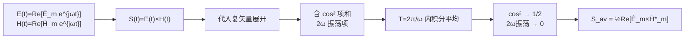

# 平均功率密度：1/2 Re[E×H*]
**关键词**：坡印亭矢量, S=E×H, 能流密度, 能量守恒

## 教科书原文

> 📖 参见：[[§7-11 复能流密度矢量]]

## 概念定义

平均功率密度是时谐电磁场中坡印亭矢量在一个完整周期内的时间平均值。它告诉我们电磁波携带的能量在空间中"净"向哪个方向流动，并滤除了以两倍频率振荡的瞬时波动分量。用一句话概括：**平均功率密度 = 电场复振幅叉乘磁场复振幅共轭后取实部的一半**。

## 类比与直觉

**类比1：交流电路中的平均功率**。在交流电路中，$$P_{av} = \frac{1}{2}\text{Re}[VI^*]$$（振幅表示）或 $$P_{av} = \text{Re}[VI^*]$$（有效值表示）。平均功率密度的公式 $$\mathbf{S}_{av} = \frac{1}{2}\text{Re}[\dot{\mathbf{E}}_m \times \dot{\mathbf{H}}_m^*]$$ 正是这一电路公式在三维空间中的推广——将标量的 V 和 I 替换为矢量 E 和 H，将乘法替换为叉乘。

**类比2：水流的净输送量**。想象一根水管中水来回振荡流动——水分子一直在前后运动，但如果你在水管中放一个桨轮，它在一个方向上的净转动次数就是"平均流动"。同理，瞬时坡印亭矢量 $$\mathbf{S}(t)$$ 包含一个以 $$2\omega$$ 频率振荡的分量，取时间平均后滤除了这一振荡，留下的是能量的"净输送"方向。

## 核心公式详释

**平均功率密度（最常用形式）**：
$$\boxed{\mathbf{S}_{av} = \frac{1}{2}\text{Re}[\dot{\mathbf{E}}_m \times \dot{\mathbf{H}}_m^*]}$$

**用有效值表示（无1/2因子）**：
$$\mathbf{S}_{av} = \text{Re}[\dot{\mathbf{E}} \times \dot{\mathbf{H}}^*]$$

**瞬时坡印亭矢量（含2倍频项）**：
$$\mathbf{S}(t) = \mathbf{S}_{av} + \frac{1}{2}\text{Re}[\dot{\mathbf{E}}_m \times \dot{\mathbf{H}}_m e^{j2\omega t}]$$

**1/2因子的来源**：
$$\frac{1}{T}\int_0^T \cos^2(\omega t)dt = \frac{1}{2}$$

| 符号 | 含义 | 单位 |
|------|------|------|
| $\mathbf{S}_{av}$ | 平均能流密度矢量（时间平均坡印亭矢量） | W/m² |
| $\dot{\mathbf{E}}_m$ | 电场强度的振幅复矢量 | V/m |
| $\dot{\mathbf{H}}_m^*$ | 磁场强度振幅复矢量的共轭 | A/m |
| $\text{Re}[\cdot]$ | 取实部运算 | - |
| $\frac{1}{2}$ | 来自 $$\cos^2(\omega t)$$ 平均值 | - |
| $\psi_e, \psi_h$ | E和H的初相角 | rad |

| 符号体系 | 公式 | 1/2因子 |
|---------|------|:---:|
| 振幅复矢量 $$\dot{\mathbf{E}}_m$ | $\frac{1}{2}\text{Re}[\dot{\mathbf{E}}_m \times \dot{\mathbf{H}}_m^*]$ | 需要 |
| 有效值复矢量 $$\dot{\mathbf{E}}$ | $\text{Re}[\dot{\mathbf{E}} \times \dot{\mathbf{H}}^*]$ | 不需要 |
| 瞬时值求平均 | $\frac{1}{T}\int_0^T \mathbf{E}(t)\times\mathbf{H}(t)dt$ | 隐含 |

**记忆口令**："振幅1/2，有效无1/2；共轭要取，实部要取"

## 推导脉络



## TEM波平均能流

理想介质平面波：$$\mathbf{S}_{av} = \mathbf{e}_z \frac{E_{x0}^2}{2Z} = \mathbf{e}_z \frac{Z H_{y0}^2}{2}$$

真空中：$$\mathbf{S}_{av} = \mathbf{e}_z \frac{E_{x0}^2}{240\pi}$$

## 常见误区

1. **忘记取共轭**：写成 $$\dot{\mathbf{E}}_m \times \dot{\mathbf{H}}_m$$ 而不是 $$\dot{\mathbf{E}}_m \times \dot{\mathbf{H}}_m^*$$。忘记共轭意味着没有消去时间因子 $$e^{j2\omega t}$$，得到的不是平均值而是含有振荡的复量。

2. **忘记取实部**：复坡印亭矢量 $$\mathbf{S}_c$$ 的虚部代表无功功率密度（来回振荡的能量），只有实部才是真正传输的有功功率密度。取实部是物理本质。

3. **1/2因子的混乱**：最容易出错的地方。记住判断规则：如果用的是振幅值（$$E_m$$），需要乘1/2；如果用的是有效值（$$E_{rms} = E_m/\sqrt{2}$$），则不需要。因为 $$(1/\sqrt{2})^2 = 1/2$$ 已经内含其中。

4. **混淆平均功率与瞬时功率**：$$\mathbf{S}(t)$$ 是时间的函数，以2倍频率振荡；$$\mathbf{S}_{av}$$ 是常数矢量（对时谐场而言）。

## 费曼检验

1. 如果你用有效值复矢量 $$\dot{\mathbf{E}}$$ 计算平均功率密度，公式中还需要1/2吗？为什么？
2. 两个时谐场 $$\mathbf{E}$$ 和 $$\mathbf{H}$$ 如果恰好有90°相位差（$$\psi_e - \psi_h = \pm \pi/2$$），平均功率密度是多少？这对应什么物理情况？
3. 为什么说 $$\text{Im}[\mathbf{S}_c]$$ 代表"无功功率密度"？它对应什么物理过程？

## 概念导航

- **关联**：[[平均功率密度]]、[[复坡印亭矢量与平均能流]]、[[复坡印亭矢量 MOC]]、[[坡印亭定理]]
- **延伸**：[[有功功率与无功功率]]、[[复能流密度矢量 MOC]]

## 自己理解

1/2因子是最容易出错的地方。记住：$$\cos^2$$ 的平均值是1/2，所以振幅乘积需要乘1/2。如果用的是有效值（$$E_{rms} = E_m/\sqrt{2}$$），那 $$E_{rms} \times H_{rms}$$ 已经内含了1/2因子（因为 $$(1/\sqrt{2})^2 = 1/2$$），所以不需要额外乘1/2。这是一个"便利规则"——用有效值就不用担心1/2因子，用振幅就要加1/2。

```signal
{signal: [
  {name: 'E(t)', wave: 'sin(2*pi*t)', data: ['E_m cos(ωt)']},
  {name: 'H(t)', wave: 'sin(2*pi*t)', data: ['H_m cos(ωt)']},
  {name: 'S(t)', wave: '2*sin(2*pi*t)^2', data: ['S_av(1+cos(2ωt))']},
  {name: 'S_av', wave: '1', data: ['直流分量 = 平均功率']}
],
head: {text: '瞬时功率S(t)与平均功率S_av的关系'},
foot: {text: 'S(t)以2ω振荡，S_av为直流分量。cos²平均=1/2是关键。'}}
```

> 📖 参见：[[§7-11 复能流密度矢量]]
