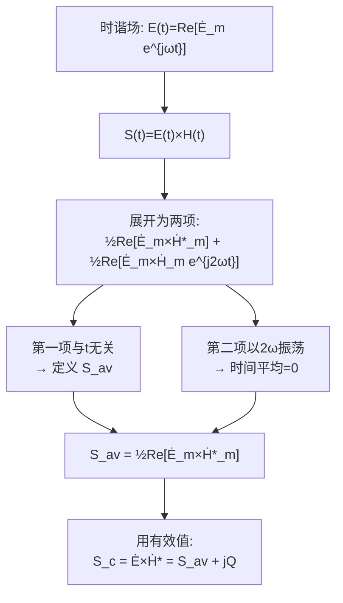

# 复坡印亭矢量与平均能流
**关键词**：复能流密度矢量

## 教科书原文

> 📖 参见：[[§7-11 复能流密度矢量]]

## 概念定义

复坡印亭矢量是时谐电磁场中为了便捷计算平均功率而引入的复数矢量工具。它把需要做时间积分才能得到的平均能流，转化为一个简单的代数运算：**电场复矢量叉乘磁场复矢量的共轭**。其实部给出有功功率密度（真正传输的能量），虚部给出无功功率密度（原地振荡不传输的能量）。

## 类比与直觉

**类比1：交流电路的复功率**。在电路理论中，复功率 $$\bar{S} = \dot{V}\dot{I}^* = P + jQ$$，实部是平均有功功率，虚部是无功功率。复坡印亭矢量 $$\mathbf{S}_c = \dot{\mathbf{E}} \times \dot{\mathbf{H}}^*$$ 是这一概念从一维电路向三维场论的推广——把电压-电流的标量乘积升级为电场-磁场的矢量叉乘。

**类比2：工资条上的"实发"和"扣款"**。$$\text{Re}[\mathbf{S}_c]$$ 是"实发工资"——真正到手的能量流；$$\text{Im}[\mathbf{S}_c]$$ 是"社保扣款"——来回倒腾但不真正离开的储能振荡。两者对应电路理论中的有功功率和无功功率。

## 核心公式详释

**复坡印亭矢量（有效值）**：
$$\mathbf{S}_c = \dot{\mathbf{E}} \times \dot{\mathbf{H}}^*$$

**复坡印亭矢量（振幅值）**：
$$\mathbf{S}_c = \frac{1}{2}\dot{\mathbf{E}}_m \times \dot{\mathbf{H}}_m^*$$

**平均能流密度（即实部）**：
$$\mathbf{S}_{av} = \text{Re}[\mathbf{S}_c] = \text{Re}[\dot{\mathbf{E}} \times \dot{\mathbf{H}}^*] = \frac{1}{2}\text{Re}[\dot{\mathbf{E}}_m \times \dot{\mathbf{H}}_m^*]$$

**瞬时能流（时谐场，含2倍频振荡）**：
$$\mathbf{S}(t) = \mathbf{S}_{av} + \frac{1}{2}\text{Re}[\dot{\mathbf{E}}_m \times \dot{\mathbf{H}}_m e^{j2\omega t}]$$

**能量定理的复矢量形式**：
$$-\oint_S \mathbf{S}_c \cdot d\mathbf{S} = \int_V \sigma|\dot{E}|^2 dV + j2\omega\int_V (\frac{\mu}{2}|\dot{H}|^2 - \frac{\varepsilon}{2}|\dot{E}|^2)dV$$

| 符号 | 含义 | 单位 |
|------|------|------|
| $\mathbf{S}_c$ | 复坡印亭矢量（复能流密度矢量） | W/m² |
| $\dot{\mathbf{E}}$ | 电场有效值复矢量 | V/m |
| $\dot{\mathbf{H}}^*$ | 磁场有效值复矢量的共轭 | A/m |
| $\text{Re}[\mathbf{S}_c]$ | 平均有功功率密度 | W/m² |
| $\text{Im}[\mathbf{S}_c]$ | 无功功率密度 | var/m² |

| 公式 | 使用场景 |
|------|----------|
| $\mathbf{S}_{av} = \text{Re}[\dot{\mathbf{E}} \times \dot{\mathbf{H}}^*]$ | 有效值计算平均功率（常用） |
| $\mathbf{S}_{av} = \frac{1}{2}\text{Re}[\dot{\mathbf{E}}_m \times \dot{\mathbf{H}}_m^*]$ | 振幅值计算平均功率 |
| $\mathbf{S}(t) = \mathbf{E}(t) \times \mathbf{H}(t)$ | 瞬时功率（含2倍频振荡） |

## 推导脉络



**关键记忆点**：共轭！$$\dot{\mathbf{H}}^*$$ 不是 $$\dot{\mathbf{H}}$$！如果不取共轭，$$e^{j\omega t}$$ 的因子就无法消去，得到的表达式仍然依赖时间。

## 常见误区

1. **忘记取共轭**：写成 $$\dot{\mathbf{E}} \times \dot{\mathbf{H}}$$ 而非 $$\dot{\mathbf{E}} \times \dot{\mathbf{H}}^*$$。没有共轭意味着没有消去时间震荡，不是平均值。

2. **混淆实部和虚部的物理意义**：实部 = 有功（真正传输的能量），虚部 = 无功（储存的电磁能在电场和磁场间来回转换）。良导体中 $$\psi_e - \psi_h \neq 0$$，$$\cos\Delta\psi < 1$$，部分能量变成焦耳热。

3. **将复坡印亭矢量直接解释为物理量**：$$\mathbf{S}_c$$ 本身是数学工具，只有它的实部 $$\text{Re}[\mathbf{S}_c]$$ 才是物理上可测量的平均能流密度。虚部对应无功功率。

4. **叉乘顺序错误**：$$\dot{\mathbf{E}} \times \dot{\mathbf{H}}^*$$ 不是 $$\dot{\mathbf{H}}^* \times \dot{\mathbf{E}}$$。叉乘反序会改变方向！

## 费曼检验

1. 如果电场和磁场完全同相（$$\psi_e = \psi_h$$），复坡印亭矢量的虚部等于多少？这对应什么物理情况？
2. 在理想导体表面上，电磁波完全反射，切向电场为零。此时流过表面法向的平均功率密度是多少？
3. 复坡印亭矢量的散度积分 $$\oint_S \mathbf{S}_c \cdot d\mathbf{S}$$ 的实部和虚部分别对应什么物理量？

## 概念导航

- **前置**：[[复坡印亭矢量 MOC]]、[[平均功率密度]]、[[平均功率密度：1div2_Re_E×H_star]]
- **关联**：[[有功功率与无功功率]]、[[复能流密度矢量 MOC]]、[[坡印亭定理]]
- **延伸**：[[复坡印亭矢量在平面波中的应用]]

## 自己理解

复坡印亭矢量 $$\mathbf{S}_c = \dot{\mathbf{E}} \times \dot{\mathbf{H}}^*$$ 中，共轭符号 `*` 是关键——它消去了时间振荡因子 $$e^{j2\omega t}$$，提取出真正有意义的平均值。类似在交流电路中 $$P = \frac{1}{2}\text{Re}[VI^*]$$，场论的复坡印亭矢量是电路复功率的推广。记住这一点：场论和电路理论在"功率"的概念上是完全统一的——只是场论在三维空间中，电路简化为一维。

```signal
{signal: [
  {name: 'E(t)', wave: 'sin(2*pi*t)', data: ['E_m cos(ωt+ψ_e)']},
  {name: 'H(t)', wave: 'sin(2*pi*t)', data: ['H_m cos(ωt+ψ_h)']},
  {name: 'S(t)', wave: '2*sin(2*pi*t)*cos(4*pi*t)', data: ['瞬时功率,2倍频振荡']},
  {name: 'S_av', wave: '1', data: ['½E_m H_m cos(ψ_e-ψ_h)=直流']},
  {name: 'Re[S_c]', wave: '1', data: ['=S_av,有功功率密度']},
  {name: 'Im[S_c]', wave: '1', data: ['=½E_m H_m sin(Δψ),无功']}
],
head: {text: '复坡印亭矢量：实部=有功,虚部=无功'},
foot: {text: '共轭消去2ω振荡,实部是净传输。Δψ=ψ_e-ψ_h控制能量分布。'}}
```

> 📖 参见：[[§7-11 复能流密度矢量]]
