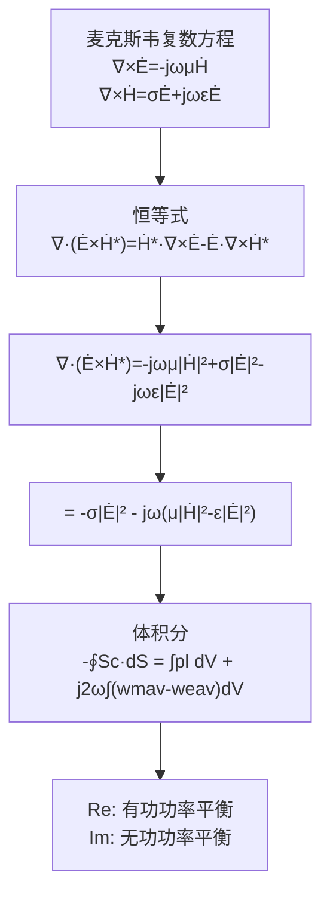

# 复能流密度矢量 MOC

## 教科书原文

> 📖 参见：[[§7-11 复能流密度矢量]]

## 概念定义

复能流密度矢量 $$\mathbf{S}_c = \dot{\mathbf{E}} \times \dot{\mathbf{H}}^*$$ 是电磁场中的"复功率"。在交流电路里，复功率 $$P_c = UI^*$$ 的实部是电阻消耗的有功功率，虚部是电感电容交换的无功功率。在电磁场里，$$\mathbf{S}_c$$ 也做同样的事：实部告诉你电磁能量真正往哪里流动（净传输），虚部告诉你电场和磁场之间有多少能量在来回交换而没有真正传播。复能量定理则把这一局部描述推广到整个体积——流入一个闭合面的复功率，实部用于内部损耗，虚部反映磁场储能和电场储能的不平衡。

## 类比与直觉

1. **公司的现金流**：实部就像公司的净利润——钱真正进来（或出去）了。虚部就像公司内部的转账——钱在部门之间周转，但总资产没变。如果一个公司每天都在部门间大量转账（大虚部）但没有实际收入（小实部），那它在"空转"——就像纯驻波场，能量来回振荡但不传播。

2. **潮汐发电站**：涨潮时水流入水库（实部，能量储存），退潮时水流出（实部，能量释放）。但水面上还有波浪在不断上下起伏（虚部，来回交换）。复能流密度同时描述这两种运动：水坝处的净水流（实部）和水面的波浪能量（虚部）。

## 核心公式详释

**复能流密度矢量定义**：
$$\mathbf{S}_c = \dot{\mathbf{E}} \times \dot{\mathbf{H}}^*$$

**实部（平均能流）**：
$$\text{Re}[\mathbf{S}_c] = \mathbf{S}_{av} = \text{平均传播功率密度}$$

**虚部（无功交换）**：
$$\text{Im}[\mathbf{S}_c] \propto \sin(\psi_e - \psi_h)$$ — 电场和磁场之间的能量交换

**复能量定理**：
$$-\oint_S \mathbf{S}_c \cdot d\mathbf{S} = \int_V p_l dV + j2\omega\int_V (w_{mav} - w_{eav}) dV$$

| 项 | 含义 |
|-----|------|
| $\text{Re}[-\oint \mathbf{S}_c \cdot d\mathbf{S}]$ | 流入闭合面的有功功率 |
| $\int_V p_l dV$ | 体积内的损耗功率（实部平衡） |
| $j2\omega\int_V (w_{mav}-w_{eav}) dV$ | 磁场与电场储能之差的2$$\omega$$倍（虚部） |

## 推导脉络

## 常见误区

1. **复能流密度只是数学技巧**：它的实部直接等于可测量的平均功率，虚部反映储能不平衡——两者都有明确的物理含义。

2. **虚部代表损耗**：错误。虚部代表电储能和磁储能的不平衡（对应无功功率），损耗由实部反映（对应焦耳热 $$\sigma E^2$$）。

3. **复能流密度和复坡印亭矢量是不同的概念**：在中国教材中，这两个术语通常互换使用，都指 $$\mathbf{S}_c = \dot{\mathbf{E}} \times \dot{\mathbf{H}}^*$$。

## 概念导航

- **前置**：[[复坡印亭矢量 MOC]]、[[能量密度与坡印亭矢量 MOC]]、[[时谐电磁场 MOC]]
- **关联**：[[复坡印亭矢量与平均能流]]、[[有功功率与无功功率]]、[[平均功率密度]]
- **进阶**：[[复能量定理]]

## 自己理解

复能流密度矢量是连接"场"和"路"两个世界的桥梁。在低频电路中，我们用电压V和电流I描述功率传输——$$P = VI$$。在高频和微波频段，"电压"和"电流"变得难以定义（它们在空间中有分布），但电场$$\mathbf{E}$$和磁场$$\mathbf{H}$$始终有明确的意义。$$\mathbf{S}_c = \dot{\mathbf{E}} \times \dot{\mathbf{H}}^*$$ 就是高频世界的$$VI^*$$——它用场的语言讲述了同样的功率守恒故事。理解了这一点，麦克斯韦方程就不再是抽象的偏微分方程，而是描述能量如何产生、传播和消耗的"会计系统"。

> 📖 参见：[[§7-11 复能流密度矢量]]
