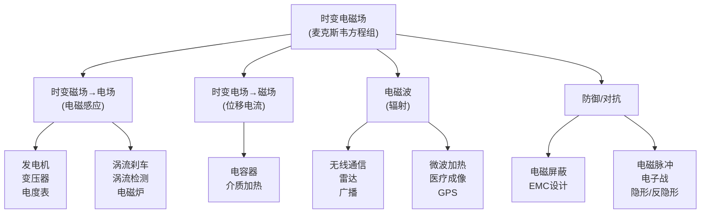

# 时变电磁场的应用 MOC

## 教科书原文

> 📖 参见：[[§7-12 时变电磁场的应用]]

## 概念定义

时变电磁场的应用可以分为两大阵营："有序利用"和"防御性应对"。有序利用包括：电磁感应（发电机、变压器、电度表），涡流效应（电磁炉、刹车、无损检测），电磁辐射（通信、雷达、微波加热）。防御性应对包括：电磁屏蔽（法拉第笼、金属外壳），电磁兼容设计（PCB布局、滤波），以及军事上的电子对抗（电磁脉冲武器与防护）。所有这些应用的理论基础都是同一个东西——麦克斯韦方程组在不同边界条件下的解。

## 应用全景图

## 核心应用详解

**1. 电磁炉**：高频电流（~25 kHz）通过线圈产生交变磁场→锅底感应涡流→涡流$$I^2R$$产生热量。铁锅好（高$$\mu$$增加磁通，高$$\sigma$$允许大涡流），铝锅不行（$$\mu_r\approx1$$感应太弱）。

**2. 涡流刹车**：运动的金属盘切割永磁体的磁场→盘中感应涡流→涡流在磁场中受洛伦兹力→力的方向反抗运动→刹车。优点是无线、无接触、无磨损（商用车辆、过山车）。

**3. 电度表**：电压线圈+电流线圈共同产生磁场→导电铝盘感应涡流→涡流受力使铝盘旋转→转速$$\propto VI\cos\phi$$（有功功率）→齿轮计数=用电量。

**4. 探地雷达**：发射电磁脉冲→地下不同介质界面反射→接收反射信号→根据来回时间定位地下物体。

**5. 电磁脉冲武器**：瞬间释放极强电磁场→耦合到电子设备→击穿半导体结或干扰电路→使敌方电子设备失效。

## 概念导航

- **核心概念**：[[涡流效应与变压器]]、[[电磁屏蔽原理]]、[[电磁感应]]
- **关联**：[[感应加热原理]]、[[电磁铁与磁悬浮]]
- **进阶**：[电磁兼容(EMC)]、[天线理论]

## 自己理解

时变电磁场的应用清单读起来就像现代技术的目录——从厨房里的电磁炉到战场上的电磁脉冲武器，麦克斯韦的四个方程支配着这一切。最让我印象深刻的是：所有这些看起来截然不同的技术，归根结底都是同样的方程在不同频率、不同边界条件下的解。低频（50 Hz）是发电机和变压器，中频（kHz-MHz）是感应加热和无线电，高频（GHz）是微波炉和雷达——频率这个参数就像一个"频谱开关"，决定了电磁场以什么方式与应用场景互动。

> 📖 参见：[[§7-12 时变电磁场的应用]]

## 费曼深度讲解

时变电磁场的应用涵盖无线通信、雷达、医学成像、微波加热等众多领域，它们的理论基础都源于麦克斯韦方程组的时变形式。天线辐射（§7-10至§7-12）利用时变电流产生辐射电磁波——电流元（赫兹偶极子）的辐射场包含近场（感应场，储能为主）和远场（辐射场，能流为主）。远场的E和H相互垂直且都垂直于传播方向，能流密度（坡印亭矢量）按$1/r^2$衰减——能量守恒要求（球面面积$4\pi r^2$增长恰好匹配$1/r^2$衰减，总能流通过任意球面恒定）。

电磁屏蔽利用导体中时变电磁场的趋肤效应（§8-3）：电磁波在导体表面极薄层内快速衰减（衰减常数$\delta=1/\sqrt{\pi f\mu\sigma}$），金属壳体内部场趋近于零。屏蔽层的厚度需要数倍δ才能有效衰减（厚度>3δ时场衰减到约5%）。不同频率需要不同材料和厚度：50Hz工频→δ约9mm（铜），需相当厚的屏蔽；10GHz微波→δ约0.7μm，薄金属箔足以屏蔽——这就是为什么高频设备的屏蔽罩可以很薄。

电磁兼容（EMC）利用时变电磁场的边界条件和传输线理论来防止电磁干扰——PCB走线考虑其特征阻抗和交叉耦合，差分信号减小辐射，接地平面提供低阻抗回路。时变场的"准静态近似"（电路尺寸远小于波长时，电感电容导致的变化比传播延迟慢得多）是集总参数电路理论有效的前提——这就是为什么电路理论到微波频率（波长∼电路尺寸）时必须被传输线理论和全波麦克斯韦方程取代。

## 更多费曼检验

1. 为什么手机（~1GHz）可以用薄金属壳屏蔽，而50Hz工频变压器屏蔽罩需要厚铁壳？频率对趋肤深度的影响如何？

2. "电路理论"vs"电磁场理论"——什么条件下KVL和KCL成立？什么条件下必须用完整的麦克斯韦方程组？

