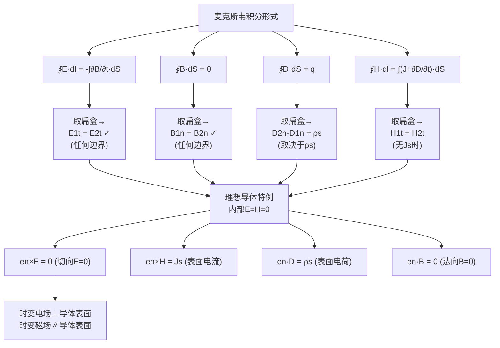

# 时变电磁场的边界条件 MOC

## 教科书原文

> 📖 参见：[[§7-3 时变电磁场边界条件]]

## 概念定义

边界条件就像是电磁场在不同介质交界面上必须遵守的"规则手册"。当电磁波从空气射入水中，或从介质射向金属表面时，电场和磁场不能随意变化——它们在界面两侧必须满足特定的关系。这些关系可以分为两类：第一类是在任何边界上都绝对成立的（切向E连续、法向B连续），就像交通规则中的"红灯必须停"；第二类是取决于边界是否有电荷和电流的（法向D和切向H的条件），就像"有交警时按交警指挥走，没交警时按信号灯走"。最特殊的是理想导体表面——电磁波打到上面就像网球打到墙上，电场被完全弹回（切向分量为零），磁场反而加倍。

## 类比与直觉

1. **绳子上的波遇到不同粗细的绳结**：当你在一根绳子上抖出一个波，波传播到绳子变粗（或变细）的接头处时，一部分波会反射，一部分会透射。在接头处，绳子的位移（类比E切向）必须连续——你不能把绳子扯断。张力（类比H切向）在无外加力时也连续。但如果接头处系了一个重物（类比表面电流），张力就会发生跳变。电磁波在介质界面上的行为与此完全类似。

2. **海关出入境检查**：不同介质之间的边界面就像一个海关。有些东西是必须守恒的（E的切向分量——像护照信息，必须连续），有些东西则取决于你携带的物品（D的法向分量——如果你带了应税品（表面电荷），就会有差额）。理想导体则是"铜墙铁壁"——什么都进不去（内部E=0, H=0），所有东西都被挡在表面以外。

## 核心公式详释

**普遍边界条件（任何边界都成立）**：
$$e_n \times (E_2 - E_1) = 0 \quad \text{→ 切向E连续}$$
$$e_n \cdot (B_2 - B_1) = 0 \quad \text{→ 法向B连续}$$

**一般介质边界（无表面电荷和电流）**：
$$e_n \cdot (D_2 - D_1) = 0 \quad \text{→ 法向D连续}$$
$$e_n \times (H_2 - H_1) = 0 \quad \text{→ 切向H连续}$$

**理想导体表面（$$\sigma \to \infty$$，内部场为零）**：
$$e_n \times E = 0 \quad \text{→ E垂直表面}$$
$$e_n \times H = J_s \quad \text{→ 表面电流=切向H}$$
$$e_n \cdot D = \rho_s \quad \text{→ 表面电荷=法向D}$$
$$e_n \cdot B = 0 \quad \text{→ 法向B=0}$$

| 符号 | 含义 |
|------|------|
| $e_n$ | 边界法向单位矢量（介质1→介质2） |
| $E_{1t}, E_{2t}$ | 两侧电场切向分量 |
| $B_{1n}, B_{2n}$ | 两侧磁通法向分量 |
| $\rho_s$ | 表面自由电荷面密度 |
| $J_s$ | 表面电流密度 |

**理想导体表面场的方向特性**：电场垂直于表面，磁场平行于表面。

## 推导脉络

## 常见误区

1. **所有边界条件都是从静态场直接搬过来的**：不完全正确。虽然形式上相同，但推导时变场边界条件时需要假定 $$\partial B/\partial t$$ 和 $$\partial D/\partial t$$ 在边界上有限（不能无穷大），这样才能让扁盒积分中时间导数项的面积分为零。

2. **理想导体中也有电磁场，只是很弱**：错误。理想导体（$$\sigma = \infty$$）内部电磁场严格为零。如果存在任何电场，根据 $$J = \sigma E$$ 将产生无穷大的电流，这是不可能的。实际的良导体在高频时由于集肤效应，场集中在极薄的表层（集肤深度），可以近似为理想导体。

3. **电场切向分量在两种介质边界上总是连续的**：对于一般介质边界确实如此。但在理想导体表面，由于导体内部 $$E=0$$，而 $$E_{1t}=E_{2t}$$，所以导体外侧的 $$E_t$$ 也必须为零。结果就是电场线必须垂直入射理想导体表面。

4. **边界条件的方向很容易搞混**：$$e_n$$ 的方向定义（从介质1指向介质2）非常重要。$$e_n \times (E_2 - E_1) = 0$$ 中的叉积顺序不能随意交换。

## 费曼检验

1. 一均匀平面波从空气垂直入射到理想导体表面。利用边界条件求反射波，证明导体表面的磁场切向分量是入射波的两倍。
2. 两种理想介质的边界上（$$\sigma_1 = \sigma_2 = 0$$），电场和磁场的法向分量各自满足什么条件？
3. 为什么在时变场中推导边界条件时，需要假设 $$\partial B/\partial t$$ 有限？
4. 理想导体表面的表面电流密度是如何产生的？它的大小与什么有关？

## 概念导航

- **前置概念**：[[麦克斯韦方程组 MOC]]、[[静电场的边界条件 MOC]]、[[恒定磁场的边界条件 MOC]]
- **后续概念**：[[平面电磁波的反射与折射]]、[[电磁屏蔽原理]]
- **关联概念**：[[理想导体表面]]、[[集肤效应]]、[[波导]]
- **常见错误**：[[边界条件方向搞反]]

## 自己理解

边界条件是电磁学中"局部约束决定全局行为"的绝佳例子。麦克斯韦方程是微分方程，有无穷多解——边界条件就是从中挑选出物理上正确的那一个。特别是在涉及理想导体时，边界条件直接告诉我们：电场线必须垂直入射、磁场线必须平行于表面。这些看似简单的几何约束，正是天线辐射、波导传输、电磁屏蔽等一切实际应用的基础。当你在手机信号不好的地方打电话时，你遇到的正是电磁波在不同介质边界上的反射、透射和绕射——这些都是边界条件在起作用。

> 📖 参见：[[§7-3 时变电磁场边界条件]]
