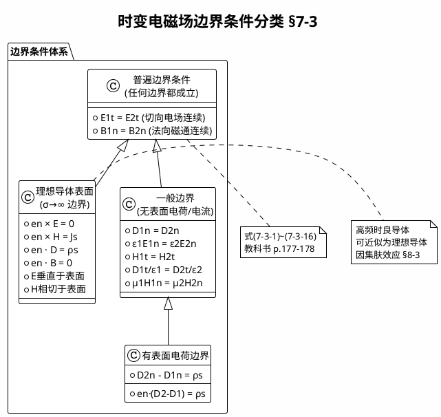

# 理想导体表面的边界条件
**关键词**：边界条件, D法向, E切向, ρₛ, 介质分界面

## 教科书原文

> 📖 参见：[[§7-3 时变电磁场边界条件]]

## 概念定义（费曼第1步）
理想导体（PEC）表面是电磁场的"完美镜子"——电场线必须垂直扎入表面（不能贴着表面滑行），磁场线必须平行贴着表面流动（不能钻入表面）。表面会"感应"出面电荷和面电流来屏蔽内部。

## 类比与直觉（费曼第2步）

**类比1：蹦床上的弹球**
- 理想导体表面 = 一面完全刚性的墙
- 电场 E = 球的速度——碰到墙必须完全垂直反弹（切向分量为零）
- 磁场 H = 球的旋转——只能在墙面上"滚"，不能穿透墙面
- 面电荷/面电流 = 墙对球的"反作用力"

**类比2：海浪拍打防波堤**
- 防波堤（理想导体）= 完全刚性，水不能穿透
- 海浪垂直拍打堤岸 = E 必须垂直于表面（$$e_n \times E = 0$$）
- 沿着堤岸流动的海水 = H 只能切向（$$e_n \cdot B = 0$$）——水（磁通）不能穿过堤岸

## 核心公式详释

### 理想导体表面四条边界条件

| # | 条件 | 物理含义 |
|---|------|----------|
| 1 | $e_n \times E = 0$ | 电场切向分量为零：E 垂直于表面 |
| 2 | $e_n \times H = J_S$ | 表面电流密度 = 磁场切向分量 |
| 3 | $e_n \cdot D = \rho_S$ | 表面电荷密度 = 电位移法向分量 |
| 4 | $e_n \cdot B = 0$ | 磁通法向分量为零：B 平行于表面 |

| 符号 | 含义 | 单位 |
|------|------|------|
| $e_n$ | 导体表面的外法向单位矢量 | — |
| $J_S$ | 表面电流密度 | A/m |
| $\rho_S$ | 表面电荷密度 | C/m² |
| $E$ | 导体外部（介质侧）的电场 | V/m |
| $H$ | 导体外部（介质侧）的磁场 | A/m |

### 理想导体内部
$$E = 0, \quad D = 0, \quad H = 0, \quad B = 0$$

（全部场量在理想导体内部为零）

## 电场和磁场在导体表面的行为

```
       介质侧                      导体侧
   E ────→ │                   │
   (垂直)  │   理想导体表面      │  E=0
           │                   │
   H ────→ │                   │  H=0
   (平行)  │   • • • • • • •   │
           │   J_S (面电流)     │
           │   + + + + + + +   │
           │   ρ_S (面电荷)     │
```

## 推导脉络

```mermaid
flowchart TD
    A[理想导体内部<br>σ→∞, E=0, H=0] --> B[利用普遍边界条件]
    B --> C[E_{1t}=E_{2t}<br>导体侧E_{2t}=0]
    C --> D[e_n×E=0<br>E垂直于表面]
    B --> E[B_{1n}=B_{2n}<br>导体侧B_{2n}=0]
    E --> F[e_n·B=0<br>B平行于表面]
    B --> G[D_{2n}-D_{1n}=ρ_S<br>导体侧D_{2n}=0]
    G --> H[e_n·D=ρ_S<br>D_n等于面电荷密度]
    B --> I[H_{2t}-H_{1t}=J_S<br>导体侧H_{2t}=0]
    I --> J[e_n×H=J_S<br>H_t等于面电流密度]
```

## 理想导体 vs 良导体

| 特性 | 理想导体(PEC) | 良导体(如铜) |
|------|:---:|------|
| $\sigma$ | $\infty$ | 很大但有限 |
| 内部 E | 严格为 0 | 有衰减的微弱场 |
| 内部 H | 严格为 0 | 有衰减的微弱场 |
| 趋肤深度 $$\delta$ | 0 | $\delta = 1/\sqrt{\pi f\mu\sigma}$ |
| 边界条件 | 精确满足4条 | 近似满足（高频时） |
| 实际存在? | 不 | 是 |

在高频时，铜、铝等良导体的趋肤深度极浅（微波频段 $$\delta \sim \mu$$m），因此可以很好地近似为理想导体。

## 常见误区

1. **误区**：理想导体内部可以有静电场。
   **修正**：即使对于静电场，理想导体内部电场也为零（否则会产生无限大电流直到电荷重新分布使内部电场为零）。静电屏蔽就是这个原理。

2. **误区**：$$e_n \times E = 0$$ 意味着导体表面的电场为零。
   **修正**：它只意味着电场的切向分量为零。法向分量 $$E_n$$ 可以不为零（$$e_n \cdot D = \rho_S$$），电场线垂直终止于导体表面。

3. **误区**：理想导体表面不存在能量损耗。
   **修正**：PEC定义就是无损耗。但如果有表面电流 $$J_S$$ 在实际良导体中流动，会产生焦耳热（趋肤深度内的损耗）。PEC是数学理想化。

4. **误区**：理想导体边界条件中的 $$J_S$$ 和 $$\rho_S$$ 是预先已知的。
   **修正**：$$J_S$$ 和 $$\rho_S$$ 通常是未知的，它们是由外部场在导体表面感应产生的——需要在求解电磁场后才能确定。

## 费曼检验

**问题1**：一均匀平面波垂直入射到理想导体表面。导体表面（z=0）的边界条件要求 $$E_x(z=0) = 0$$。求反射波的表达式，并证明导体表面形成驻波。
> 提示：入射波 $$E_i = e_x E_0 e^{-jkz}$$，反射波 $$E_r = e_x E_r e^{+jkz}$$

**问题2**：理想导体表面附近，已知 $$H = e_y 2 \cos(\omega t)$$ A/m（导体外紧贴表面处）。求表面电流密度 $$J_S$$ 的大小和方向。
> 提示：$$e_n \times H = J_S$$，设 $$e_n = e_z$$（从导体指向外部）

**问题3**：为什么在实际工程中，微波器件（如波导、腔体）可以用良导体近似为理想导体来分析？
> 提示：考虑趋肤深度 $$\delta$$ 与工作波长的比值

## 概念导航
- 前置：[[普遍边界条件推导]]、[[时变电磁场的边界条件 MOC]]
- 关联：[[电磁屏蔽原理]]、[[趋肤深度的物理意义]]
- 后续：[[矩形波导中的边界条件应用]]、[[导电介质中的平面电磁波]]

## 自己理解（费曼复述）
> 学完本节后，用自己的大白话写一段解释。
> （在这里写你的理解）
> 📖 参见：[[§7-3 时变电磁场边界条件]]

## 可视化图表


