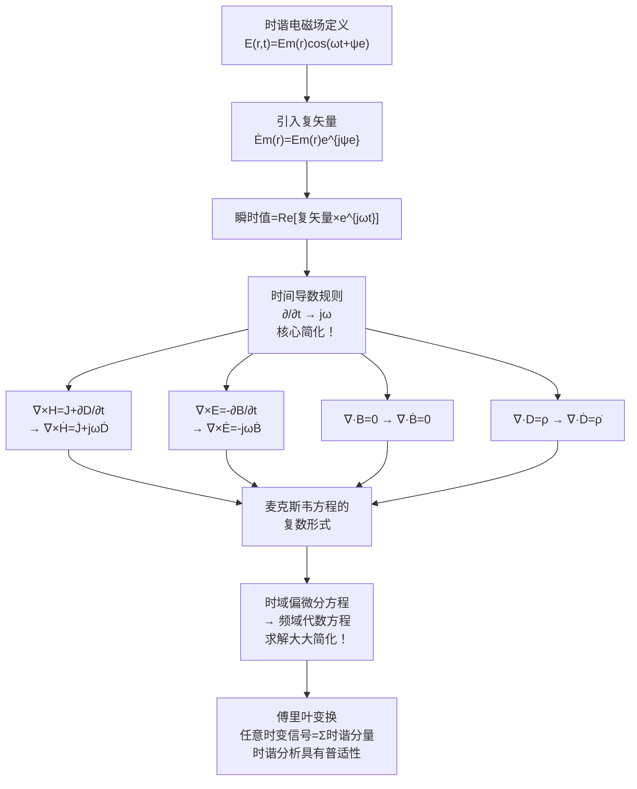

# 时谐电磁场 MOC

## 教科书原文

> 📖 参见：[[§7-8 时谐电磁场]], [[§7-9 麦克斯韦方程的复矢量形式]]

## 概念定义

时谐电磁场就是把时间因子固定为正弦（余弦）函数的电磁场，然后用一个叫"复矢量"的巧妙数学工具，把含时间的偏微分方程变成不含时间的代数方程。想象你在分析一个秋千的摆动：你不是每时每刻追踪秋千的位置，而是直接知道秋千的"振幅"和"相位"——振幅告诉你秋千摆多远，相位告诉你它在摆动周期的哪个位置。复矢量就是电磁场的"振幅+相位"描述。因为任何复杂的周期运动都能分解为许多正弦运动的叠加（傅里叶变换），所以掌握了时谐场的分析方法，就等于掌握了所有时变电磁场的分析方法。

## 类比与直觉

1. **音乐中的音符与频谱**：一段交响乐听起来很复杂，但乐谱上的每个音符都是固定频率的正弦波。傅里叶告诉我们：任何声音都可以分解为不同频率正弦波的叠加。时谐电磁场就是电磁世界的"单个音符"——掌握了单个音符（单频正弦场）的特性，就能理解任何复杂的电磁交响曲。

2. **旋转的秒针与复数的魔力**：想象秒针在钟面上匀速旋转。如果你只看它在水平轴上的投影，它做余弦振荡——但这很麻烦，你每时每刻都得算cos。更好的方法是用复数$$e^{j\omega t}$$直接描述秒针的旋转——复矢量就是这个旋转的"冻结快照"（在t=0时刻），之后乘以$$e^{j\omega t}$$就恢复完整的时间演化。

## 核心公式详释

**瞬时值与复矢量的关系**：
$$\mathbf{E}(r,t) = \text{Re}[\dot{\mathbf{E}}_m(r)e^{j\omega t}] = \text{Re}[\sqrt{2}\dot{\mathbf{E}}(r)e^{j\omega t}]$$

其中 $$\dot{\mathbf{E}}_m(r)$$ 为振幅复矢量，$$\dot{\mathbf{E}}(r)$$ 为有效值复矢量。

**时间导数 → 代数乘法（核心简化！）**：
$$\frac{\partial}{\partial t} \rightarrow j\omega$$

**复数形式麦克斯韦方程（有效值）**：
$$\nabla \times \mathbf{H} = \mathbf{J} + j\omega\mathbf{D}$$
$$\nabla \times \mathbf{E} = -j\omega\mathbf{B}$$
$$\nabla \cdot \mathbf{B} = 0$$
$$\nabla \cdot \mathbf{D} = \rho$$

**复数形式本构关系**：
$$\mathbf{D} = \varepsilon\mathbf{E}, \quad \mathbf{B} = \mu\mathbf{H}, \quad \mathbf{J} = \sigma\mathbf{E} + \mathbf{J}'$$

| 符号 | 含义 | 说明 |
|------|------|------|
| $\omega$ | 角频率 | $\omega = 2\pi f$ |
| $T$ | 周期 | $T = 2\pi/\omega = 1/f$ |
| $\dot{\mathbf{E}}_m$ | 振幅复矢量 | 包含幅度和空间相位 |
| $\dot{\mathbf{E}}$ | 有效值复矢量 | $\dot{\mathbf{E}} = \dot{\mathbf{E}}_m/\sqrt{2}$ |
| $\psi_e(r)$ | 初始相位 | 可能随空间位置变化 |
| $j\omega$ | 时间导数算子 | $\partial/\partial t \to j\omega$ |

## 推导脉络

## 常见误区

1. **复矢量本身是复数所以是物理量**：错误。复矢量是一个数学工具——真实的物理场是复矢量乘以$$e^{j\omega t}$$后取实部。复矢量的模代表振幅，幅角代表相位。

2. **时谐电磁场必须是纯正弦的**：实际中大多数信号不是纯正弦的。但傅里叶变换告诉我们，任何信号都可以分解为不同频率正弦波的叠加。因此，分析单频时谐场是分析任意时变场的基础。

3. **$$\partial/\partial t = j\omega$$ 总是成立**：这只对时谐场（单频正弦）成立。对于非正弦的时变场，$$\partial/\partial t$$ 是一个真正的微分算子，不能用代数乘法替代。

4. **有效值和振幅可以互换使用**：在许多公式中，用有效值还是振幅会导致差$$\sqrt{2}$$或2的因子。特别在功率计算中：瞬时功率取平均时产生1/2因子，这恰与有效值定义中的$$1/\sqrt{2}$$的平方（即1/2）对应。

## 费曼检验

1. 证明复矢量形式下，平均坡印亭矢量 $$\mathbf{S}_{av} = \frac{1}{2}\text{Re}[\dot{\mathbf{E}}_m \times \dot{\mathbf{H}}_m^*]$$。
2. 如果一个时谐电场的复矢量为 $$\mathbf{E} = (3+j4)\mathbf{e}_x e^{-jkz}$$，写出其瞬时值表达式。
3. 为什么复矢量形式的麦克斯韦方程中，旋度方程的时间导数项变成了$$j\omega$$？
4. 说明复矢量形式下位移电流密度如何表示，并与时域形式比较。

## 概念导航

- **前置概念**：[[麦克斯韦方程组 MOC]]、[[位移电流 MOC]]、[[复数]]、[[傅里叶变换]]
- **后续概念**：[[复坡印亭矢量 MOC]]、[[亥姆霍兹方程的导出]]、[[平面电磁波]]
- **关联概念**：[[位函数的复矢量形式 MOC]]、[[平均功率密度]]
- **数学工具**：[[复矢量]]、[[相量法]]

## 自己理解

时谐电磁场的复矢量方法是一种"偷懒"但极其强大的数学技巧。它把含时间的微分方程变成了代数方程——$$\partial/\partial t$$ 这个可怕的微分算子变成了简单的乘法因子 $$j\omega$$。这不只是方便计算，更重要的是它揭示了一个深刻的物理事实：在线性时不变系统中，不同频率的电磁波分量彼此独立地传播，互不干扰。这个性质是通信技术的基础——我们之所以能同时收听多个电台、使用WiFi和蓝牙而互不干扰，正是因为不同频率的电磁波在空间中"各自走各自的路"。

> 📖 参见：[[§7-8 时谐电磁场]], [[§7-9 麦克斯韦方程的复矢量形式]]
