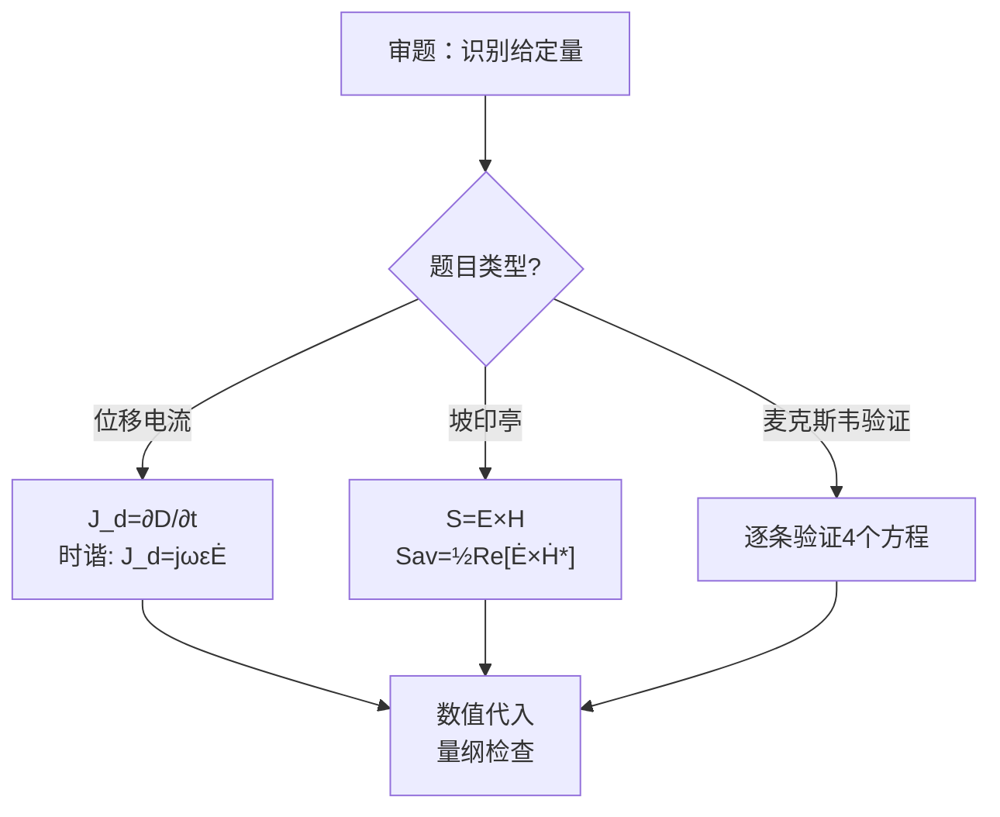

---
tags: [习题, 电磁场, 时变电磁场, 麦克斯韦, 坡印亭, 位移电流]
chapter: "第7章"
textbook_section: "§7习题"
textbook_page: "201-203"
type: exercise
importance: ⚪
exam_frequency: ★
exam_type: 计
difficulty: intermediate
created: 2026-04-28
---

# 习题：第7章 时变电磁场（教科书p.201-203）

📌 **一句话本质**：第7章课后习题——位移电流、麦克斯韦方程组、坡印廷定理、时谐场的计算与应用
🏷️ **重要度**：⚪ | 考试：★ | 题型：计

## 教材原题概览

第7章习题围绕时变电磁场的三大核心模块：麦克斯韦方程组应用、坡印亭定理与能流计算、以及时谐场的复矢量表示。这些题目将前面各章（静电场、恒定电流场、恒定磁场）的知识统一在麦克斯韦方程组框架下。

| 题号范围 | 主题 | 核心公式/技能 |
|----------|------|--------------|
| 7-1~7-4 | 位移电流密度计算 | $\mathbf{J}_d = \varepsilon_0\frac{\partial\mathbf{E}}{\partial t}$ |
| 7-5~7-9 | 麦克斯韦方程组的应用 | $\nabla\times\mathbf{H} = \mathbf{J} + \frac{\partial\mathbf{D}}{\partial t}$ |
| 7-10~7-14 | 坡印亭矢量与能流 | $\mathbf{S} = \mathbf{E}\times\mathbf{H}$$, $$S_{av} = \frac{1}{2}\text{Re}[E\times H^*]$ |
| 7-15~7-18 | 时谐场与复矢量 | 复表示法，相量运算 |

> 📖 p.201-203

## 费曼4步解题法

### 第1步：明确已知和目标

**位移电流类**：已知电场随时间的变化率 $$\frac{\partial\mathbf{E}}{\partial t}$$，求 $$\mathbf{J}_d$$。

**坡印亭矢量类**：给定时谐场的E和H（可能是复矢量形式），求瞬时功率和平均功率。

**麦克斯韦方程类**：给定场分布，验证满足某条麦克斯韦方程，或从方程出发推导场间关系。

### 第2步：核心公式速查

**位移电流密度**：$$\mathbf{J}_d = \frac{\partial\mathbf{D}}{\partial t} = \varepsilon\frac{\partial\mathbf{E}}{\partial t}$$（真空中 $$\varepsilon_0$$）

**麦克斯韦-安培定律**：$$\nabla\times\mathbf{H} = \mathbf{J}_c + \mathbf{J}_d = \mathbf{J}_c + \frac{\partial\mathbf{D}}{\partial t}$$

**坡印亭矢量（瞬时）**：$$\mathbf{S}(t) = \mathbf{E}(t) \times \mathbf{H}(t)$$

**平均坡印亭矢量**：$$\mathbf{S}_{av} = \frac{1}{T}\int_0^T \mathbf{S}(t)dt = \frac{1}{2}\text{Re}[\dot{\mathbf{E}}_m \times \dot{\mathbf{H}}_m^*]$$

**时谐场的麦克斯韦方程组（频域）**：
$$\nabla\times\dot{\mathbf{H}} = \dot{\mathbf{J}} + j\omega\varepsilon\dot{\mathbf{E}}$$
$$\nabla\times\dot{\mathbf{E}} = -j\omega\mu\dot{\mathbf{H}}$$
$$\nabla\cdot\dot{\mathbf{D}} = \dot{\rho}$$
$$\nabla\cdot\dot{\mathbf{B}} = 0$$

### 第3步：典型例题

**例1（位移电流）**：平行板电容器（极板面积S，间距d）接到电压 $$u(t) = U_m\sin\omega t$$。求极板间的位移电流密度。

*解*：$$E = u/d = (U_m/d)\sin\omega t$$
$$J_d = \varepsilon_0\frac{dE}{dt} = \varepsilon_0\frac{U_m\omega}{d}\cos\omega t$$
总位移电流：$$I_d = J_d S = \varepsilon_0 S\frac{U_m\omega}{d}\cos\omega t = C\omega U_m\cos\omega t$$（其中 $$C = \varepsilon_0 S/d$$）

**例2（坡印亭矢量）**：已知真空中 $$\dot{\mathbf{E}}_m = 100\mathbf{a}_x e^{-j\beta z}$$ V/m, $$\dot{\mathbf{H}}_m = 0.265\mathbf{a}_y e^{-j\beta z}$$ A/m。求 $$S_{av}$$。

*解*：$$\mathbf{S}_{av} = \frac{1}{2}\text{Re}[\dot{\mathbf{E}}_m \times \dot{\mathbf{H}}_m^*] = \frac{1}{2}\text{Re}[100\times0.265\;\mathbf{a}_x\times\mathbf{a}_y]$$
$$= \frac{1}{2}\times26.5\;\mathbf{a}_z = 13.25\;\mathbf{a}_z$$ W/m²

**例3（麦克斯韦验证）**：已知 $$\mathbf{H} = H_0\cos(\omega t - \beta z)\mathbf{a}_y$$，$$\mathbf{E} = E_0\cos(\omega t - \beta z)\mathbf{a}_x$$。验证它们满足 $$\nabla\times\mathbf{E} = -\mu_0\frac{\partial\mathbf{H}}{\partial t}$$。

*解*：$$\nabla\times\mathbf{E} = \frac{\partial E_x}{\partial z}\mathbf{a}_y = -\beta E_0\sin(\omega t-\beta z)\mathbf{a}_y$$
$$-\mu_0\frac{\partial\mathbf{H}}{\partial t} = -\mu_0 H_0(-\omega\sin(\omega t-\beta z))\mathbf{a}_y = \mu_0\omega H_0\sin(\omega t-\beta z)\mathbf{a}_y$$
两者相等要求 $$\beta E_0 = \mu_0\omega H_0 \to E_0/H_0 = \mu_0\omega/\beta = \mu_0 c = \eta_0$$。验证通过！

### 第4步：验证技巧

- 坡印亭矢量方向：右手定则 E×H，与波的传播方向一致
- 位移电流量纲：$$\partial D/\partial t$$ 的单位是 A/m²（与传导电流密度相同）
- 复坡印亭矢量：共轭在H上（不是E上），叉乘顺序 E×H*（不是 H*×E）

## 解题流程图

## 常见误区

1. **坡印亭矢量的1/2因子**：用振幅表示时需乘1/2（$$\frac{1}{2}\text{Re}[\dot{E}_m\times\dot{H}_m^*]$$），用有效值时无需（$$\text{Re}[\dot{E}\times\dot{H}^*]$$）。
2. **忘记给H取共轭**：复坡印亭矢量是 $$\dot{\mathbf{E}}\times\dot{\mathbf{H}}^*$$，不是 $$\dot{\mathbf{E}}\times\dot{\mathbf{H}}$$。不取共轭的话时间因子 $$e^{j2\omega t}$$ 不消失。
3. **混淆传导电流和位移电流**：$$\mathbf{J}_c = \sigma\mathbf{E}$$（导体中的真实电荷流动），$$\mathbf{J}_d = \varepsilon\partial\mathbf{E}/\partial t$$（真空中变化的电场也等效为"电流"）。

## 概念导航

- **前置**：[[位移电流假说]]、[[麦克斯韦方程组的微分形式]]、[[坡印亭定理]]
- **关联**：[[习题：麦克斯韦方程组综合推导题]]、[[思考题：坡印亭矢量的物理直觉]]

## 自己理解

第7章习题的核心在于将"静态"的场论思维升级为"动态"——电场不再是无旋的（$$\nabla\times\mathbf{E} = -\partial\mathbf{B}/\partial t$$），磁场不再仅由传导电流激发（$$\mathbf{J}_d$$ 的加入）。通过这些习题训练，目标是建立一种直觉：**在时变场中，E和H是同一硬币的两面，从任何一个出发都可以通过麦克斯韦方程求出另一个**。

> 📖 p.201-203
