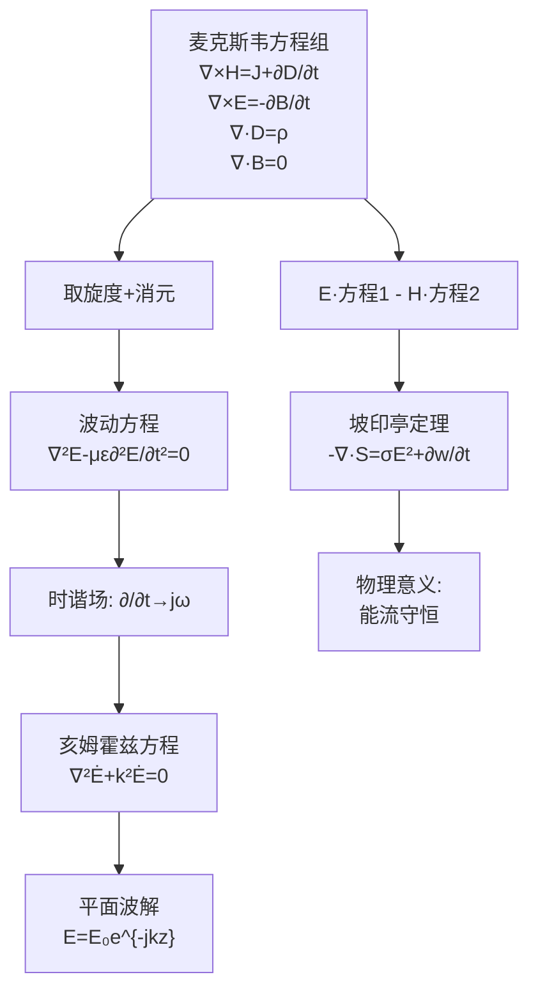

# 习题：麦克斯韦方程组综合推导题
**关键词**：思考题, 预习, 概念检验, 时变电磁场

## 教材原题

从麦克斯韦方程组的微分形式出发，完成以下推导：

1. 推导时变电磁场的波动方程（达朗贝尔方程）
2. 证明无源区中 $$\mathbf{E}$$ 和 $$\mathbf{H}$$ 满足相同的波动方程
3. 由麦克斯韦方程组推导坡印亭定理
4. 对时谐场，推导亥姆霍兹方程

## 费曼4步解题法

### 第1步：明确已知和目标

**已知**：麦克斯韦方程组的微分形式
$$\nabla \times \mathbf{H} = \mathbf{J} + \frac{\partial\mathbf{D}}{\partial t}$$
$$\nabla \times \mathbf{E} = -\frac{\partial\mathbf{B}}{\partial t}$$
$$\nabla \cdot \mathbf{D} = \rho$$
$$\nabla \cdot \mathbf{B} = 0$$
以及本构关系：$$\mathbf{D} = \varepsilon\mathbf{E}, \mathbf{B} = \mu\mathbf{H}, \mathbf{J} = \sigma\mathbf{E}$$

**目标**：
(1) 波动方程：$$\nabla^2\mathbf{E} - \mu\varepsilon\frac{\partial^2\mathbf{E}}{\partial t^2} - \mu\sigma\frac{\partial\mathbf{E}}{\partial t} = \nabla(\rho/\varepsilon)$$
(2) 无源区：$$\nabla^2\mathbf{E} - \mu\varepsilon\frac{\partial^2\mathbf{E}}{\partial t^2} = 0$$
(3) 坡印亭定理：$$-\nabla\cdot(\mathbf{E}\times\mathbf{H}) = \frac{\partial}{\partial t}(\frac{1}{2}\varepsilon E^2 + \frac{1}{2}\mu H^2) + \sigma E^2$$
(4) 亥姆霍兹方程：$$\nabla^2\dot{\mathbf{E}} + k^2\dot{\mathbf{E}} = 0$$，其中 $$k^2 = \omega^2\mu\varepsilon - j\omega\mu\sigma$$

### 第2步：推导波动方程（关键思路）

**直观理解**：麦克斯韦的两个旋度方程就像一对"联锁反应"——变化的电场产生旋涡状的磁场（方程1），变化的磁场又反过来产生旋涡状的电场（方程2）。当电场变化时，产生磁场的变化，磁场的变化又产生电场的变化……这种"自维持"的交替变化就是电磁波。波动方程正是从这对"联锁"的旋度方程中"解耦"出来的。

**推导流程**：

对 $$\nabla \times \mathbf{E} = -\frac{\partial\mathbf{B}}{\partial t}$$ 两边再取旋度：
$$\nabla \times \nabla \times \mathbf{E} = -\frac{\partial}{\partial t}(\nabla \times \mathbf{B})$$

利用矢量恒等式 $$\nabla \times \nabla \times \mathbf{E} = \nabla(\nabla\cdot\mathbf{E}) - \nabla^2\mathbf{E}$$：
$$\nabla(\nabla\cdot\mathbf{E}) - \nabla^2\mathbf{E} = -\frac{\partial}{\partial t}(\nabla \times \mu\mathbf{H})$$

由 $$\nabla\times\mathbf{H} = \mathbf{J} + \frac{\partial\mathbf{D}}{\partial t} = \sigma\mathbf{E} + \varepsilon\frac{\partial\mathbf{E}}{\partial t}$$ 和 $$\nabla\cdot\mathbf{E} = \rho/\varepsilon$$，代入得：
$$\nabla(\rho/\varepsilon) - \nabla^2\mathbf{E} = -\mu\frac{\partial}{\partial t}(\sigma\mathbf{E} + \varepsilon\frac{\partial\mathbf{E}}{\partial t})$$

整理得：
$$\boxed{\nabla^2\mathbf{E} - \mu\varepsilon\frac{\partial^2\mathbf{E}}{\partial t^2} - \mu\sigma\frac{\partial\mathbf{E}}{\partial t} = \nabla(\rho/\varepsilon)}$$

**在无源区（$$\rho=0, \mathbf{J}=0$$ 或 $$\sigma=0$$）**，方程简化为：
$$\boxed{\nabla^2\mathbf{E} - \mu\varepsilon\frac{\partial^2\mathbf{E}}{\partial t^2} = 0}$$

这正是标准的**波动方程**（达朗贝尔方程），波速 $$v = 1/\sqrt{\mu\varepsilon}$$。

### 第3步：推导坡印亭定理

从两个旋度方程出发。用 $$\mathbf{H}$$ 点乘 $$\nabla\times\mathbf{E}$$ 方程，用 $$\mathbf{E}$$ 点乘 $$\nabla\times\mathbf{H}$$ 方程，然后相减：

$$\mathbf{H}\cdot(\nabla\times\mathbf{E}) = -\mathbf{H}\cdot\frac{\partial\mathbf{B}}{\partial t}$$
$$\mathbf{E}\cdot(\nabla\times\mathbf{H}) = \mathbf{E}\cdot\mathbf{J} + \mathbf{E}\cdot\frac{\partial\mathbf{D}}{\partial t}$$

两式相减：
$$\mathbf{E}\cdot(\nabla\times\mathbf{H}) - \mathbf{H}\cdot(\nabla\times\mathbf{E}) = \mathbf{E}\cdot\mathbf{J} + \mathbf{E}\cdot\frac{\partial\mathbf{D}}{\partial t} + \mathbf{H}\cdot\frac{\partial\mathbf{B}}{\partial t}$$

利用矢量恒等式 $$\nabla\cdot(\mathbf{E}\times\mathbf{H}) = \mathbf{H}\cdot(\nabla\times\mathbf{E}) - \mathbf{E}\cdot(\nabla\times\mathbf{H})$$：
$$-\nabla\cdot(\mathbf{E}\times\mathbf{H}) = \mathbf{E}\cdot\mathbf{J} + \mathbf{E}\cdot\frac{\partial\mathbf{D}}{\partial t} + \mathbf{H}\cdot\frac{\partial\mathbf{B}}{\partial t}$$

令 $$\mathbf{S} = \mathbf{E}\times\mathbf{H}$$（坡印亭矢量），对线性各向同性介质：
$$\boxed{-\nabla\cdot\mathbf{S} = \sigma E^2 + \frac{\partial}{\partial t}(\frac{1}{2}\varepsilon E^2 + \frac{1}{2}\mu H^2)}$$

| 项 | 含义 |
|----|------|
| $-\nabla\cdot\mathbf{S}$ | 能流密度的净流出（$$\mathbf{S}$$ 通过闭合面的通量） |
| $\sigma E^2$ | 焦耳损耗功率密度 |
| $\frac{\partial}{\partial t}(\frac{1}{2}\varepsilon E^2)$ | 电能密度的时间变化率 |
| $\frac{\partial}{\partial t}(\frac{1}{2}\mu H^2)$ | 磁能密度的时间变化率 |

### 第4步：对时谐场推导亥姆霍兹方程

对时谐场 $$\mathbf{E}(t) = \text{Re}[\dot{\mathbf{E}}_m e^{j\omega t}]$$，时间导数 $$\partial/\partial t \to j\omega$$，$$\partial^2/\partial t^2 \to -\omega^2$$。

代入有源区的波动方程：
$$\nabla^2\dot{\mathbf{E}} + \omega^2\mu(\varepsilon - j\sigma/\omega)\dot{\mathbf{E}} = \nabla(\rho/\varepsilon)$$

定义复波数：$$k_c^2 = \omega^2\mu(\varepsilon - j\sigma/\omega) = \omega^2\mu\varepsilon - j\omega\mu\sigma$$

无源区（$$\rho=0$$）：
$$\boxed{\nabla^2\dot{\mathbf{E}} + k_c^2\dot{\mathbf{E}} = 0}$$

这就是**亥姆霍兹方程**。对理想介质（$$\sigma=0$$）：$$k = \omega\sqrt{\mu\varepsilon}$$（实数），方程变为 $$\nabla^2\dot{\mathbf{E}} + k^2\dot{\mathbf{E}} = 0$$。

## 推导全景图

## 常见误区

1. **波动方程和亥姆霍兹方程混淆**：波动方程是时域方程（含 $$\partial^2/\partial t^2$$），亥姆霍兹方程是频域方程（含 $$k^2$$），仅适用于时谐场。
2. **在无源区忘记本构关系**：$$\mathbf{D} = \varepsilon\mathbf{E}, \mathbf{B} = \mu\mathbf{H}$$ 对线性各向同性介质成立。不能跳过本构关系直接写波动方程。
3. **坡印亭矢量定义混淆**：$$\mathbf{S} = \mathbf{E} \times \mathbf{H}$$ 不是 $$\mathbf{H} \times \mathbf{E}$$，也不是 $$\mathbf{D} \times \mathbf{B}$$。必须用 E 和 H，不是 D 和 B！

## 概念导航

- **前置**：[[位移电流假说]]、[[麦克斯韦方程组的微分形式]]、[[坡印亭定理]]
- **关联**：[[时变电磁场波动方程推导]]、[[亥姆霍兹方程与平面波解]]

## 自己理解

这四道综合推导题涵盖了从麦克斯韦方程组到平面波的完整推导链条。它们揭示了电磁理论的深刻统一性：波动方程来自旋度方程的"迭代自耦"，坡印亭定理来自两个旋度方程的"能量乘法"，亥姆霍兹方程则是波动方程的频域化身。

> 📖 参见：[[§7-1 位移电流]], [[§7-11 复能流密度矢量]]
