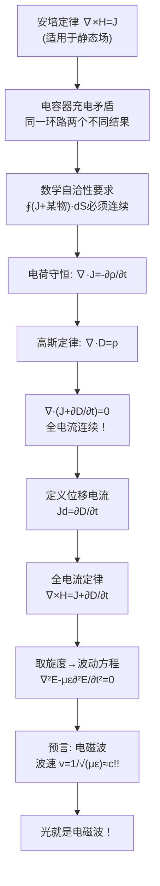

# 思考题：位移电流为什么是天才的创造
**关键词**：思考题, 预习, 概念检验, 时变电磁场

## 教科书原文（7-1 什么是位移电流？它与传导电流及运流电流的本质区别是什么？为什么在不良导体中位移电流有可能大于传导电流？）

> 📖 参见：[[§7-1 位移电流]]

## 概念定义

麦克斯韦在1864年做的事，相当于发现了一个方程组中的"拼写错误"并大胆修正了它。安培定律 $$\nabla \times \mathbf{H} = \mathbf{J}$$ 在静态场中完美工作，但应用到电容器充电电路时自相矛盾：对同一环路，选不同积分面得到不同结果。麦克斯韦没有像其他人一样说"这个方程有时不适用"，而是深入研究矛盾，发现只有加入一项 $$\partial \mathbf{D}/\partial t$$（位移电流），方程才能在任何情况下保持自洽。他的天才在于：这不是从实验发现的，而是从"方程组必须自洽"的数学要求中推导出来的。更震撼的是，这个纯粹理论上的修正预言了电磁波的存在，并且波速恰好等于光速——光就是电磁波。

## 类比与直觉

1. **会计查账发现的一分钱**：一个老会计发现账本上借方和贷方差了一分钱。别人说"忽略了吧"，但他追踪这一分钱，最后发现了一个持续的贪污模式。麦克斯韦就像这个会计——安培定律中"差的一项"看似微小（电容器中的间隙），但补上后揭示了一个全新的物理世界（电磁波）。

2. **拼图缺了一块**：麦克斯韦方程组就像一幅拼图，库仑、安培、法拉第各贡献了几块，但总是差一块拼不上——这一块就是位移电流。麦克斯韦不是"发现"了这一块，而是根据周围拼图的形状"推导"出缺失的那一块应该是什么形状。放上去之后，整幅图完美了——并浮现出之前看不见的图案（电磁波）。

## 核心公式详释（天才创造的关键公式）

**矛盾**（电容器充电电路）：
- 选面S1穿过导线：$$\oint \mathbf{H}\cdot d\mathbf{l} = I$$
- 选面S2穿过电容间隙：$$\oint \mathbf{H}\cdot d\mathbf{l} = 0$$
- 同一环路，两个答案！数学不自洽！

**麦克斯韦的修正**：
$$\nabla \times \mathbf{H} = \mathbf{J} + \frac{\partial \mathbf{D}}{\partial t}$$

**位移电流密度**：
$$\mathbf{J}_d = \frac{\partial \mathbf{D}}{\partial t} = \varepsilon \frac{\partial \mathbf{E}}{\partial t}$$

| 天才的维度 | 说明 |
|-----------|------|
| 不是实验发现 | 从数学自洽性推导 |
| 大胆假设 | 变化的电场产生磁场（前所未有）|
| 实验预言 | 电磁波，1888年赫兹验证 |
| 统一理论 | 光 = 电磁波（波速恰好是c）|
| 深远影响 | 相对论、无线电、一切现代通信 |

## 推导脉络

## 常见误区

1. **麦克斯韦做了新实验来发现位移电流**：没有。这是纯理论推导。他研究了安培定律的数学不自洽性，并通过电荷守恒和高斯定律推导出必须加入位移电流项。

2. **位移电流是"真实"电流**：不是。它不涉及电荷运动，不产生焦耳热。但它在产生磁场方面与真实电流完全等效——这就是麦克斯韦的天才假设。

3. **位移电流很小所以不重要**：单独看$$\partial D/\partial t$$可能很小，但正是它使得麦克斯韦方程组自洽，并预言了电磁波。没有它就没有无线电。

## 费曼检验

1. 画出电容器充电电路，分别选穿过导线和穿过间隙的两个面积分面，写出安培定律的积分结果，展示矛盾。
2. 从电荷守恒定律和高斯定律出发，推导为什么必须加入位移电流项。
3. 计算真空中 $$E=10^6\sin(2\pi\times10^9 t)$$ V/m 时的位移电流密度，并与铜中相同电场下的传导电流密度比较。
4. 如果麦克斯韦没有引入位移电流，今天的哪些技术不可能存在？

## 概念导航

- **前置概念**：[[安培环路定律]]、[[电荷守恒定律]]、[[高斯定律]]
- **关联概念**：[[位移电流 MOC]]、[[麦克斯韦方程组 MOC]]、[[法拉第电磁感应定律]]
- **历史脉络**：[[从四大实验到四大方程的故事线]]、[[费曼法专项 理解麦克斯韦方程组]]
- **进阶阅读**：[[位移电流 MOC]]

## 自己理解

位移电流可能是物理学史上最美丽的"打补丁"。麦克斯韦发现了一个不自洽——就像程序员发现一个函数对不同输入返回不同结果——然后他通过分析代码（物理定律）之间的关系，找出了缺失的那一行。加上这一行后，程序不仅跑通了所有现有测试，还自动产生了新的功能（预言电磁波和光速）。这就是理论物理的威力：当你确信方程组的自洽性时，数学本身会告诉你自然界应该如何运作。麦克斯韦不需要做实验来"发现"位移电流——他推导了它的存在，然后让实验去验证。这是人类理性力量的顶峰展示。

> 📖 参见：[[§7-1 位移电流]], [[§7-1 位移电流]]
