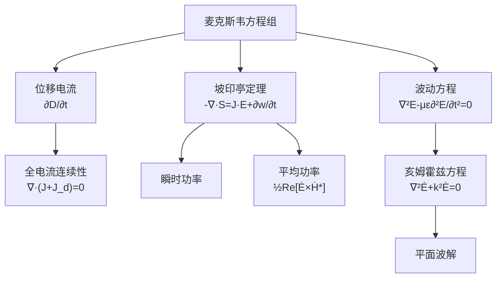

# 第7章 时变电磁场 思考题与习题 MOC

## 教科书原文

> 📖 参见：[[§7-1 位移电流]], [[§7-2 麦克斯韦方程]], [[§7-3 时变电磁场边界条件]], [[§7-4 标量位与矢量位]], [[§7-5 位函数方程求解]], [[§7-6 能量密度与能流密度矢量]], [[§7-7 时变电磁场惟一性定理]], [[§7-8 时谐电磁场]], [[§7-9 麦克斯韦方程的复矢量形式]], [[§7-10 位函数的复矢量形式]], [[§7-11 复能流密度矢量]], [[§7-12 时变电磁场的应用]]

## 概念定义

时变电磁场是电磁理论的"皇冠"——它统一了电和磁，预言了电磁波的存在，并揭示了光就是电磁波。本章的思考题和习题围绕三大核心展开：**位移电流**（使安培环路定律完备的关键补充）、**麦克斯韦方程组**（电磁场统一理论）、**坡印亭定理**（电磁能量守恒）。掌握了这三件事，整章就通了。

## 类比与直觉

**类比1：位移电流 = 水管中的"弹性段"**。普通的传导电流像水管中实际流动的水，而位移电流像水管中一段弹性膜——水实际上没过这段膜，但压力变化（电场变化）传递了过去。正是这个"弹性段"让交流电路即使有电容隔断也能"导通"，也让电磁波能在真空中传播（不需要介质中的实际电荷流动）。

**类比2：坡印亭矢量 = 电磁场的"快递单号"**。$$\mathbf{S} = \mathbf{E} \times \mathbf{H}$$ 告诉你能量正在往哪个方向"发货"，大小告诉你"包裹的能量密度有多大"。坡印亭定理就是电磁能量的"快递追踪系统"——流入一个体积的能量 = 体积内储存的能量变化 + 消耗的能量。

## 思考题索引

| 编号 | 主题 | 笔记链接 | 题型 |
|------|------|----------|:---:|
| 7-1~7-6 | 位移电流、麦克斯韦方程、时变场基础 | [[思考题：7-1至7-6 位移电流麦克斯韦方程与时变场基础（教科书p.200-201）]] | 概念理解 |
| 7-7~7-12 | 电磁辐射、能量、时谐场、复矢量 | [[思考题：7-7至7-12 电磁辐射能量时谐场与复矢量（教科书p.200-201）]] | 综合应用 |
| 专题 | 坡印亭矢量的物理直觉 | [[思考题：坡印亭矢量的物理直觉]] | 物理解释 |

## 习题索引

| 题号 | 主题 | 笔记链接 |
|------|------|----------|
| 7-1~7-X | 全部习题 | [[习题：第7章 时变电磁场（教科书p.201-203）]] |
| 综合 | 麦克斯韦方程组综合推导 | [[习题：麦克斯韦方程组综合推导题]] |

## 核心公式速查

**位移电流密度**：
$$\mathbf{J}_d = \frac{\partial\mathbf{D}}{\partial t} = \varepsilon\frac{\partial\mathbf{E}}{\partial t}$$

**麦克斯韦-安培定律（全电流定律）**：
$$\nabla\times\mathbf{H} = \mathbf{J} + \frac{\partial\mathbf{D}}{\partial t}$$

**坡印亭定理**：
$$-\nabla\cdot(\mathbf{E}\times\mathbf{H}) = \sigma E^2 + \frac{\partial}{\partial t}(\frac{1}{2}\varepsilon E^2 + \frac{1}{2}\mu H^2)$$

**复坡印亭矢量**：
$$\mathbf{S}_{av} = \frac{1}{2}\text{Re}[\dot{\mathbf{E}}_m \times \dot{\mathbf{H}}_m^*]$$

## 解题框架

## 常见误区

1. **位移电流只在电容器中存在**：虽然"电容器中的位移电流"是经典比喻，但位移电流 $$\partial\mathbf{D}/\partial t$$ 存在于任何电场变化的地方——包括电磁波在真空中传播时。它是场的属性，不是介质属性！
2. **坡印亭矢量S = E×H中的E和H必须是同一频率**：不同频率的E和H的乘积在时间平均意义下为零（正交性），不能混用。
3. **将复坡印亭矢量直接当作物理功率**：$$\mathbf{S}_c$$ 是数学工具，只有它的实部才是可测量的平均功率。虚部代表无功功率。

## 概念导航

- **核心文件**：[[时变电磁场 MOC]]、[[位移电流假说]]、[[麦克斯韦方程组的微分形式]]
- **能量流**：[[坡印亭定理]]、[[复坡印亭矢量 MOC]]
- **位函数**：[[推迟位与延迟时间R_div_v]]

## 自己理解

时变电磁场这一章是整个电磁理论的"灵魂"。前面几章讲的静电、静磁、恒定电流场都是"静止"的特例——而时变场把它们统一起来，揭示了电磁波的存在。本思考题和习题集的目的就是帮你在概念上打通"位移电流为什么是必需"和"坡印亭矢量到底在说什么"这两个关键节点。

> 📖 第7章思考题与习题, p.200-203

## 更多费曼检验
1. 时变电磁场中最容易出错的三种题型是什么？每种的核心陷阱在哪里？
2. 从麦克斯韦方程出发，推导自由空间中的波动方程并验证真空光速c=1/√(μ₀ε₀)。
