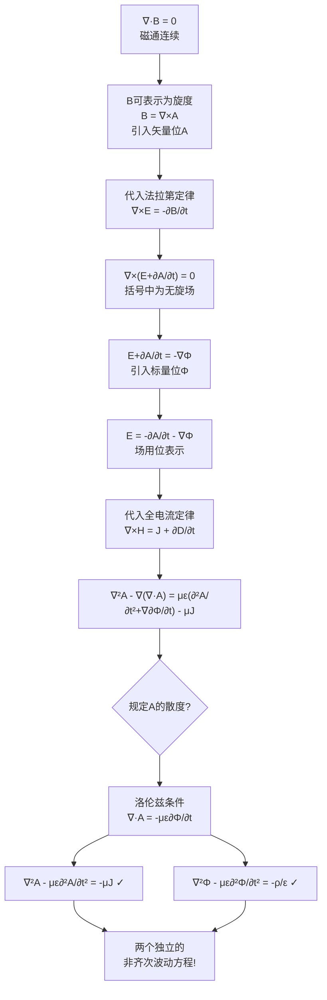

# 标量位与矢量位 MOC

## 教科书原文

> 📖 参见：[[§7-4 标量位与矢量位]]

## 概念定义

标量位$$\Phi$$和矢量位$$\mathbf{A}$$就像是电磁场的"中介人"——直接求解$$\mathbf{E}$$和$$\mathbf{H}$$需要处理6个分量（3个E分量+3个H分量）耦合在一起的复杂方程，但如果先求出两个"位函数"（1个标量$$\Phi$$+3个矢量$$\mathbf{A}$$的分量=4个量），再通过取梯度和取旋度就能方便地得到$$\mathbf{E}$$和$$\mathbf{H}$$。这就像是：与其直接背一篇长文章，不如先记住大纲和关键词，然后还原出全文。位函数就是电磁场求解的"大纲"。

## 类比与直觉

1. **地图上的等高线与水流**：标量位$$\Phi$$就像地形图上的海拔高度——它是一个标量场，在每一点给出一个数值。电场$$\mathbf{E}$$就是从高电位流向低电位的"水流"，方向是负梯度方向（水往低处流）。矢量位$$\mathbf{A}$$则像一个"漩涡场"——想象每个点有一个小箭头，这些箭头的旋度（漩涡强度）就是磁通密度$$\mathbf{B}$$。

2. **CEO与中层管理**：麦克斯韦方程就像是公司的最终产品（电磁场$$\mathbf{E}, \mathbf{H}$$），直接管理所有细节（6个分量耦合）很累。标量位$$\Phi$$和矢量位$$\mathbf{A}$$就像是CEO和COO——先管理好这两位（4个量），他们再通过梯度（部门分工）和旋度（流程流转）产生最终的产品。更重要的是，$$\Phi$$和$$\mathbf{A}$$各自满足结构完全相同的方程——就像用同样的管理方法管两个部门。

## 核心公式详释

**位函数定义**：
$$\mathbf{B} = \nabla \times \mathbf{A} \quad \text{(矢量位的旋度=磁通密度)}$$
$$\mathbf{E} = -\frac{\partial \mathbf{A}}{\partial t} - \nabla\Phi \quad \text{(场由位的时变和梯度决定)}$$

**洛伦兹条件（规范条件）**：
$$\nabla \cdot \mathbf{A} = -\mu\varepsilon\frac{\partial \Phi}{\partial t}$$

**位函数满足的非齐次波动方程（达朗贝尔方程）**：
$$\nabla^2 \mathbf{A} - \mu\varepsilon\frac{\partial^2 \mathbf{A}}{\partial t^2} = -\mu \mathbf{J}$$
$$\nabla^2 \Phi - \mu\varepsilon\frac{\partial^2 \Phi}{\partial t^2} = -\frac{\rho}{\varepsilon}$$

| 符号 | 含义 | 单位 | 说明 |
|------|------|------|------|
| $\Phi$ | 标量电位 | V | 由电荷分布决定 |
| $\mathbf{A}$ | 矢量磁位 | Wb/m | 由电流分布决定 |
| $\mathbf{B}$ | 磁通密度 | T | $\mathbf{B} = \nabla \times \mathbf{A}$ |
| $\mathbf{E}$ | 电场强度 | V/m | $\mathbf{E} = -\nabla\Phi - \partial\mathbf{A}/\partial t$ |
| $v$ | 波速 | m/s | $v = 1/\sqrt{\mu\varepsilon}$ |

**简化效果**：原问题6个分量耦合 → 位函数4个独立分量 → 直角坐标中求解1个标量方程4次

## 推导脉络

## 常见误区

1. **洛伦兹条件是唯一可选规范**：错误。库仑规范（$$\nabla \cdot \mathbf{A} = 0$$）也是常用的规范条件，特别适合静态场和低频情况。洛伦兹条件的优势在于它使得$$\mathbf{A}$$和$$\Phi$$的方程完全对称且解耦。

2. **矢量位$$\mathbf{A}$$和标量位$$\Phi$$是物理可观测的量**：错误。$$\mathbf{A}$$和$$\Phi$$不是唯一的——规范变换（$$\mathbf{A}' = \mathbf{A} + \nabla\psi, \Phi' = \Phi - \partial\psi/\partial t$$）不改变物理可观测量$$\mathbf{E}$$和$$\mathbf{B}$$。这是规范场论的起点。

3. **静态场中不需要位函数**：错误。即使静态场，位函数也能大大简化求解。静电场的泊松方程 $$\nabla^2\Phi = -\rho/\varepsilon$$ 就是位函数方程。

4. **位函数只用于简化计算**：不仅是计算工具。在现代物理学中（量子力学、粒子物理），矢量位$$\mathbf{A}$$具有直接的物理意义——Aharonov-Bohm效应证明$$\mathbf{A}$$即使在$$\mathbf{B}=0$$的区域也能影响电子行为。

## 费曼检验

1. 证明：如果对$$\mathbf{A}$$和$$\Phi$$做规范变换 $$\mathbf{A}' = \mathbf{A} + \nabla\psi, \Phi' = \Phi - \partial\psi/\partial t$$，$$\mathbf{E}$$和$$\mathbf{B}$$不变。
2. 从洛伦兹条件和电荷守恒定律出发，证明两者的一致性。
3. 在静态场（$$\partial/\partial t = 0$$）极限下，位函数方程退化为什么形式？
4. 为什么说在直角坐标系中，矢量位方程实际上等于三个独立的标量方程？

## 概念导航

- **前置概念**：[[麦克斯韦方程组 MOC]]、[[亥姆霍兹定理]]、[[无散场与无旋场 MOC]]
- **后续概念**：[[推迟位与延迟时间]]、[[位函数的复矢量形式 MOC]]、[[亥姆霍兹方程的导出]]
- **关联概念**：[[洛伦兹条件]]、[[规范变换]]、[[电磁辐射]]

## 自己理解

位函数方法是物理学中"间接求解"策略的典范。面对复杂的麦克斯韦方程组（6个耦合分量），我们退一步，先定义两个辅助量（$$\Phi$$和$$\mathbf{A}$$），它们各自满足结构简单且相互独立的波动方程。求出位函数后再通过微分运算还原出场。这种"以退为进"的策略在物理学中反复出现——从引力势到量子力学的波函数，都是把复杂问题转化为更简单问题的艺术。洛伦兹条件的引入更是精妙：它不仅是数学上的简化手段，而且自然地与电荷守恒定律一致，反映了物理规律的内在和谐。

> 📖 参见：[[§7-4 标量位与矢量位]]
