---
tags: [电磁场, 时变电磁场, 洛伦兹规范, 标量位, 矢量位, 规范条件]
chapter: "第7章"
textbook_section: "§7-4"
textbook_page: "181-182"
type: core-concept
importance: 🟡
exam_frequency: ★★
exam_type: 计
difficulty: advanced
level: ★★★
created: 2026-04-28
---

# 洛伦兹规范
**关键词**：动态位, φ, A, 洛伦兹规范, 库仑规范, 达朗贝尔方程

📌 **一句话本质**：洛伦兹规范∇·A+με∂φ/∂t=0——让A和φ的方程解耦为标准的达朗贝尔方程
🏷️ **重要度**：🟡 | 考试：★★ | 题型：计

## 🔧工程场景

电磁仿真软件——所有频域求解器默认使用洛伦兹规范，才能将A和φ的耦合方程解耦为独立的波动方程

## 教科书原文

> 📖 参见：[[§7-4 标量位与矢量位]]

## 概念定义（费曼第1步）
洛伦兹规范是给矢量位 A 和标量位 $$\Phi$$ 之间的一条"配合规则"——它规定了 A 的散度应该等于什么。选择这条规则后，A 和 $$\Phi$$ 满足的方程就变得像双胞胎一样（形式完全相同的波动方程），而且 A 只与电流源有关、$$\Phi$$ 只与电荷源有关，极大简化了计算。

## 🧠类比与直觉（费曼第2步）

**类比1：联立方程组的消元法**
解二元一次方程组时，你可以通过加减消元让 x 和 y 的方程"脱钩"。洛伦兹规范做的就是这件事——让原来纠缠在一起的 A 和 $$\Phi$$ 的方程变得互不依赖。
- 没有洛伦兹规范：A 的方程里含有 $$\Phi$$，$$\Phi$$ 的方程里含有 A
- 加上洛伦兹规范：A 的方程只含 J，$$\Phi$$ 的方程只含 $$\rho$$

**类比2：交通信号灯**
- A = 东西向车流，$$\Phi$$ = 南北向车流
- 没有规范 = 没有信号灯，两条路互相干扰（方程耦合）
- 洛伦兹规范 = 智能信号灯系统，让东西向车流（A）只受东西向来源（J）影响，南北向车流（$$\Phi$$）只受南北向来源（$$\rho$$）影响

🔖 **口诀**：洛伦兹规范解耦A和φ，达朗贝尔方程独立解

## 核心公式详释

### 洛伦兹条件（洛伦兹规范）
$$\nabla \cdot A = -\mu\varepsilon\frac{\partial\Phi}{\partial t}$$

| 符号 | 含义 | 单位 |
|------|------|------|
| $\nabla \cdot A$ | 矢量位 A 的散度 | Wb/m² (T) |
| $\mu$ | 磁导率 | H/m |
| $\varepsilon$ | 介电常数 | F/m |
| $\Phi$ | 标量位 | V |
| $\partial\Phi/\partial t$ | 标量位的时间变化率 | V/s |

### 规范后的位函数方程（达朗贝尔方程）
$$\nabla^2 A - \mu\varepsilon\frac{\partial^2 A}{\partial t^2} = -\mu J$$

$$\nabla^2 \Phi - \mu\varepsilon\frac{\partial^2 \Phi}{\partial t^2} = -\frac{\rho}{\varepsilon}$$

| 符号 | 含义 |
|------|------|
| $\nabla^2$ | 拉普拉斯算子 |
| $\mu\varepsilon\frac{\partial^2}{\partial t^2}$ | 波动项（达朗贝尔项） |
| $\mu J$ | A 的源项（仅与电流有关） |
| $\rho/\varepsilon$ | $\Phi$$ 的源项（仅与电荷有关） |

### 静态极限验证
当 $$\partial/\partial t \to 0$$（静态场）：
- $$\nabla^2 A = -\mu J$$ → **矢量泊松方程**（恒定磁场）
- $$\nabla^2 \Phi = -\rho/\varepsilon$$ → **标量泊松方程**（静电场）
- $$\nabla \cdot A = 0$$ → **库仑规范**

在静态极限下，洛伦兹规范自动退化为库仑规范——洛伦兹规范是库仑规范在时变场中的自然推广！

## 📐推导脉络

```mermaid
flowchart TD
    A[已知: ∇×A=B] --> B[需规定 ∇·A 才能唯一确定A]
    B --> C{散度可任意选择}
    C --> D[选择 ∇·A = 0<br>库仑规范]
    C --> E[选择 ∇·A = -με∂Φ/∂t<br>洛伦兹规范]
    D --> F[方程耦合<br>A与Φ不独立]
    E --> G[方程解耦<br>∇²A-με∂²A/∂t²=-μJ<br>∇²Φ-με∂²Φ/∂t²=-ρ/ε]
    G --> H[A仅与J有关<br>Φ仅与ρ有关]
    H --> I[位函数方程结构相同<br>求解方法统一]
    C --> J[洛伦兹规范与<br>电荷守恒定律一致]
    J --> E
```

## 洛伦兹规范 vs 库仑规范

| 特性 | 库仑规范 | 洛伦兹规范 |
|------|----------|------------|
| 条件 | $\nabla \cdot A = 0$ | $\nabla \cdot A = -\mu\varepsilon\frac{\partial\Phi}{\partial t}$ |
| 位方程 | $\nabla^2 A - \mu\varepsilon\frac{\partial^2 A}{\partial t^2} = -\mu J + \mu\varepsilon\nabla(\frac{\partial\Phi}{\partial t})$ | $\nabla^2 A - \mu\varepsilon\frac{\partial^2 A}{\partial t^2} = -\mu J$ |
| 方程耦合 | A和$$\Phi$$耦合 | A和$$\Phi$$解耦 |
| 标量位 | $\nabla^2\Phi = -\rho/\varepsilon$$（瞬时传播） | $\nabla^2\Phi - \mu\varepsilon\frac{\partial^2\Phi}{\partial t^2} = -\rho/\varepsilon$$（有限速度传播） |
| 相对论协变性 | 否 | 是 |
| 适用场景 | 静态场、原子物理 | 时变场、电磁波、相对论 |

## ⚠️常见误区

1. **误区**：洛伦兹规范是以物理学家 H.A. Lorentz 命名的。
   **修正**：洛伦兹规范以丹麦物理学家 **Ludvig Lorenz**（1829-1891）命名，不是以荷兰物理学家 **Hendrik Lorentz**（洛伦兹变换的那位）命名。两人名字仅差一个字母"t"，经常被混淆。

2. **误区**：规范条件的选择会影响最终计算出的 E 和 B。
   **修正**：无论选择哪种规范，最终计算出的 E 和 B 是相同的（规范不变性）。规范选择只影响计算过程的简繁程度。

3. **误区**：洛伦兹规范是一个"假设"，需要实验验证。
   **修正**：规范条件是对 A 散度的数学规定，不是物理假设。它的合理性体现在与电荷守恒定律的一致性，以及最终导出的场量 E 和 B 满足麦克斯韦方程。

4. **误区**：在静态场中洛伦兹规范不适用，必须切换回库仑规范。
   **修正**：在静态极限 $$\partial/\partial t \to 0$$ 下，洛伦兹规范自动退化为库仑规范——两者在静态场中完全等价。

## ❓费曼检验

**问题1**：从洛伦兹规范 $$\nabla \cdot A = -\mu\varepsilon\frac{\partial\Phi}{\partial t}$$ 出发，结合电荷守恒定律 $$\nabla \cdot J = -\partial\rho/\partial t$$ 和位函数方程，证明洛伦兹规范是自洽的。
> 提示：对 A 的波动方程取散度

**问题2**：在真空中的时谐电磁场，位函数满足 $$\nabla^2 A + k^2 A = -\mu J$$。对应的洛伦兹规范在复矢量形式下怎么写？
> 提示：时谐场中 $$\partial/\partial t \to j\omega$$

**问题3**：如果选择 $$\nabla \cdot A = 0$$（库仑规范），位函数方程会变成什么形式？方程是否还解耦？
> 提示：代入原始耦合方程式(7-4-6)

## 🔗概念导航
- 前置：[[动态位的引入]]、[[标量位与矢量位 MOC]]
- 关联：[[库仑规范与洛伦兹规范的选择]]、[[达朗贝尔方程]]
- 后续：[[位函数方程求解]]、[[亥姆霍兹方程的导出]]

## 自己理解（费曼复述）
> 学完本节后，用自己的大白话写一段解释。
> （在这里写你的理解）
> 📖 参见：[[§7-4 标量位与矢量位]]
