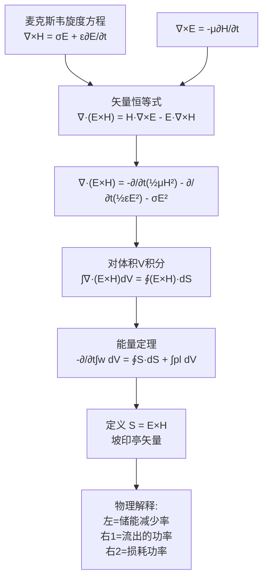

# 能量密度与坡印亭矢量 MOC

## 教科书原文

> 📖 参见：[[§7-6 能量密度与能流密度矢量]]

## 概念定义

坡印亭矢量回答了"电磁能量如何从一个地方跑到另一个地方"这个看似简单却极其深刻的问题。想象你用一个电池点亮远方的灯泡：能量不是沿着导线内部流动的！坡印亭的计算表明，能量实际上是通过导线周围的电磁场（空间中的电场$$\mathbf{E}$$和磁场$$\mathbf{H}$$）从电池传输到灯泡的。导线的作用只是"引导"电磁场沿着它走，就像铁轨引导火车一样——但火车（能量）是在铁轨上方（空间中）跑的，不是铁轨内部跑的。$$\mathbf{S} = \mathbf{E} \times \mathbf{H}$$ 就是告诉你能量流动的方向和大小。

## 类比与直觉

1. **商场扶梯与人群**：想象一个斜向上的自动扶梯（$$\mathbf{S}$$方向），扶梯上站满了人。每个人代表一个微小的能量包。扶梯的运动方向（$$=\mathbf{E} \times \mathbf{H}$$方向）告诉你能量流向哪里，而扶梯上人的密度（$$EH$$乘积）告诉你单位时间运送了多少能量。电场$$\mathbf{E}$$和磁场$$\mathbf{H}$$必须同时非零且不平行，才有能量流动——就像扶梯必须有斜度才能把人运上去。

2. **河流中的能量传送**：河水流动（电流）确实携带动能，但真正把水从上游运到下游的是重力场（$$\mathbf{E}$$）和水压（$$\mathbf{H}$$）的联合作用。坡印亭告诉我们：即使电流在导线里面流，电磁能量实际上是通过导线外面的"电磁场河流"传输的。这个反直觉的认识是电磁学最深刻的洞察之一。

## 核心公式详释

**能量密度（瞬时值）**：
$$w(r,t) = \frac{1}{2}\varepsilon E^2(r,t) + \frac{1}{2}\mu H^2(r,t)$$

**坡印亭矢量（瞬时值）**：
$$\mathbf{S}(r,t) = \mathbf{E}(r,t) \times \mathbf{H}(r,t)$$
瞬时值大小：$$S(r,t) = E(r,t)H(r,t) \quad \text{(当 } \mathbf{E} \perp \mathbf{H} \text{ 时)}$$

**能量定理（积分形式）**：
$$-\frac{\partial}{\partial t}\int_{V} w \, dV = \oint_{S} \mathbf{S} \cdot d\mathbf{S} + \int_{V} p_l \, dV$$

**能量定理（文字表述）**：体积V内储能的减少率 = 穿过闭合面S流出的功率 + V内损耗的功率

| 符号 | 含义 | 单位 |
|------|------|------|
| $w_e$ | 电场能量密度 | J/m³ |
| $w_m$ | 磁场能量密度 | J/m³ |
| $w$ | 总电磁能量密度 | J/m³ |
| $\mathbf{S}$ | 坡印亭矢量（能流密度） | W/m² |
| $p_l$ | 损耗功率密度 | W/m³ |
| $\mathbf{E}, \mathbf{H}$ | 电场强度、磁场强度 | V/m, A/m |

**方向判据（右手定则）**：四指从$$\mathbf{E}$$弯向$$\mathbf{H}$$，拇指指向$$\mathbf{S}$$。

## 推导脉络

## 常见误区

1. **电能是通过导线内部传输的**：这是最普遍的误解。坡印亭矢量分析表明，直流电路中的能量是通过导线周围的电磁场在空间中传输的。导线内部的坡印亭矢量指向导线内部（径向），代表能量损耗（焦耳热），而导线外部的坡印亭矢量沿导线方向，代表能量传输。

2. **$$\mathbf{S}=\mathbf{E}\times\mathbf{H}$$ 只是一个数学定义，没有物理意义**：错误。能量定理严格证明了$$\mathbf{E}\times\mathbf{H}$$的闭合面积分等于体积内储能的减少率减去损耗。这不是定义，而是从麦克斯韦方程导出的守恒律。

3. **静态场中没有坡印亭矢量**：错误。只要$$\mathbf{E}$$和$$\mathbf{H}$$同时存在且不平行，就有坡印亭矢量。例如一根通有恒定电流的导线周围同时存在径向电场和角向磁场，坡印亭矢量沿导线方向。

4. **$$\mathbf{S}$$的方向就是电磁波传播方向**：在平面波中确实如此，但不是普遍成立。在驻波或近场中，$$\mathbf{S}$$的瞬时值可能来回振荡，平均值可能为零。

## 费曼检验

1. 一根通有直流电流I的长直导线，其电阻为R。用坡印亭矢量计算从导线表面流入导线的功率，验证它等于焦耳热$$I^2R$$。
2. 在均匀平面波中，证明平均坡印亭矢量 $$S_{av} = \frac{1}{2}\frac{E_0^2}{Z}$$，其中Z为波阻抗。
3. 电容器充电过程中，坡印亭矢量是如何从侧面流入电容器极板之间的？
4. 在理想导体表面，坡印亭矢量的法向分量是多少？为什么？

## 概念导航

- **前置概念**：[[电场能量 MOC]]、[[磁场能量 MOC]]、[[麦克斯韦方程组 MOC]]
- **后续概念**：[[复坡印亭矢量 MOC]]、[[平均功率密度]]、[[有功功率与无功功率]]
- **关联概念**：[[平面电磁波]]、[[能量定理]]、[[电磁辐射]]
- **进阶话题**：[[坡印亭矢量的物理直觉]]

## 自己理解

坡印亭矢量 $$\mathbf{S} = \mathbf{E} \times \mathbf{H}$$ 是电磁学中最反直觉但又最深刻的概念之一。我们从小到大被教导"电在导线里流"，但麦克斯韦方程告诉我们：能量是在场里面流的。导线不过是一个"波导"——它提供了电荷和电流，这些电荷和电流产生环绕导线的电磁场，而能量通过这些场从电源传输到负载。这个认识对于理解高频电路至关重要：在微波频段，"导线"变成了"波导"或"微带线"，能量传输完全通过场来进行。坡印亭矢量也解释了为什么电磁波可以在真空中传播——不需要介质，$$\mathbf{E}\times\mathbf{H}$$直接在空间中携带能量前行。

> 📖 参见：[[§7-6 能量密度与能流密度矢量]]
