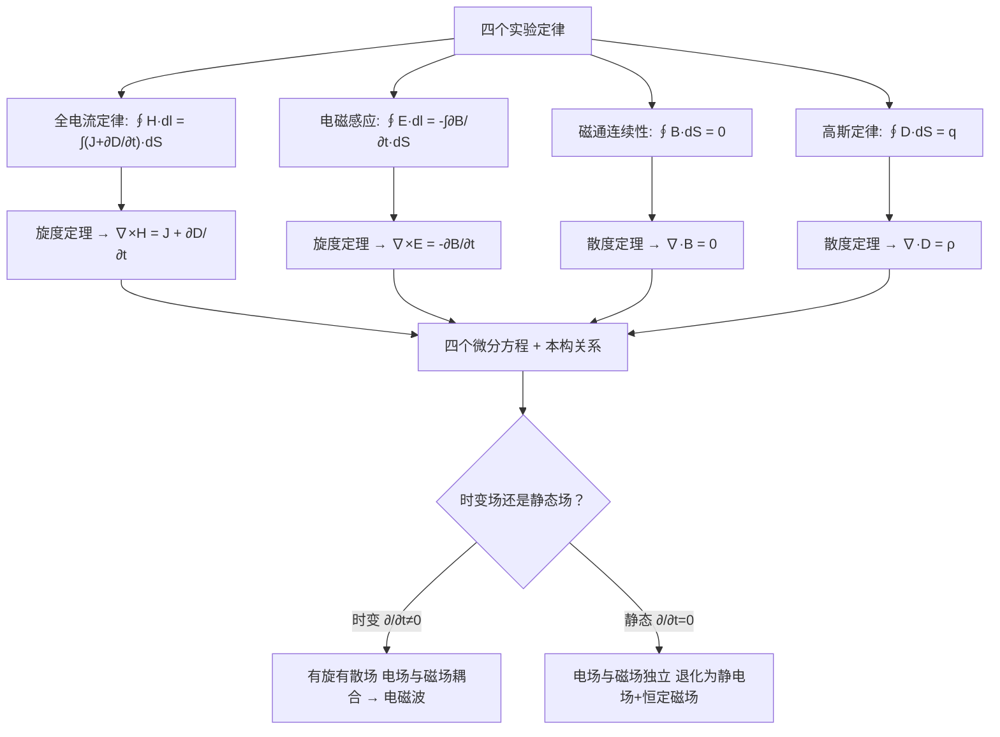
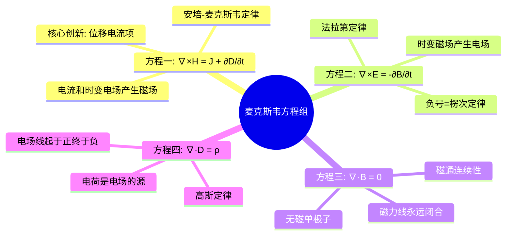
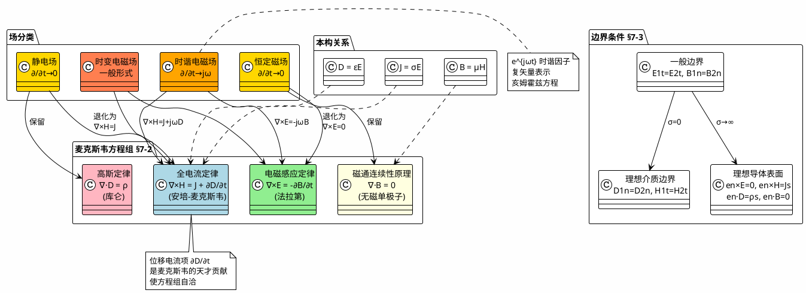

# 麦克斯韦方程组：四大方程的积分形式与微分形式
**关键词**：麦克斯韦方程组, ∇×, ∇·, Maxwell, 本构关系

## 概念定义

**麦克斯韦方程组**是描述宏观电磁现象最完备的数学框架。四个方程分别概括了静电场的高斯定律、磁通连续性原理、法拉第电磁感应定律和全电流定律，由麦克斯韦在 1865 年总结归纳而成。这组方程在电磁学中的地位，相当于牛顿三定律在经典力学中的地位。

**积分形式**（描述有限区域内的场与源的关系）：

$$\oint_l \mathbf{H} \cdot d\mathbf{l} = \int_S \left( \mathbf{J} + \frac{\partial \mathbf{D}}{\partial t} \right) \cdot d\mathbf{S} \quad \text{(7-2-1a)}$$

$$\oint_l \mathbf{E} \cdot d\mathbf{l} = -\int_S \frac{\partial \mathbf{B}}{\partial t} \cdot d\mathbf{S} \quad \text{(7-2-1b)}$$

$$\oint_S \mathbf{B} \cdot d\mathbf{S} = 0 \quad \text{(7-2-1c)}$$

$$\oint_S \mathbf{D} \cdot d\mathbf{S} = q \quad \text{(7-2-1d)}$$

**微分形式**（描述空间每一点上场的变化规律）：

$$\nabla \times \mathbf{H} = \mathbf{J} + \frac{\partial \mathbf{D}}{\partial t} \quad \text{(7-2-2a)}$$

$$\nabla \times \mathbf{E} = -\frac{\partial \mathbf{B}}{\partial t} \quad \text{(7-2-2b)}$$

$$\nabla \cdot \mathbf{B} = 0 \quad \text{(7-2-2c)}$$

$$\nabla \cdot \mathbf{D} = \rho \quad \text{(7-2-2d)}$$

## 类比与直觉

**类比一：四张"交通规则"牌描述整个城市的车流**

想象一个城市的交通系统需要四张规则牌来完整描述：
- **牌一（∇·D = ρ）**："所有车辆必须从车库（正电荷）出发，到目的地（负电荷）停下"——没有其他地方可以产生或消灭车辆。
- **牌二（∇·B = 0）**："在环城高速上，车辆永远绕圈，绝不会凭空出现或消失"——你没有见过只有一端的磁铁。
- **牌三（∇×E = -∂B/∂t）**："每当环城高速上发生堵车变化（磁场变化），整个区域的车流都会开始绕行（产生涡旋电场）"——这就是发电机和变压器的工作原理。
- **牌四（∇×H = J + ∂D/∂t）**："车流（电流）和新建道路（变化的电场）都会产生环形拥堵（磁场）"——这就是电磁铁和电磁波的工作原理。

**类比二：水的循环系统**

- 方程一（∇·D = ρ）：水源（水龙头打开=正源，水漏走=负源）
- 方程二（∇·B = 0）：没有"水的创造"也没有"水的消失"
- 方程三（∇×E = -∂B/∂t）：水流速变化 → 水面上出现漩涡
- 方程四（∇×H = J + ∂D/∂t）：水位变化 + 水流 → 产生漩涡

## 教科书推导：逐步拆解

### 第1步：四个方程的来源

教科书明确指出，麦克斯韦归纳下述四个方程来完整描述时变电磁场：

**第一方程（全电流定律）**：积分形式来自 §7-1 的式 (7-1-7)，微分形式来自式 (7-1-8)。这是**修正后的安培环路定律**，加入了位移电流项 $$\partial \mathbf{D}/\partial t$$。

**第二方程（电磁感应定律）**：积分形式来自第六章的式 (6-1-3)，$$\oint_l \mathbf{E} \cdot d\mathbf{l} = -\int_S \frac{\partial \mathbf{B}}{\partial t} \cdot d\mathbf{S}$$。这是**法拉第电磁感应定律的麦克斯韦表述**——时变磁场产生涡旋电场。负号体现楞次定律：感应电场的方向反抗磁通量的变化。

**第三方程（磁通连续性原理）**：$$\oint_S \mathbf{B} \cdot d\mathbf{S} = 0$$，这是从恒定磁场推广而来的——**自然界不存在磁单极子（磁荷）**，磁力线永远是闭合的。

**第四方程（高斯定律）**：$$\oint_S \mathbf{D} \cdot d\mathbf{S} = q$$，这是从静电场推广而来的——**闭合面的电通量等于面内包围的总自由电荷量**。教科书指出，静态场中的高斯定律及磁通连续性原理对于时变电磁场仍然成立。

### 第2步：从积分形式到微分形式 —— 散度定理和旋度定理的应用

教科书利用两个基本定理完成转换：

**对积分形式 (7-2-1a)** 左边应用旋度定理 $$\oint_l \mathbf{H} \cdot d\mathbf{l} = \int_S (\nabla \times \mathbf{H}) \cdot d\mathbf{S}$$：

$$\int_S (\nabla \times \mathbf{H}) \cdot d\mathbf{S} = \int_S \left( \mathbf{J} + \frac{\partial \mathbf{D}}{\partial t} \right) \cdot d\mathbf{S}$$

对任意曲面 $$S$$ 成立 → 得 $$\nabla \times \mathbf{H} = \mathbf{J} + \frac{\partial \mathbf{D}}{\partial t}$$ (7-2-2a)

**同理对 (7-2-1b)** 应用旋度定理 → 得 $$\nabla \times \mathbf{E} = -\frac{\partial \mathbf{B}}{\partial t}$$ (7-2-2b)

**对 (7-2-1c)** 应用散度定理 → 得 $$\nabla \cdot \mathbf{B} = 0$$ (7-2-2c)

**对 (7-2-1d)** 应用散度定理 → 得 $$\nabla \cdot \mathbf{D} = \rho$$ (7-2-2d)

### 第3步：四个方程不是完全独立的 —— 方程之间的内在联系

教科书通过两个关键的推导展示了方程之间的相互关联：

**(a) 由第一方程 (7-2-2a) 和电荷守恒定律 (7-2-3) 导出第四方程 (7-2-2d)：**

对 $$\nabla \times \mathbf{H} = \mathbf{J} + \partial \mathbf{D}/\partial t$$ 两边取散度：

$$0 = \nabla \cdot \mathbf{J} + \frac{\partial}{\partial t}(\nabla \cdot \mathbf{D})$$

代入电荷守恒定律 $$\nabla \cdot \mathbf{J} = -\partial \rho/\partial t \quad \text{(7-2-3)}$$：

$$\frac{\partial}{\partial t}(\nabla \cdot \mathbf{D} - \rho) = 0$$

即在任何时刻 $$\nabla \cdot \mathbf{D} - \rho = \text{常数}$$。考虑到 $$t = 0$$ 时 $$\mathbf{D} = 0, \rho = 0$$，常数应为零，因此 $$\nabla \cdot \mathbf{D} = \rho$$。

**(b) 由第二方程 (7-2-2b) 导出第三方程 (7-2-2c)：**

对 $$\nabla \times \mathbf{E} = -\partial \mathbf{B}/\partial t$$ 两边取散度：

$$0 = -\frac{\partial}{\partial t}(\nabla \cdot \mathbf{B})$$

因此 $$\nabla \cdot \mathbf{B} = \text{常数}$$。考虑到 $$t = 0$$ 时 $$\mathbf{B} = 0$$，常数应为零，得 $$\nabla \cdot \mathbf{B} = 0$$。

**结论**：四个方程中，旋度方程 (7-2-2a) 和 (7-2-2b) 是核心，散度方程 (7-2-2c) 和 (7-2-2d) 可以从旋度方程和电荷守恒导出（配合适当的初始条件）。

### 第4步：本构关系 —— 场与介质的桥梁

麦克斯韦方程组还需要补充介质特性方程才能封闭求解。教科书给出了线性、各向同性介质中的本构关系：

$$\mathbf{D} = \varepsilon \mathbf{E} \quad \text{(7-2-4)}$$

$$\mathbf{B} = \mu \mathbf{H} \quad \text{(7-2-5)}$$

$$\mathbf{J} = \sigma \mathbf{E} + \mathbf{J}' \quad \text{(7-2-6)}$$

其中 $$\mathbf{J}'$$ 代表产生时变电磁场的除位移电流、传导电流和磁化电流之外的其他形式外源（如天线上的激励电流）。

### 第5步：时变电磁场的散度与旋度特性分析

由微分形式的麦克斯韦方程组可以分析场的旋涡特性：

- **时变电场**：$$\nabla \cdot \mathbf{D} = \rho$$ → 有散；$$\nabla \times \mathbf{E} = -\partial \mathbf{B}/\partial t$$ → 有旋。时变电场是**有旋有散场**。
- **时变磁场**：$$\nabla \cdot \mathbf{B} = 0$$ → 无散；$$\nabla \times \mathbf{H} = \mathbf{J} + \partial \mathbf{D}/\partial t$$ → 有旋。时变磁场是**有旋无散场**。

在电荷及电流均不存在的**无源区**（$$\rho = 0, \mathbf{J} = 0$$）中，时变电磁场是**有旋无散场**。电场线和磁场线相互铰链、自行闭合，在空间形成电磁波。教科书特别指出：在无源区中，由 (7-2-2a) 和 (7-2-2b) 可见**时变电场的方向与时变磁场的方向处处相互垂直**。

### 第6步：静态极限 —— 回到熟悉的静电场和恒定磁场

对于不随时间变化的静态场：

$$\frac{\partial \mathbf{E}}{\partial t} = \frac{\partial \mathbf{D}}{\partial t} = \frac{\partial \mathbf{H}}{\partial t} = \frac{\partial \mathbf{B}}{\partial t} = 0$$

麦克斯韦方程组退化为：
- 静电场方程：$$\nabla \times \mathbf{E} = 0$$，$$\nabla \cdot \mathbf{D} = \rho$$
- 恒定磁场方程：$$\nabla \times \mathbf{H} = \mathbf{J}$$，$$\nabla \cdot \mathbf{B} = 0$$

**电场和磁场不再相关，彼此独立**——这是静态场的本质特征。

## Mermaid推导流程图

### 四个方程的"角色分工"

## MATLAB可视化提示词

- **功能描述**：可视化麦克斯韦方程组四个方程的物理含义——用四子图分别展示：(1) ∇·D = ρ 展示点电荷周围的电场线辐射，(2) ∇·B = 0 展示磁铁周围的闭合磁力线，(3) ∇×E = -∂B/∂t 展示变化的磁场产生涡旋电场，(4) ∇×H = J + ∂D/∂t 展示导线电流和变化的电场产生环绕磁场。
- **输入参数**：各子图的物理参数（电荷量 q，电流 I，频率 f，显示范围），介质参数（ε, μ, σ），时间点。
- **输出要求**：2×2 子图布局——左上：点电荷周围电场 quiver 箭头 + 闭合高斯面的通量标注，右上：磁铁周围闭合磁力线 streamlines + ∇·B = 0 标注，左下：线圈中变化的 B 和感应电场 E 的 quiver 箭头，右下：导线周围的磁场 H 环 + 极板间位移电流的彩色填充标注。
- **代码结构**：分别计算四个子图中涉及的场量 → 设置子图布局 → 绘制场量（quiver/streamline/surf） → 添加标题（公式+物理意义）和说明文字。
- **注释要求**：每个子图标题用中文标注方程名称和物理意义，关键物理量用变量名标注。
- **错误处理**：检查各物理参数的合理性，确保显示范围与物理尺寸一致。

## 常见误区

1. **四个方程不是完全独立的**：教科书通过两个推导证明，散度方程（∇·B = 0, ∇·D = ρ）在给定适当初始条件下可以从旋度方程和电荷守恒定律导出。但这不意味着散度方程是多余的——它们提供了场在不同条件下必须满足的额外约束。

2. **静态极限下电场和磁场解耦**：在 $$\partial/\partial t = 0$$ 的极限下，∇×E = 0 和 ∇×H = J 彼此独立——这就是为什么我们在前六章可以分开学习静电学和静磁学。但在时变场中，两个旋度方程通过时间导数项相互耦合，形成电磁波的基础。

3. **积分形式和微分形式描述的是同一物理定律**：积分形式适用于有限区域，反映场与源的整体关系；微分形式适用于每个空间点，反映场的局部变化。两者通过散度定理和旋度定理等价转换。

4. **麦克斯韦方程组+本构关系+边界条件 = 完整的电磁问题描述**：仅靠四个方程本身不足以求解具体的电磁问题。还需要介质的本构关系（D = εE, B = μH, J = σE）和具体问题的边界条件/初始条件。这正是电磁场数学求解的"三部曲"。

5. **无源区中 ∇·D = 0 并不意味着没有电场**：仅仅是没有自由电荷作为源。无源区中的电场可以由边界条件（如导体上的电荷）或时变磁场感应产生。此时 ∇·D = 0 表示电场线在无源区内连续穿过，既不起始于某点也不终止于某点。

## 费曼检验

1. 用麦克斯韦方程组的微分形式解释：为什么在无源区（ρ = 0, J = 0）中，即使没有电荷和电流，电磁场也可以存在？（提示：∇×E = -∂B/∂t 和 ∇×H = ∂D/∂t 构成相互耦合的方程对，允许时变的 E 和 H 在真空中通过相互感应来存在和传播。）

2. 对 ∇×H = J + ∂D/∂t 两边取散度，说明为什么安培原始定律（∇×H = J）在时变场中会与电荷守恒定律矛盾。（提示：∇·(∇×H) ≡ 0（旋度的散度恒为零），所以 ∇·J = 0。但在时变场中，∇·J = -∂ρ/∂t ≠ 0——矛盾！加入 ∂D/∂t 项后，∇·(J + ∂D/∂t) = -∂ρ/∂t + ∂(∇·D)/∂t = -∂ρ/∂t + ∂ρ/∂t = 0，数学自洽性恢复。）

3. 从能量角度解释：为什么麦克斯韦方程组的第二个方程（法拉第定律）中的负号是必须的？（提示：负号对应楞次定律——感应电流的方向总是反抗引起感应的磁通量变化。如果没有负号，感应电流将"增强"磁通量变化 → 正反馈 → 能量会无中生有，违背能量守恒定律。）

## 概念导航

- 前置概念：[[位移电流/电容器充电悖论与位移电流的引入]]、[[法拉第电磁感应定律的旋度形式]]、[[矢量场的通量、散度与散度定理/散度的定义：矢量场的源强度]]、[[矢量场的环量、旋度与旋度定理/旋度的定义与方向判定]]
- 后续概念：[[时谐电磁场/复数表示法的引入]]、[[从麦克斯韦到波动方程的推导]]、[[坡印廷矢量]]
- 关联概念：[[亥姆霍兹定理：矢量场的唯一分解]]、[[电磁场的边界条件]]

> 📖 **教科书参考**：§7-2, p.174-176

## 可视化图表

