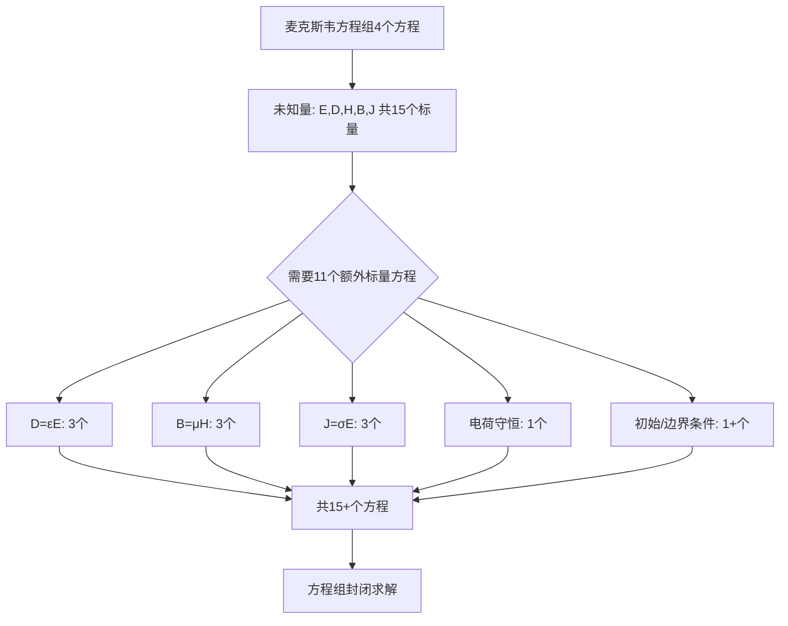

---
tags: [电磁场, 时变电磁场, 本构关系, 介质]
chapter: "第7章"
textbook_section: "§7-2"
textbook_page: "175"
type: core-concept
importance: 🟡
exam_frequency: ★★
exam_type: 计
difficulty: basic
level: ★
created: 2026-04-28
---

# 本构关系：$$D=\varepsilon E$$，$$B=\mu H$$，$$J=\sigma E$$
**关键词**：麦克斯韦方程组, ∇×, ∇·, Maxwell, 本构关系

📌 **一句话本质**：本构关系是介质对场的响应方程——D=εE是极化响应，B=μH是磁化响应，J=σE是导电响应
🏷️ **重要度**：🟡 | 考试：★★ | 题型：计

## 🔧工程场景

微波介质基板选型——根据ε,tanδ选择PCB基板材料，ε偏差0.1导致微带线阻抗失配

## 教科书原文

> 📖 参见：[[§7-2 麦克斯韦方程]]

## 概念定义（费曼第1步）
这三条公式告诉你：同一个电场 E，在不同材料中会产生不同的电通密度 D（$$\varepsilon$$ 决定）、不同的电流密度 J（$$\sigma$$ 决定）；同一个磁场 H，在不同材料中会产生不同的磁通密度 B（$$\mu$$ 决定）。它们是材料和电磁场之间的"翻译官"。

## 🧠类比与直觉（费曼第2步）

**类比1：推购物车**
- 同样用10牛推购物车（E = 10）→ 在光滑地板上（$$\sigma$$ 小）跑得飞快（J 大不大要看 $$\sigma$$）→ 在泥地里（$$\sigma$$ 大）几乎推不动但耗能大
- $$\varepsilon$$ 像购物车的弹性：同样推力下弹性越好的车越容易变形
- $$\mu$$ 像购物车的惯性质量：越重越难加速

**类比2：音响系统**
- E = 音频信号（电压），D = 纸盆位移（电通），$$\varepsilon$$ = 扬声器灵敏度
- H = 功放输出（磁场），B = 实际磁通，$$\mu$$ = 磁芯效率
- $$\sigma$$ = 导线电阻——信号在其中衰减

🔖 **口诀**：三方程定介质，εμσ全概括

## 核心公式详释

### 公式1：$$D = \varepsilon E = \varepsilon_0 \varepsilon_r E$$

| 符号 | 含义 | 物理意义 |
|------|------|----------|
| $D$ | 电通密度 | 单位面积通过的电通量，包含真空+极化贡献 |
| $\varepsilon$ | 介电常数 | 介质"允许"电场通过的能力 |
| $\varepsilon_0$ | 真空介电常数 | $8.854 \times 10^{-12}$$ F/m |
| $\varepsilon_r$ | 相对介电常数 | 介质相对于真空的电容率倍数 |
| $E$ | 电场强度 | 单位电荷受力 |

### 公式2：$$B = \mu H = \mu_0 \mu_r H$$

| 符号 | 含义 | 物理意义 |
|------|------|----------|
| $B$ | 磁通密度 | 单位面积的磁通量，产生感应电动势的是B |
| $\mu$ | 磁导率 | 介质"允许"磁场通过的能力 |
| $\mu_0$ | 真空磁导率 | $4\pi \times 10^{-7}$$ H/m |
| $\mu_r$ | 相对磁导率 | 介质相对于真空的磁导率倍数 |
| $H$ | 磁场强度 | 由自由电流产生的磁化力 |

### 公式3：$$J = \sigma E + J'$$

| 符号 | 含义 | 物理意义 |
|------|------|----------|
| $J$ | 传导电流密度 | 介质中自由电荷定向运动的电流密度 |
| $\sigma$ | 电导率 | 介质导电能力，S/m |
| $J'$ | 外源电流密度 | 天线馈电等外加激励 |

## D 与 E、B 与 H 的区别

| 场量对 | 哪个更"基本" | 包含极化/磁化? | 在真空中的关系 |
|--------|:---:|:---:|------|
| E (电场强度) | 基本量 | 不含极化 | $D = \varepsilon_0 E$ |
| D (电通密度) | 导出量 | 含极化效应 | 同上 |
| B (磁通密度) | 基本量 | 含磁化效应 | $B = \mu_0 H$ |
| H (磁场强度) | 导出量 | 不含磁化 | 同上 |

重要认识：**法拉第定律用的是 B 不是 H**（$$\nabla \times E = -\partial B/\partial t$$），因为感应电动势由磁通密度的变化产生。而**安培定律中用的是 H**（$$\nabla \times H = J + \partial D/\partial t$$），因为磁场由自由电流产生。

## 📐推导脉络

## ⚠️常见误区

1. **误区**：E 和 D、B 和 H 在非真空介质中是同一个东西。
   **修正**：E 和 D 在介质中完全不同。例如在介质内部，E 可能较小（受极化反向电场抵消），但 D 由自由电荷决定保持不变。B 和 H 也类似。

2. **误区**：$$\varepsilon_r$$ 总是大于 1。
   **修正**：对于等离子体、金属在光频下，$$\varepsilon_r$$ 可能小于 1 甚至为负值。但常规介质中 $$\varepsilon_r \geq 1$$。

3. **误区**：本构关系中的 $$\sigma$$ 是常数。
   **修正**：半导体的 $$\sigma$$ 随温度剧烈变化（负温度系数），金属的 $$\sigma$$ 也随温度变化（正温度系数）。在高频时还需考虑趋肤效应使有效电阻增大。

4. **误区**：$$J = \sigma E$$ 在任何情况下都成立。
   **修正**：这是线性各向同性介质的欧姆定律。在各向异性介质（如石墨）中，$$\sigma$$ 是一个张量（3×3矩阵），J 的方向不一定与 E 平行。

## ❓费曼检验

**问题1**：真空中 D 和 E 的关系是什么？此时麦克斯韦方程 $$\nabla \cdot D = \rho$$ 可以写成什么形式？
> 提示：真空中 $$\varepsilon_r = 1$$

**问题2**：一个电容器极板间填充了 $$\varepsilon_r = 4$$ 的介质。保持极板电荷不变，插入介质后电场强度 E 和电通密度 D 分别如何变化？
> 提示：D 由自由电荷决定（$$\oint D \cdot dS = q$$），E 由 D 和 $$\varepsilon$$ 共同决定

**问题3**：为什么法拉第定律中用 $$\partial B/\partial t$$ 而不用 $$\partial H/\partial t$$？
> 提示：考虑感应电动势的物理来源

## 🔗概念导航
- 前置：[[本构关系]]、[[麦克斯韦方程组 MOC]]
- 关联：[[介质极化]]、[[介质磁化]]
- 后续：[[等效介电常数]]、[[导电介质中的平面电磁波]]

## 自己理解（费曼复述）
> 学完本节后，用自己的大白话写一段解释。
> （在这里写你的理解）
> 📖 参见：[[§7-2 麦克斯韦方程]]
