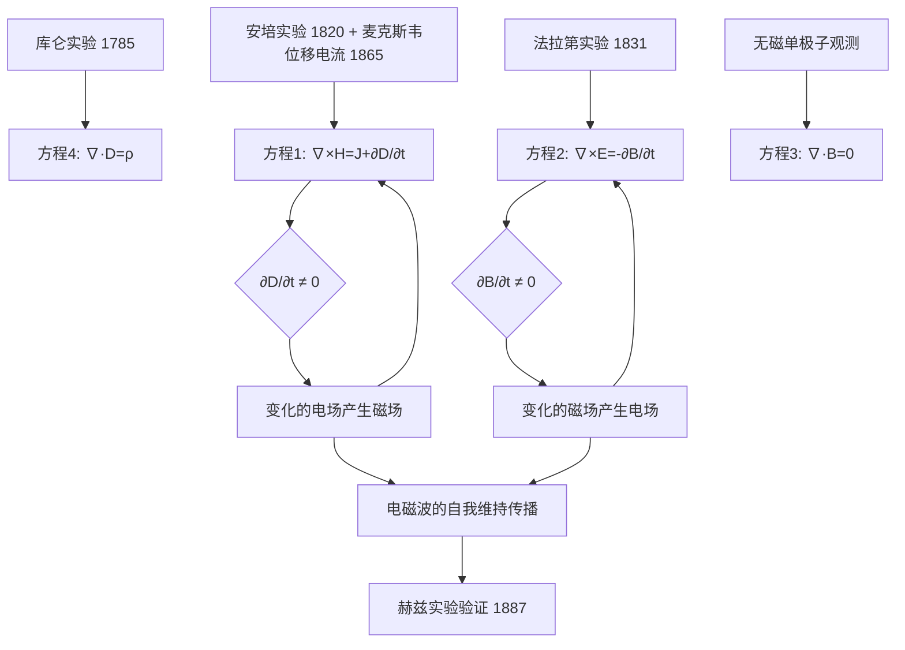
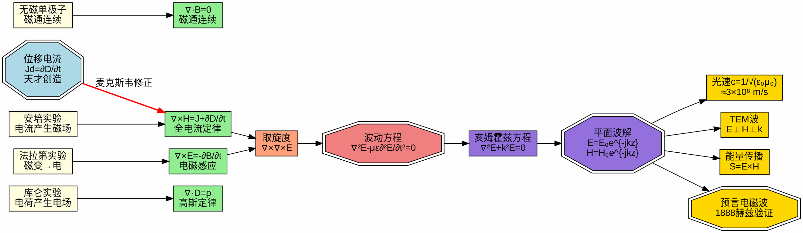

# 麦克斯韦方程组：每个方程的物理意义与对应实验
**关键词**：麦克斯韦方程组, ∇×, ∇·, Maxwell, 本构关系

📌 **一句话本质**：四个方程来自四个实验定律——库仑、磁通连续、法拉第、安培-麦克斯韦——每个方程分别管理电场源、磁单极、电磁感应和磁场的源
🏷️ **重要度**：🔴 | 考试：★★★ | 题型：简

## 🔧工程场景

天线设计——四方程联立求解辐射场。如果漏了∂D/∂t项，天线只发热不辐射，能量全困在近场区。

## 教科书原文

> 📖 参见：[[§7-2 麦克斯韦方程]]

## 概念定义（费曼第1步）
麦克斯韦方程组是描述电磁场行为的四个方程——它们告诉你电荷和电流如何产生电场和磁场，以及变化的电场和磁场如何互相"生出"对方。就像四条交通规则共同管理了所有电磁现象的高速公路。

## 🧠类比与直觉（费曼第2步）

**类比1：多米诺骨牌链**
法拉第方程（$$\nabla \times E = -\partial B/\partial t$$）像是"变化的磁场推倒电场这块骨牌"，而安培-麦克斯韦方程（$$\nabla \times H = J + \partial D/\partial t$$）像是"变化的电场推倒磁场这块骨牌"。两块骨牌互相推倒，形成永不停止的电磁波链——这就是光！

**类比2：会计的收支平衡**
高斯定律（$$\nabla \cdot D = \rho$$）像会计记录：电荷是电场的"收入来源"，负电荷是"支出"。磁通连续性（$$\nabla \cdot B = 0$$）说明磁场永远收支平衡——不存在单独的"磁荷收入"。

🔖 **口诀**：四方程统天下，电磁一体不分家

## 核心公式详释

### 方程1：全电流定律（安培-麦克斯韦）
$$\nabla \times H = J + \frac{\partial D}{\partial t}$$

| 符号 | 含义 | 单位 |
|------|------|------|
| $H$ | 磁场强度 | A/m |
| $J$ | 传导电流密度 | A/m² |
| $D$ | 电通密度（电位移矢量） | C/m² |
| $\partial D/\partial t$ | 位移电流密度 | A/m² |
| $\nabla \times$ | 旋度算子 | 1/m |

### 方程2：法拉第电磁感应定律
$$\nabla \times E = -\frac{\partial B}{\partial t}$$

| 符号 | 含义 | 单位 |
|------|------|------|
| $E$ | 电场强度 | V/m |
| $B$ | 磁通密度（磁感应强度） | T (Wb/m²) |
| 负号 | 楞次定律：感应电场阻碍磁通变化 | — |

### 方程3：磁通连续性原理
$$\nabla \cdot B = 0$$

| 符号 | 含义 | 单位 |
|------|------|------|
| $\nabla \cdot$ | 散度算子 | 1/m |
| 恒为0 | 不存在磁单极子 | — |

### 方程4：高斯定律
$$\nabla \cdot D = \rho$$

| 符号 | 含义 | 单位 |
|------|------|------|
| $\rho$ | 自由电荷体密度 | C/m³ |

## 四大方程：从实验到数学

| # | 微分形式 | 积分形式 | 来源实验 | 实验者 | 年代 |
|---|----------|----------|----------|--------|------|
| 1 | $\nabla \times H = J + \frac{\partial D}{\partial t}$ | $\oint_l H \cdot dl = I + \int \frac{\partial D}{\partial t} \cdot dS$ | 安培实验 + 麦克斯韦修正 | 安培/麦克斯韦 | 1820/1865 |
| 2 | $\nabla \times E = -\frac{\partial B}{\partial t}$ | $\oint_l E \cdot dl = -\int \frac{\partial B}{\partial t} \cdot dS$ | 法拉第电磁感应 | 法拉第 | 1831 |
| 3 | $\nabla \cdot B = 0$ | $\oint_S B \cdot dS = 0$ | 无磁单极子 | 高斯/实验 | - |
| 4 | $\nabla \cdot D = \rho$ | $\oint_S D \cdot dS = q$ | 库仑定律 | 库仑 | 1785 |

## 方程1：全电流定律 —— 电流和变化电场产生磁场

**物理图像**：任何电流（传导+位移）周围环绕着磁场。磁场 H 沿闭合回路的环量 = 穿过该回路的总全电流。

$$\nabla \times H = J + \frac{\partial D}{\partial t}$$

- **J 项**：传导电流 + 运流电流 → 恒定磁场（安培原版）
- **$$\partial D/\partial t$$ 项**：位移电流 → 麦克斯韦的天才修正 → 变化的电场也产生磁场
- **实验基础**：奥斯特发现电流产生磁场（1820），安培定量总结（1820-1825），麦克斯韦添加位移电流项（1865）

## 方程2：法拉第电磁感应定律 —— 变化磁场产生电场

$$\nabla \times E = -\frac{\partial B}{\partial t}$$

- **负号的意义**：楞次定律——感应电场的方向总是阻碍磁通的变化
- **实验**：法拉第（1831）：磁铁插入线圈 → 电流计偏转。磁铁不动 → 无电流
- **应用**：发电机、变压器、感应加热、无线充电

## 方程3：磁通连续性原理 —— 不存在磁单极子

$$\nabla \cdot B = 0$$

- **含义**：磁力线永远闭合，无起点无终点。无法隔离出单独的N极或S极
- **数学推论**：B 可表示为矢量位的旋度 $$B = \nabla \times A$$

## 方程4：高斯定律 —— 电荷产生电场

$$\nabla \cdot D = \rho$$

- 正电荷：电场的"源泉"（D线从正电荷出发）
- 负电荷：电场的"漏洞"（D线终止于负电荷）
- **实验基础**：库仑扭秤实验（1785）

## 方程的相互关系

方程1和方程2形成**正反馈循环**：
变化的电场（$$\partial D/\partial t$$） → 磁场（方程1） → 变化的磁场（$$\partial B/\partial t$$） → 电场（方程2） → ... → **电磁波**以光速传播！

方程3和方程4可由方程1+方程2+电荷守恒推导（在特定条件下），但习惯上仍并列为四个基本方程。

## 📐推导脉络

## ⚠️常见误区

1. **误区**：四个方程相互完全独立。
   **修正**：方程3和方程4可由方程1和方程2配合电荷守恒推导。但习惯上仍并列为四个基本方程。

2. **误区**：麦克斯韦方程组是从实验中完全"推导"出来的。
   **修正**：方程1的位移电流项是麦克斯韦的理论假设，并非从实验直接得出。赫兹实验（1887）才验证了电磁波的存在。

3. **误区**：麦克斯韦方程组中的$$\partial D/\partial t$$就是电容器中的真实电流。
   **修正**：位移电流不是电荷的运动，不产生焦耳热。它是麦克斯韦为了保持方程的自洽性而引入的理论构造。在真空中传播的电磁波中，$$\partial D/\partial t$$代表了变化的电场产生磁场的机制。

4. **误区**：麦克斯韦方程组只适用于真空。
   **修正**：配合本构关系 $$D = \varepsilon E$$, $$B = \mu H$$, $$J = \sigma E$$，麦克斯韦方程组适用于任意线性、各向同性的介质。

## ❓费曼检验

**问题1**：如果不存在位移电流项，麦克斯韦方程组会产生什么矛盾？
> 提示：对 $$\nabla \times H = J$$ 两边取散度

**问题2**：从方程1和方程2出发，说明为什么电磁波可以在真空中传播。
> 提示：真空中 $$J = 0, \rho = 0$$

**问题3**：方程2中的负号如果改成正号（$$\nabla \times E = +\partial B/\partial t$$），物理上意味着什么？
> 提示：考虑能量守恒

## 🔗概念导航
- 前置：[[四大方程的积分形式与微分形式]]、[[位移电流 MOC]]
- 关联：[[本构关系]]、[[电磁波]]、[[坡印亭定理的推导]]
- 后续：[[麦克斯韦方程组的对称性]]、[[复麦克斯韦方程组]]

## 自己理解（费曼复述）
> 学完本节后，用自己的大白话写一段解释。
> （在这里写你的理解）
✂️

> 📖 参见：[[§7-2 麦克斯韦方程]]

## 可视化图表

