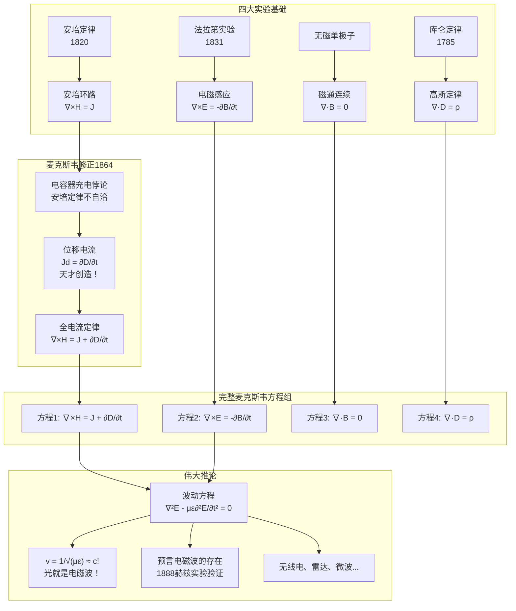
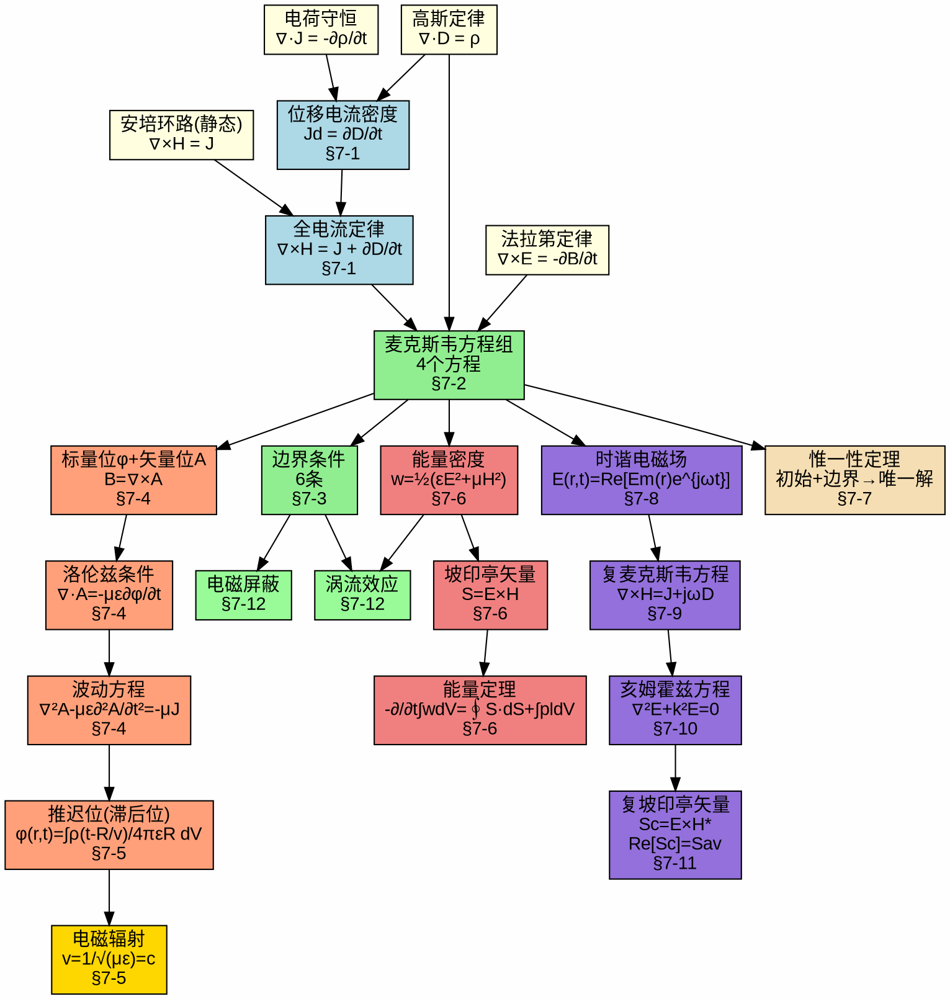

# 麦克斯韦方程组 MOC

## 教科书原文

> 📖 参见：[[§7-2 麦克斯韦方程]]

## 概念定义

麦克斯韦方程组就像一套四个"规则卡片"，完整地规定了电磁场如何随时间和空间变化。想象你在玩一个沙盒游戏，里面有"电荷""电流""电场""磁场"四种东西。麦克斯韦方程组告诉你：规则1——电流和变化的电场能产生漩涡状的磁场；规则2——变化的磁场能产生漩涡状的电场；规则3——磁场永远是闭合的，没有起点也没有终点（没有磁单极子）；规则4——电场从正电荷出发，终止于负电荷。就这么四条规则，加上介质特性（$$D=\varepsilon E, B=\mu H, J=\sigma E$$），就能描述从静电复印到手机信号到太阳光的一切电磁现象。

## 类比与直觉

1. **交响乐团的四个声部**：麦克斯韦方程组就像一个交响乐谱的四个声部——每个方程是一个声部，分别规定了电场的旋度来源（全电流）、磁场的旋度来源（变化电场负号）、磁场的散度（永远为零）、电场的散度（来自电荷）。单独一个声部听不出旋律，四个声部一起演奏，就是完整的电磁交响曲——从静电场到光波，无所不包。

2. **四条交通规则**：想象一个城市只有四条交通规则就能管理所有车辆。规则1：车辆（磁场漩涡）由车流密度（电流）和变化中的拥堵（位移电流）产生。规则2：变化中的车辆密度产生新的交通波。规则3：任何路口车辆总数守恒（没有车辆凭空消失）。规则4：所有车辆从停车场（正电荷）出发，必须到达目的地（负电荷）。四条规则，管理一切交通——这就是麦克斯韦方程组的优雅。

## 核心公式详释

**微分形式（完整版）**：
$$\nabla \times \mathbf{H} = \mathbf{J} + \frac{\partial \mathbf{D}}{\partial t} \quad \text{全电流定律}$$
$$\nabla \times \mathbf{E} = -\frac{\partial \mathbf{B}}{\partial t} \quad \text{法拉第电磁感应定律}$$
$$\nabla \cdot \mathbf{B} = 0 \quad \text{磁通连续性原理}$$
$$\nabla \cdot \mathbf{D} = \rho \quad \text{高斯定律}$$

**本构关系（介质特性方程）**：
$$\mathbf{D} = \varepsilon \mathbf{E}, \quad \mathbf{B} = \mu \mathbf{H}, \quad \mathbf{J} = \sigma \mathbf{E} + \mathbf{J}'$$

| 符号 | 含义 | 单位 | 类型 |
|------|------|------|------|
| $\mathbf{E}$ | 电场强度 | V/m | 场量 |
| $\mathbf{D}$ | 电通密度 | C/m² | 场量 |
| $\mathbf{H}$ | 磁场强度 | A/m | 场量 |
| $\mathbf{B}$ | 磁通密度 | T (Wb/m²) | 场量 |
| $\mathbf{J}$ | 电流密度 | A/m² | 源量 |
| $\rho$ | 电荷密度 | C/m³ | 源量 |
| $\varepsilon$ | 介电常数 | F/m | 介质参数 |
| $\mu$ | 磁导率 | H/m | 介质参数 |
| $\sigma$ | 电导率 | S/m | 介质参数 |

**方程独立性与自洽性**：
- 由 $$\nabla \cdot (\nabla \times \mathbf{H}) = 0$$ 和电荷守恒可导出 $$\nabla \cdot \mathbf{D} = \rho$$
- 由 $$\nabla \cdot (\nabla \times \mathbf{E}) = 0$$ 可导出 $$\nabla \cdot \mathbf{B} = 0$$
- 四个方程中只有两个旋度方程是独立的！两个散度方程可作为初始条件

## 推导脉络

## 常见误区

1. **四个方程完全独立**：错误。只有两个旋度方程是真正独立的。对全电流定律取散度，结合电荷守恒定律，可以直接导出高斯定律。对法拉第定律取散度可以直接导出磁通连续性原理。四个方程是冗余的——这种冗余恰恰保证了方程组的自洽性。

2. **麦克斯韦方程组只在真空中成立**：错误。加上本构关系（$$D=\varepsilon E, B=\mu H, J=\sigma E$$）后，适用于任何线性、各向同性介质。对非线性介质（如铁磁体）需要更复杂的本构关系。

3. **静态场是麦克斯韦方程组的特例**：这句话本身正确，但需要注意的是——静态场中 $$\partial/\partial t = 0$$，此时电场和磁场完全解耦，成为两个独立的问题。麦克斯韦的核心贡献恰恰是发现了它们在时变情况下的耦合关系。

4. **麦克斯韦只是"归纳"了前人的方程**：严重低估。麦克斯韦做的关键一步是加入位移电流项 $$\partial D/\partial t$$——这不只是归纳，而是创造性的大胆假设。没有这一项，方程组数学上不自洽，物理上无法预言电磁波。

## 费曼检验

1. 写出麦克斯韦四个方程的微分形式。如果 $$\partial/\partial t = 0$$（静态场），这些方程如何退化？电场和磁场是否还存在耦合？
2. 证明从全电流定律和电荷守恒定律可以导出高斯定律。这个推导说明了什么关于方程组独立性的问题？
3. 如果一个区域中 $$\mathbf{J} = 0, \rho = 0$$（无源区），且 $$\frac{\partial}{\partial t} = 0$$（静态），那么该区域中的电磁场是什么样的？
4. 为什么说 $$\nabla \cdot \mathbf{B} = 0$$ 等价于"不存在磁单极子"？如果存在磁单极子，这个方程应该如何修改？

## 概念导航

- **前置概念**：[[位移电流 MOC]]、[[法拉第电磁感应定律]]、[[高斯定律]]、[[安培环路定律]]
- **后续概念**：[[时谐电磁场 MOC]]、[[波动方程与平面波解 MOC]]、[[时变电磁场的边界条件 MOC]]
- **关联概念**：[[电磁波]]、[[对偶性原理]]、[[本构关系]]、[[标量位与矢量位 MOC]]
- **历史脉络**：[[从四大实验到四大方程的故事线]]

## 自己理解

麦克斯韦方程组之美在于它的"少即是多"——四条方程（实际上两条独立旋度方程加初始条件），配合三个本构关系，就能描述宇宙中一切经典电磁现象。从静电复印机到太阳发出的光，从手机信号到银河系的磁场，全部包含在这几条线里面。更令人惊叹的是，方程组中隐含的对称性——电场和磁场在方程中几乎是对称的（只是差了符号和磁单极子的缺失），这种对称性启发了爱因斯坦去思考相对论。麦克斯韦在1864年写下这些方程时，他不可能预见到GPS、WiFi或微波炉——但所有这些技术都只是这些方程的不同解而已。这就像发现了一个宇宙的源代码。

> 📖 参见：[[§7-2 麦克斯韦方程]]

## 可视化图表

