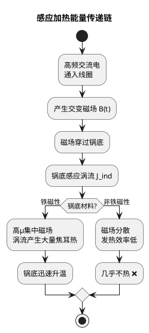

# 感应加热原理
**关键词**：恒定磁场的应用

📌 **一句话本质**：感应加热利用交变磁场在导体中感应涡流——涡流的焦耳热直接在工件内部产生，无需火焰或热传导

🏷️ **重要度**：🔴 | 考试：★★★ | 题型：简

## 🔧 工程场景

高频变压器设计——趋肤效应使电流集中在导体表面，如果线径选太粗（超过趋肤深度的2倍），导体内侧浪费了铜截面，变压器会过热。

## 🧠 类比与直觉

**类比：微波炉加热vs电磁炉加热**。微波炉用电磁波（位移电流）加热食物分子，电磁炉用涡流（传导电流）加热锅底——两者都在物体内部产生热量，但机制不同。电磁炉需要导体（铁锅），微波炉需要极性分子（水）。

**口诀**：交变磁场生涡流，焦耳热在体内发，频率选深浅可控

## 教科书原文

> 📖 参见：[[§6-5]]

## ✂️ 可跳过

> 本节是感应加热和涡流效应的工程应用，若已掌握涡流产生机制（∇×E=-∂B/∂t→J=σE）、趋肤深度δ=1/√(πfμσ)和频率选择的工程考量，可直接跳至下一个概念。

## 感应加热在电磁炉中的应用

电磁炉底部线圈通以高频交流电（~20-50 kHz），产生交变磁场。锅底（铁磁性材料）中感应出涡流，焦耳热 $P = J^2/\sigma$ 直接加热锅底。

**为什么用铁锅不能用铝锅？**：铁的高磁导率将磁场集中到锅底，且铁的电阻率较高（涡流发热效率高）。铝的磁导率低且电阻率太低（涡流大但发热少）。

> 📖 参见：[[§6-5 恒定磁场的应用]]

## 费曼深度讲解

感应加热是法拉第电磁感应定律在工业应用中的典范。原理：交变电流通过线圈产生交变磁场，交变磁场在下方的导体工件中感应出涡流（法拉第定律$\nabla\times E=-\partial B/\partial t$→导体中的感应电场→$J=\sigma E$的涡流→焦耳热$p=J^2/\sigma$），涡流加热工件。因此感应加热不需要火焰或热传导——热量直接在工件内部产生（体积加热），加热速度快且可控。

感应加热的频率选择是一个经典的电磁场工程问题：频率越高，趋肤深度$\delta=1/\sqrt{\pi f\mu\sigma}$越浅——表面加热（适合淬火、表面硬化）；频率越低，趋肤深度越深——穿透加热（适合熔炼、锻造加热）。这就是为什么表面淬火用高频（10-500kHz），而金属熔炼用中频（1-10kHz）或工频（50Hz）。频率的选择是"热处理的深度"和"加热速度"之间的权衡。

涡流分布的定量分析：在圆柱形工件中，交变轴向磁场$B_z(t)=B_0\sin(\omega t)$在工件内感应出环形涡流$J_\varphi(r)$。对于半径a>>δ的高频情况，涡流集中在表面δ厚度内（趋肤效应），沿径向指数衰减$J_\varphi(r)\approx J_0 e^{-(a-r)/\delta}$。总功率损耗$P=\int_V J^2/\sigma dV\approx\frac{1}{2}\pi a L B_0^2\omega^2\sigma\delta$（近似公式，适用于a>>δ）。对于低频穿透加热，涡流几乎均匀分布在整个截面内，$P\approx\frac{1}{8}\pi a^2 L B_0^2\omega^2\sigma$（低频极限）。

## 更多费曼检验

1. 为什么感应加热只适用于导电材料而不适用于绝缘体？绝缘体中的电场能否产生焦耳热？

2. 两个相同尺寸的金属圆柱放在同一交变磁场中，一个是铝（σ=3.5×10^7S/m）、一个是不锈钢（σ=1.4×10^6S/m）。同频率下哪个加热更快？趋肤深度谁更小？

