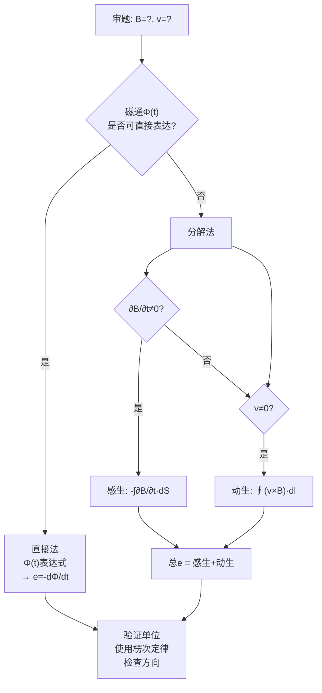

# 习题：法拉第电磁感应定律综合题
**关键词**：思考题, 预习, 概念检验, 电磁感应

📌 **一句话本质**：法拉第定律综合题的关键是——先写出Φ(t)的完整表达式，再对t求全导，感生和动生贡献自动分离

🏷️ **重要度**：⚪ | 考试：★ | 题型：计

## 教材原题

法拉第定律的综合应用：包括感生电动势计算、动生电动势计算、以及两者共存时的总电动势。典型题型：矩形线圈在变化磁场中旋转、滑棒在导轨上运动、变压器铁心中的感应电动势。

## 费曼4步解题法

### 第1步：明确已知和目标

审题时先判断磁通变化的原因：

- **仅B变化**（$\partial\mathbf{B}/\partial t \neq 0, \mathbf{v}=0$）→纯感生：$e = -\int_S\frac{\partial\mathbf{B}}{\partial t}\cdot d\mathbf{S}$
- **仅回路运动**（$\mathbf{v}\neq0, \partial\mathbf{B}/\partial t=0$）→纯动生：$e = \oint(\mathbf{v}\times\mathbf{B})\cdot d\mathbf{l}$
- **两者都有** → 全导数公式

### 第2步：核心公式

**法拉第定律（全导数形式）**：
$$e = -\frac{d}{dt}\int_{S(t)}\mathbf{B}\cdot d\mathbf{S} = -\int_S\frac{\partial\mathbf{B}}{\partial t}\cdot d\mathbf{S} + \oint_l(\mathbf{v}\times\mathbf{B})\cdot d\mathbf{l}$$

**感生电场（涡旋电场）**：
$$\nabla\times\mathbf{E} = -\frac{\partial\mathbf{B}}{\partial t}$$

**动生电动势特殊情况**（直导线在均匀B中运动）：
$$e = Blv\sin\theta$$（l为导线长度，v为速度，$\theta$为v与B间夹角）

### 第3步：典型例题

**例1（纯感生）**：圆形线圈（半径a，N匝）置于均匀时变磁场 $B = B_0\sin\omega t$ 中，磁场垂直于线圈平面。求感应电动势。

*解*：$\Phi = N \cdot B \cdot \pi a^2 = N\pi a^2 B_0\sin\omega t$
$e = -d\Phi/dt = -N\pi a^2 B_0\omega\cos\omega t$
最大值：$e_m = N\pi a^2 B_0\omega$

**例2（纯动生）**：长l的金属棒在均匀磁场B中以速度v垂直于B和棒运动。求两端电动势。

*解*：$e = \oint(\mathbf{v}\times\mathbf{B})\cdot d\mathbf{l} = vBl$
方向由右手定则判定：$\mathbf{v}\times\mathbf{B}$方向。

**例3（混合）**：矩形线圈（a×b）在时变磁场 $B = B_0\sin\omega t$ 中以角速度$\omega_0$旋转。求总电动势。

*一般情况*：用全导数$e = -d\Phi/dt$。
$\Phi(t) = B(t)ab\cos\theta(t) = B_0ab\sin\omega t\cos(\omega_0 t)$
$e = -d\Phi/dt = -B_0ab[\omega\cos\omega t\cos\omega_0 t - \omega_0\sin\omega t\sin\omega_0 t]$

（涉及乘积法则求导，包含了$\partial B/\partial t$和$d\theta/dt$两项贡献）

### 第4步：解题策略



## 常见误区

1. **全导数 = 偏导数 + 动生项**：$d/dt \neq \partial/\partial t$ 当回路运动时。遗漏动生项是高频错误。
2. **洛伦兹力不做功**：$\mathbf{F}_m = q\mathbf{v}\times\mathbf{B}$ 对电荷不做功，但动生电动势中非静电力做功的机制是：磁力使电荷偏转，而维持导体运动的机械力才是真正的能量来源。
3. **楞次定律方向判定**：感应电流的磁场总是阻碍引起它的磁通变化——"来拒去留"。
4. **忽略互感和自感的区别**：变压器中主磁通和漏磁通分别对应互感和自感，混淆会导致错误。

## 关键对比：感生 vs 动生电动势

| 特征 | 感生电动势 | 动生电动势 |
|------|-----------|-----------|
| 产生原因 | $\partial\mathbf{B}/\partial t \neq 0$ | 导体在磁场中运动 |
| 非静电力 | 涡旋电场 $\mathbf{E}_{\text{vort}}$ | 洛伦兹力 $\mathbf{v}\times\mathbf{B}$ |
| 公式 | $e = -\int_S \frac{\partial\mathbf{B}}{\partial t}\cdot d\mathbf{S}$ | $e = \oint (\mathbf{v}\times\mathbf{B})\cdot d\mathbf{l}$ |
| 电场旋度 | $\nabla\times\mathbf{E} \neq 0$ | $\nabla\times\mathbf{E} = 0$（导体外） |
| 能量来源 | 磁场能量变化 | 机械能→电能 |

## 概念导航

- **核心**：[[法拉第电磁感应定律 MOC]]、[[动生电动势与感生电动势的本质区别]]
- **关联**：[[麦克斯韦方程组的完整形式]]、[[习题：第6章 电磁感应]]

## 自己理解

法拉第定律综合题的"通关密语"是：**先算磁通$\Phi(t)$的完整表达式（含时间依赖），再对时间求全导**。不要试图在脑中区分感生和动生——让数学替你做这件事。$\Phi(t)$一旦写对，求导后感生和动生的贡献自动正确分离。

> 📖 参见：[[§6-1 电磁感应定律]], [[§6-2 电感]], [[§6-1 电磁感应定律]], [[§6-2 电感]]

## 感生与动生电动势的时间波形

```wavedrom
{signal: [
  {name: 'B场变化\n(纯感生)', wave: 'x2.2.2.2.', data: ['B=B₀sinωt', 'Φ变化', 'e≠0', '一直持续']},
  {name: '回路运动\n(纯动生)', wave: '2...2...', data: ['v≠0', '匀速运动', 'v=0停止', '']},
  {name: '感生电动势\n(纯感生)', wave: 'x3.3.3.3.', data: ['eᵢ=-dΦ/dt', '∝ ωB₀cosωt', '', '']},
  {name: '动生电动势\n(纯动生)', wave: '2...2...', data: ['eₘ=vBl', '匀速则恒定', 'v=0则0', '']},
  {name: '混合情况', wave: 'x5.5.5.5.', data: ['e=eᵢ+eₘ', '', '', '']},
]}
```

> 📖 参见：[[§6-1 电磁感应定律]], [[§6-2 电感]], [[§6-1 电磁感应定律]], [[§6-2 电感]]
