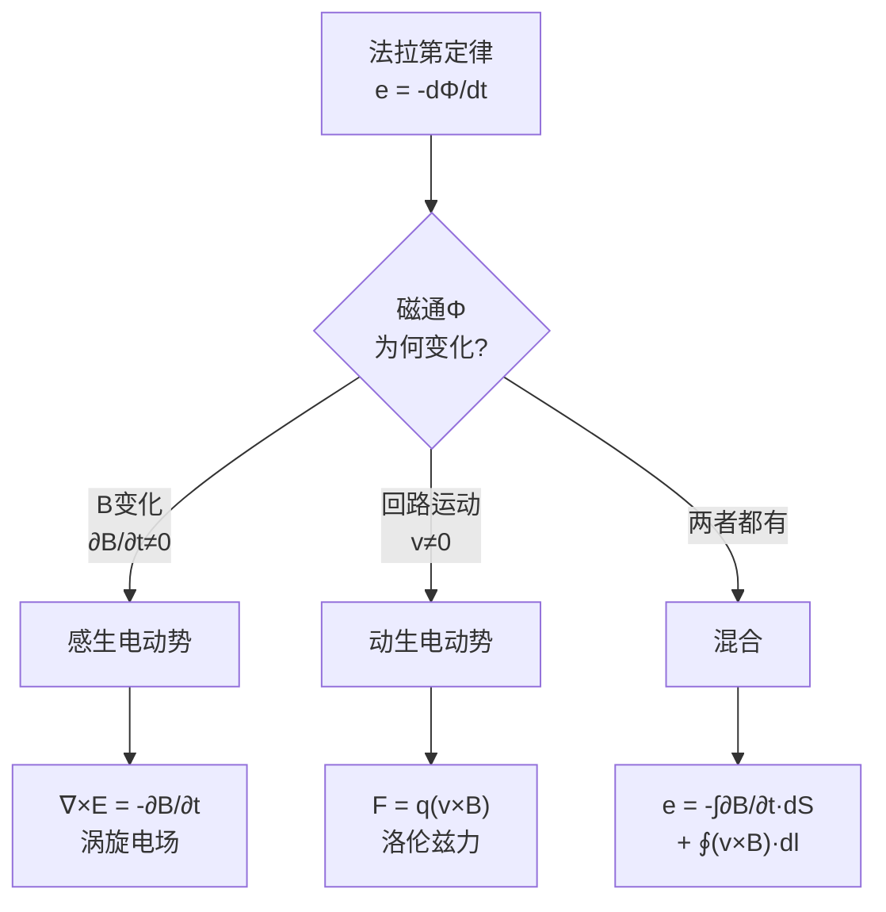

# 思考题：动生电动势与感生电动势的本质区别
**关键词**：思考题, 预习, 概念检验, 电磁感应

📌 **一句话本质**：动生靠洛伦兹力推电荷（导体动），感生靠涡旋电场推电荷（B变）——两者都归一到ε=-dΦ/dt

🏷️ **重要度**：⚪ | 考试：★ | 题型：简

## 教科书原题

> 6-1 动生电动势和感生电动势的本质区别是什么？试从产生机制、公式表达和物理含义三个方面进行对比。

## 费曼4步解题法

### 第1步：明确问题核心

法拉第定律 $$e = -d\Phi/dt$$ 统一描述了两种产生感应电动势的机制，但它们的微观物理本质完全不同。这道题要求从"是什么导致了磁通变化"出发，区分两种电动势的产生机制。

### 第2步：三个维度对比

| 维度 | 动生电动势 | 感生电动势 |
|------|----------|----------|
| **产生机制** | 导体在磁场中运动，电荷受洛伦兹力 | 磁场本身随时间变化，产生涡旋电场 |
| **微观物理** | $\mathbf{F} = q\mathbf{v}\times\mathbf{B}$$（洛伦兹力） | $\oint\mathbf{E}_{\text{涡}}\cdot d\mathbf{l} = -\int\partial\mathbf{B}/\partial t\cdot d\mathbf{S}$ |
| **公式** | $e = \oint_l (\mathbf{v}\times\mathbf{B})\cdot d\mathbf{l}$ | $e = -\int_S \frac{\partial\mathbf{B}}{\partial t}\cdot d\mathbf{S}$ |
| **力场性质** | 洛伦兹力（非保守力的表现），不对应"电场" | 涡旋电场 $$\mathbf{E}_{\text{涡}}$$，非保守场 |
| **B是否变化** | B恒定（或至少不以 $$\partial\mathbf{B}/\partial t$$ 方式变化） | B必须随时间变化 |
| **回路要求** | 要求导体回路（或部分）运动 | 回路可静止，只需 $$\partial\mathbf{B}/\partial t \neq 0$ |
| **能量转换** | 机械能 → 电能（发电机原理） | 磁场储能 → 电能（变压器原理） |

### 第3步：统一在法拉第定律下

法拉第定律的积分形式：$$e = -\frac{d}{dt}\int_S \mathbf{B}\cdot d\mathbf{S}$$

利用莱布尼茨法则展开全导数（含运动边界）：
$$\frac{d}{dt}\int_{S(t)} \mathbf{B}\cdot d\mathbf{S} = \int_S \frac{\partial\mathbf{B}}{\partial t}\cdot d\mathbf{S} + \oint_l (\mathbf{B}\times\mathbf{v})\cdot d\mathbf{l}$$

前半部分是**感生**贡献（$$\partial\mathbf{B}/\partial t$$），后半部分是**动生**贡献（$$\mathbf{v}$$ 引起的面积变化）。

因此：$$e = \underbrace{-\int_S \frac{\partial\mathbf{B}}{\partial t}\cdot d\mathbf{S}}_{\text{感生}} + \underbrace{\oint_l (\mathbf{v}\times\mathbf{B})\cdot d\mathbf{l}}_{\text{动生}}$$

注意：$$-\mathbf{B}\times\mathbf{v} = \mathbf{v}\times\mathbf{B}$$（叉乘反序变号）

### 第4步：实例区分

**纯感生（变压器）**：
- 静止线圈套在铁心上，初级线圈电流变化 → 铁心中B变化 → 次级线圈感应电动势
- $$\mathbf{v}=0$$, $$\partial\mathbf{B}/\partial t \neq 0$$
- **没有机械运动**，纯电磁感应

**纯动生（发电机）**：
- 矩形线圈在均匀恒定磁场中匀速旋转
- $$\partial\mathbf{B}/\partial t = 0$$（B均匀且不变），但线圈面积在磁场中的投影随时间变化
- **机械能驱动线圈转动** → 产生交变电动势

**混合情况（实际发电机/电动机）**：
- 旋转电机中既有磁场旋转（等效 $$\partial\mathbf{B}/\partial t$$），也有导体在磁场中运动（$$\mathbf{v}$$）
- 两种效应共存

## 常见误区

1. **动生电动势和感生电动势是两种不同的物理定律**：它们都是同一个法拉第定律 $$e=-d\Phi/dt$$ 在不同条件下的表现。数学上统一的，物理机制不同。
2. **动生电动势也对应涡旋电场**：动生电动势来自洛伦兹力 $$\mathbf{F}=q\mathbf{v}\times\mathbf{B}$$，不是涡旋电场。在运动导体的静止参考系中，动生电动势可以通过洛伦兹变换"转化"为感生电动势——这是狭义相对论的优美应用。
3. **法拉第定律的负号可选可不选**：负号（楞次定律）是能量守恒的要求，不可省略。没有它，感应电流会"鼓励"磁通变化而非"反对"它——导致正反馈永动机。

## 概念导航

- **核心**：[[法拉第电磁感应定律 MOC]]
- **关联**：[[涡旋电场的环路特性]]、[[感生电场与静电场对比]]
- **延伸**：[[麦克斯韦方程组的完整形式]]、[[洛伦兹力]]

## 自己理解

动生和感生的区分在哲学层面揭示了一个深刻的统一的物理事实：**电和磁是同一现象在不同参考系中的不同表现**。在一个参考系中的纯磁力（洛伦兹力），在另一个参考系中会部分转化为电力。这就是爱因斯坦建立狭义相对论的重要启发之一——"动生"和"感生"的区分不是绝对的，而是依赖于观察者的参考系。

> 📖 参见：[[§6-1 电磁感应定律]], [[§6-2 电感]]
