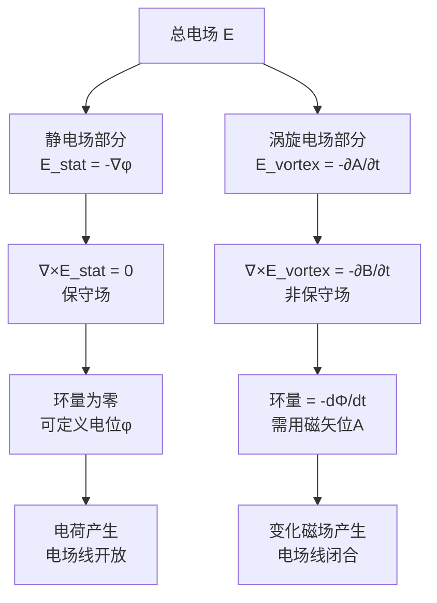

# 思考题：涡旋电场的环路特性
**关键词**：思考题, 预习, 概念检验, 电磁感应

📌 **一句话本质**：涡旋电场绕一圈净功不为零——与静电场最本质的区别：涡旋电场是非保守场，电场线是闭合的环

🏷️ **重要度**：⚪ | 考试：★ | 题型：简

## 教科书原题

> 6-3 感生电场（涡旋电场）与静电场在环路特性上有何本质区别？这一区别的物理根源是什么？

## 费曼4步解题法

### 第1步：明确问题核心

这道题考察的是电磁学中最具颠覆性的概念之一：**电场不一定都是保守场**。变化的磁场产生的涡旋电场是非保守场——沿闭合路径的环量不为零。理解这一点是理解麦克斯韦方程组中 $$\nabla\times\mathbf{E} = -\partial\mathbf{B}/\partial t$$ 的关键。

### 第2步：核心对比

| 性质 | 静电场 | 涡旋电场（感生电场） |
|------|--------|---------------------|
| **环量** | $\oint\mathbf{E}\cdot d\mathbf{l} = 0$ | $\oint\mathbf{E}_{\text{涡}}\cdot d\mathbf{l} = -\frac{d\Phi}{dt} \neq 0$ |
| **旋度** | $\nabla\times\mathbf{E} = 0$ | $\nabla\times\mathbf{E}_{\text{涡}} = -\frac{\partial\mathbf{B}}{\partial t} \neq 0$ |
| **保守性** | 保守场（有势场） | 非保守场（无势场！） |
| **力线** | 始于正电荷，终于负电荷（开放） | 闭合的涡旋线（无首无尾） |
| **电位** | 可定义标量电位 $$\phi$$：$$\mathbf{E} = -\nabla\phi$ | 不能定义标量电位！需磁矢位：$$\mathbf{E}_{\text{涡}} = -\frac{\partial\mathbf{A}}{\partial t}$ |
| **做功** | 绕闭合路径不做净功 | 绕闭合路径可以做净功！ |
| **来源** | 电荷（散度源） | 变化的磁场（旋度源） |

### 第3步：深层物理根源

**为什么静电场环路积分为零？**

根本原因：库仑力是中心力（$$F \propto 1/r^2$$，方向径向）。任何中心力场的环量都恒为零——这是一个纯几何事实（中心力场是保守场的充要条件）。

**为什么涡旋电场环量不为零？**

根本原因：变化的磁场磁力线是闭合的。根据法拉第定律，沿闭合回路的感生电动势 $$e = \oint\mathbf{E}_{\text{涡}}\cdot d\mathbf{l} = -d\Phi/dt$$。只要回路包围的磁通在变化，环量就不为零。涡旋电场的力线也是闭合的——它们围绕变化的磁力线形成"漩涡"。

### 第4步：完整电场理论——两种成分的叠加

在一般时变电磁场中，总电场是两种成分的叠加：

$$\boxed{\mathbf{E} = \mathbf{E}_{\text{静电}} + \mathbf{E}_{\text{涡旋}} = -\nabla\phi - \frac{\partial\mathbf{A}}{\partial t}}$$

其中：
- $$-\nabla\phi$$：静电场部分（保守，由电荷产生，可定义标量电位）
- $$-\partial\mathbf{A}/\partial t$$：涡旋电场部分（非保守，由变化磁场产生，需用磁矢位描述）

**环量**：
$$\oint\mathbf{E}\cdot d\mathbf{l} = \underbrace{-\oint\nabla\phi\cdot d\mathbf{l}}_{=0} - \underbrace{\frac{\partial}{\partial t}\oint\mathbf{A}\cdot d\mathbf{l}}_{=-\frac{d\Phi}{dt}} = -\frac{d\Phi}{dt}$$

## 常见误区

1. **涡旋电场也能定义电位**：不能！电位 $$\phi$$ 只有在 $$\nabla\times\mathbf{E}=0$$（无旋场）时才有意义。涡旋电场的有旋性使得"两点间电压"与路径有关，电位函数无法唯一定义。
2. **只有变化的磁场才产生有旋电场**：这是宏观电磁学的结论。但在更深层的物理（量子电动力学）中，即使是静态电荷产生的库仑场，其量子描述也涉及虚光子交换，存在另一种意义上的"旋量"。
3. **涡旋电场线在空间中一定是圆形的**：涡旋电场线是闭合的，但不一定是圆形。它们围绕变化的磁通形成各种闭合曲线，具体形状取决于磁场的空间分布。

## 概念导航

- **前置**：[[法拉第电磁感应定律 MOC]]、[[静电场环路定律]]
- **关联**：[[位移电流假说]]、[[麦克斯韦方程组的微分形式]]
- **延伸**：[[推迟位]]、[[电磁波的辐射机制]]

## 自己理解

涡旋电场的发现是法拉第对物理学最伟大的贡献之一——它打破了"电场永远是无旋的"这一经典信念，揭示了电和磁之间更深层的动力学联系。涡旋电场的存在意味着：**你不需要电荷就能产生电场**——只需要一个变化的磁场。这一发现是电磁波理论的基础：变化的B产生E，变化的E又产生B，如此交替推进，电磁波就能在真空中传播。

> 📖 参见：[[§6-1 电磁感应定律]]

## 费曼深度讲解

涡旋电场（感生电场）区别于静电场的最根本特征是环量非零：$\oint_C E_{induced}\cdot dl = -\frac{d\Phi_B}{dt} \neq 0$。对于任何包围着变化磁通的闭合回路，涡旋电场的环量等于磁通量时间变化率的负值。这意味着：(1)不存在标量电位φ可以从E_induced导出（∇×E_induced≠0→不保守）；(2)两点之间的"电位差"不再是路径无关的——走不同的路径感生电场做的功可以不同！这就是为什么在包含变化磁通的电路中KVL（基尔霍夫电压定律）"失效"——KVL是"路径无关的电位差之和为零"，但感生电场不是路径无关的；(3)E_induced的电场线是闭合曲线（漩涡）而非从正到负的开放曲线。

涡旋电场和静电场的组合$E=E_{static}+E_{induced}$构成电磁场最完整的描述。E_static由电荷分布产生（有源无旋），E_induced由时变磁场产生（有旋无源——∇·E_induced=0因为磁荷不存在）。两者的散度和旋度互补——静电场的无旋性（∇×E_static=0）和感应的无源性（∇·E_induced=0）恰好使总场E的散度和旋度都定义完备：∇·E=ρ/ε₀（来自电荷源），∇×E=−∂B/∂t（来自时变磁源）。这正是亥姆霍兹定理的最佳体现——总场被散度源和旋度源完整且唯一地确定。

涡旋电场的物理效应——电子回旋加速器（Betatron）：变化的磁通在环形真空管中感应涡旋电场，使电子沿圆形轨道加速。电子轨道稳定在特定半径处，使得轨道的平均磁通变化率恰好提供所需的加速力和向心力平衡。这是涡旋电场环路特性最精确的工程应用——利用$\oint E\cdot dl = -d\Phi/dt$进行电子加速。

## 更多费曼检验

1. 为什么涡旋电场的电力线是闭合的？从∇×E≠0和∇·E=0出发，用场的直觉解释（涡旋无源但有旋）。

2. 一个环形螺线管内的磁场随时间线性增加——管外空间是否存在感应电场？如果有，方向如何？在何处电场强度最大？（参考法拉第定律的环路选择）

