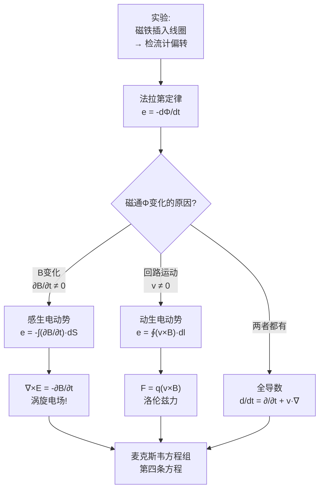

# 法拉第电磁感应定律 MOC

## 教科书原文

> 📖 参见：[[§6-1 电磁感应定律]], [[§6-2]]

## 概念定义（费曼一句话）

法拉第定律 = **"变化的磁场产生电场"**——这是麦克斯韦方程组中联系电与磁的关键桥梁。**感生电动势**来自 $$\partial\mathbf{B}/\partial t$$（磁场本身在变），**动生电动势**来自 $$\mathbf{v}\times\mathbf{B}$$（导体在磁场中运动）。两者在数学上统一，但物理机制不同：感生对应涡旋电场，动生对应洛伦兹力。没有这个定律，就没有发电机、变压器、无线充电——整个现代电力工业都不存在。

## 类比与直觉

**类比1：划船穿过的漩涡区**。感生电动势就像你在湖中划船，湖中心突然出现一个漩涡（变化的磁场）——水流的旋转会推动你的船桨（产生涡旋电场）。动生电动势则像是你主动划船穿过平静但有暗流的湖面（导体在恒定磁场中运动）——你自身的运动使你感受到了"等效水流"（洛伦兹力）。

**类比2：蹦床上的弹球**。磁场的变化就像在蹦床中央上下跳动（变化磁场产生涡旋电场），蹦床边缘的球会被推动。而导体的运动就像球在静止的蹦床上滚动——球的轨迹因蹦床的弹性（洛伦兹力）而弯曲。两种情况下球都在动，但"推动力"的来源不同。

## 核心公式详释

**法拉第定律（积分形式）**：
$$\boxed{e = \oint_l \mathbf{E}\cdot d\mathbf{l} = -\frac{d}{dt}\int_S \mathbf{B}\cdot d\mathbf{S} = -\frac{d\Phi}{dt}}$$

**法拉第定律（微分形式——麦克斯韦-法拉第方程）**：
$$\boxed{\nabla\times\mathbf{E} = -\frac{\partial\mathbf{B}}{\partial t}}$$

**感生电动势（B变化，回路不动）**：
$$e_{\text{感生}} = -\int_S \frac{\partial\mathbf{B}}{\partial t}\cdot d\mathbf{S}$$

**动生电动势（B恒定，回路运动）**：
$$e_{\text{动生}} = \oint_l (\mathbf{v}\times\mathbf{B})\cdot d\mathbf{l}$$

**一般情况（B变化 + 回路运动，含 $$\frac{d}{dt} = \frac{\partial}{\partial t} + \mathbf{v}\cdot\nabla$$）**：
$$e = -\int_S \frac{\partial\mathbf{B}}{\partial t}\cdot d\mathbf{S} + \oint_l (\mathbf{v}\times\mathbf{B})\cdot d\mathbf{l}$$

| 物理量 | 符号 | 单位 |
|--------|------|------|
| 感应电动势 | $e$ | V (伏特) |
| 磁通 | $\Phi = \int\mathbf{B}\cdot d\mathbf{S}$ | Wb (韦伯) |
| 感生电场 | $\mathbf{E}_{\text{感生}}$ | V/m |
| 洛伦兹力 | $\mathbf{F} = q(\mathbf{v}\times\mathbf{B})$ | N |

## 推导脉络



## 常见误区

1. **混淆"磁通变化"和"磁场变化"**：磁通变化 $$\frac{d\Phi}{dt}$$ 可以由B变化（变压器效应）或面积/取向变化（发电机效应）引起，不能望文生义地认为只有B变了才产生电动势。

2. **认为动生电动势也是由涡旋电场引起的**：动生电动势的微观本质是洛伦兹力 $$\mathbf{F} = q\mathbf{v}\times\mathbf{B}$$，作用于运动导体中的电荷。它不对应 $$\nabla\times\mathbf{E}$$，这一点经常考。

3. **忽略楞次定律（负号）**：$$e = -d\Phi/dt$$ 中的负号是物理本质——感应电流总是"反抗"引起它的磁通变化（能量守恒的要求）。如果负号取反，感应电流会"鼓励"磁通变化，导致正反馈——永动机。

## 费曼检验

1. 一个矩形线圈在均匀恒定磁场中匀速平动（不旋转），为什么没有感应电动势？请分别从 $$\frac{d\Phi}{dt}$$ 和 $$\oint(\mathbf{v}\times\mathbf{B})\cdot d\mathbf{l}$$ 两个角度解释。
2. 如果将法拉第定律的负号去掉，违反了什么物理定律？
3. 麦克斯韦将法拉第定律的积分形式 $$\oint\mathbf{E}\cdot d\mathbf{l} = -\frac{d\Phi}{dt}$$ 写成微分形式 $$\nabla\times\mathbf{E} = -\frac{\partial\mathbf{B}}{\partial t}$$。为什么积分形式中的"d/dt"变成微分形式中的"$$\partial/\partial t$$"？$$\mathbf{v}\times\mathbf{B}$$ 那部分去了哪里？

## 概念导航
- **前置**：[[斯托克斯定理的物理理解]]、[[磁通密度的定义]]
- **后继**：[[位移电流与麦克斯韦方程组]]、[[麦克斯韦方程组的完整形式]]
- **关联**：[[感生电动势与动生电动势的本质区别]]、[[涡旋电场的环路特性]]

## 自己理解（费曼复述）

法拉第定律最颠覆性的发现是：变化的磁场产生的是**涡旋电场**——电场线是闭合的！这与静电场完全不同（静电场线从正电荷到负电荷）。涡旋电场沿闭合回路的环量不为零，这意味着它不是保守场，不能定义标量电位——必须用矢量磁位A来描述：$$\mathbf{E} = -\nabla\phi - \frac{\partial\mathbf{A}}{\partial t}$$。第一项是保守（静电）部分，第二项才是法拉第定律的成贡献——变化的磁矢位产生非保守电场。

> 📖 参见：[[§6-1 电磁感应定律]], [[§6-2 电感]]

## 可视化图表

```plantuml
@startuml 电磁感应能量转换流程
!theme plain
skinparam backgroundColor #FEFEFE

title 电磁感应中的能量转换与守恒 §6-5~§6-8

(*) --> "机械能输入\n(外力做功推动磁铁/导体)" as MechIn

MechIn --> "磁通变化\nΔΦ/Δt" as FluxChange

FluxChange --> "感应电动势\nε = -dΦ/dt" as EMFInduced

EMFInduced --> "感应电流(闭合回路)\nI = ε/(R+r)" as InducedCurrent
EMFInduced --> "感应电场(非保守场)\n∮E·dl = -∫∂B/∂t·dS" as InducedEField
EMFInduced --> "感生电动势(变压器)\nε_trans = -N·dΦ/dt" as TransEMF

InducedCurrent --> "焦耳热损耗\nP_J = I²R" as JouleLoss
InducedCurrent --> "磁场能存储\nW_m = ½LI²" as MagEnergy
InducedCurrent --> "安培力做功\nF = I∫dl×B" as AmpereWork

state "动生EMF" as MotionalEMF {
  state "ε_m = ∮(v×B)·dl" as MotionEq
  state "洛伦兹力驱动\nF_L = q(E+v×B)" as Lorentz
  state "发电机原理\n机械能→电能" as Generator
}

state "感生EMF" as InducedEMF {
  state "ε_i = -∫∂B/∂t·dS" as InduceEq
  state "涡旋电场E_i\n∇×E = -∂B/∂t" as VortexE
  state "变压器原理\n电磁耦合" as Transformer
}

AmpereWork --> MotionalEMF : 安培力(阻力)与外力平衡
MechIn --> MotionalEMF : 外力克服安培力
FluxChange --> InducedEMF : 时变磁场直接感应

JouleLoss --> [*] : 热能散逸
MagEnergy --> [*] : 存储/释放

Generator --> [*] : 输出电能
Transformer --> [*] : 输出电能

note right of MotionalEMF
  **动生EMF本质**: 
  磁场力F=qv×B对电荷做功
  v: 导体运动速度
  B: 外磁场
  **适用**: 发电机、麦克风
end note

note right of InducedEMF
  **感生EMF本质**:
  时变磁场产生涡旋电场
  无需导体运动
  **适用**: 变压器、无线充电
end note

note bottom of FluxChange
  能量守恒: 
  输入机械能 = 
  输出电能 + 焦耳热 + 场储能增量
  ∮S·dS + ∂W/∂t = 0
end note

@enduml

```
