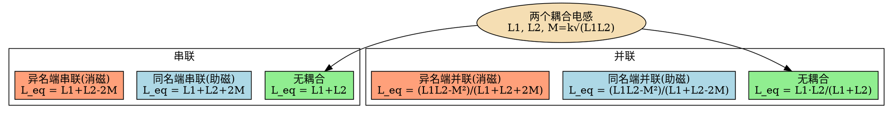

# 电感的串并联等效
**关键词**：电感, 串并联, 互感, 同名端

📌 **一句话本质**：电感串联无耦合就相加L₁+L₂，有耦合时要加减2M——同名端接法决定M前的正负号

🏷️ **重要度**：🟡 | 考试：★★ | 题型：计

## 教科书原文

> 📖 参见：[[§6-2]]

## 🔧 工程场景

EMI滤波器共模扼流圈——两个绕组同向串联在同一磁芯上，利用大互感M增强共模阻抗。若同名端接反→M为负→电感相互抵消→共模抑制比从60dB骤降到10dB→设备传导发射超标，过不了FCC认证。

## 🧠 类比与直觉

**类比：两个人推同一个箱子**。电感串联就像两人接力推——力是叠加的（L₁+L₂）。但如果两人之间"有默契"（互感M），要么配合默契合力更大（同名端串联L₁+L₂+2M），要么互相较劲力量抵消（异名端串联L₁+L₂-2M）。同名端就是两人约定的"用力方向"。

**口诀**：串联加并联倒数，有耦合要加减2M

## 电感串并联关系图

## ✂️ 可跳过

> 本节是电感串并联等效的入门，若已掌握无耦合L_eq=L₁+L₂（串）、L_eq=L₁L₂/(L₁+L₂)（并）以及有耦合时±2M的修正规则，可直接跳至下一个概念。
