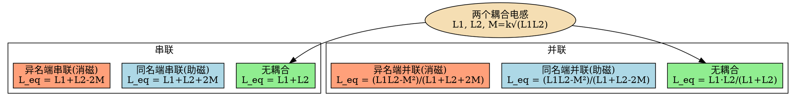

# 电感的串并联等效

## 教科书原文

> 📖 参见：[[§6-2]]

## 电感串并联关系图

```graphviz
digraph G {
    rankdir=TB;
    node [shape=box, style=filled];

    subgraph cluster_series {
        label="串联";
        fillcolor=lightyellow;
        S [label="无耦合\nL_eq = L1+L2", fillcolor=lightgreen];
        S1 [label="同名端串联(助磁)\nL_eq = L1+L2+2M", fillcolor=lightblue];
        S2 [label="异名端串联(消磁)\nL_eq = L1+L2-2M", fillcolor=lightsalmon];
    }

    subgraph cluster_parallel {
        label="并联";
        fillcolor=lightcyan;
        P [label="无耦合\nL_eq = L1·L2/(L1+L2)", fillcolor=lightgreen];
        P1 [label="同名端并联(助磁)\nL_eq = (L1L2-M²)/(L1+L2-2M)", fillcolor=lightblue];
        P2 [label="异名端并联(消磁)\nL_eq = (L1L2-M²)/(L1+L2+2M)", fillcolor=lightsalmon];
    }

    T [label="两个耦合电感\nL1, L2, M=k√(L1L2)", shape=ellipse, fillcolor=wheat];
    T -> S;
    T -> P;
}
```
