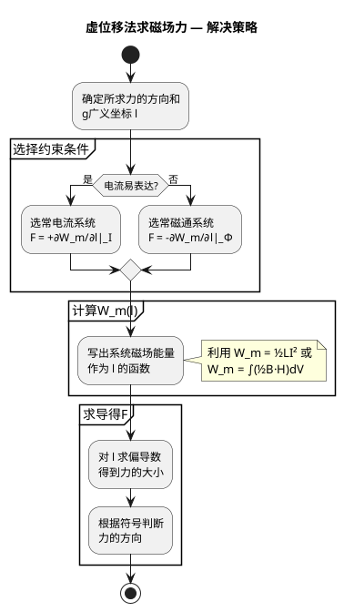

# 虚位移法应用实例
**关键词**：虚位移法, 磁场力, 能量法, 广义坐标

📌 **一句话本质**：虚位移法用磁场能量对位移求导算力——假装系统移动一小步，看能量怎么变，导数就是力的大小

🏷️ **重要度**：🟡 | 考试：★★ | 题型：计

## 教科书原文

> 📖 参见：[[§6-4]]

## 🔧 工程场景

电磁继电器衔铁行程设计——用虚位移法计算电磁吸力F=∂W_m/∂x。算错力→衔铁行程选错→额定电压下吸合失败→继电器触点抖动烧毁，控制电路误动作导致整机停机。

## 🧠 类比与直觉

**类比：拉弹簧测力**。虚位移法就像拉弹簧——你不知道弹簧力多大，但你拉一拉知道了能量变化ΔW=F·Δx，反推就能算出力。虚位移的"虚"就是假装拉了一下（不真的移动），用能量变化反算力。

**口诀**：虚位移求导算磁力，正号恒流负恒磁

## 虚位移法三步策略

## ✂️ 可跳过

> 本节是虚位移法应用实例的入门，若已掌握F=+∂W_m/∂x（恒流）和F=-∂W_m/∂x（恒磁）的选择规则以及W_m(l)的构造方法，可直接跳至下一个概念。
