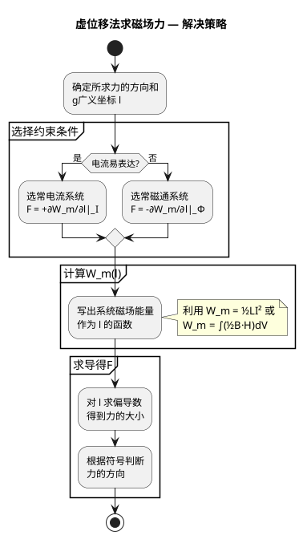

# 虚位移法应用实例

## 教科书原文

> 📖 参见：[[§6-4]]

## 虚位移法三步策略

```plantuml
@startuml
title 虚位移法求磁场力 — 解决策略

start
:确定所求力的方向和\ng广义坐标 l;

partition "选择约束条件" {
  if (电流易表达?) then (是)
    :选常电流系统\nF = +∂W_m/∂l|_I;
  else (否)
    :选常磁通系统\nF = -∂W_m/∂l|_Φ;
  endif
}

partition "计算W_m(l)" {
  :写出系统磁场能量\n作为 l 的函数;
  note right
    利用 W_m = ½LI² 或
    W_m = ∫(½B·H)dV
  end note
}

partition "求导得F" {
  :对 l 求偏导数\n得到力的大小;
  :根据符号判断\n力的方向;
}

stop

@enduml
```
