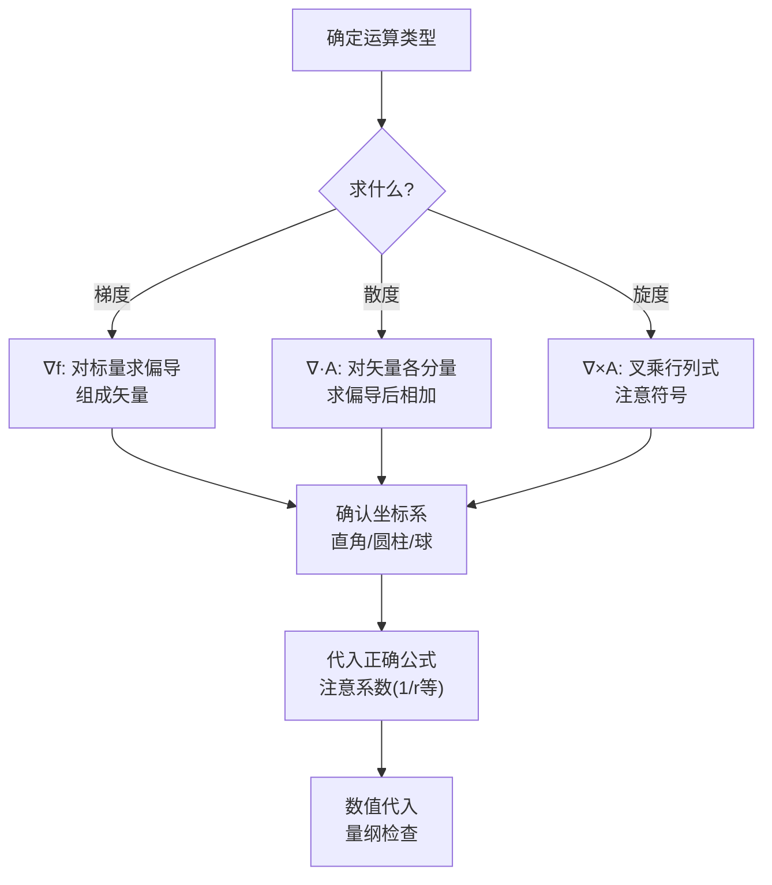

# 习题：第1章 矢量分析（教科书p.34-36）

## 教材原题概览

第1章习题是全书最基础的练习，主要训练三个"度"的计算——梯度、散度、旋度——以及它们在三种正交坐标系（直角、圆柱、球）中的展开。虽然计算本身不复杂，但它们是后续所有场论运算的基础。

| 题号范围 | 主题 | 核心技能 |
|----------|------|----------|
| 1-1~1-4 | 矢量加减法、标积、矢积 | 矢量代数基本功 |
| 1-5~1-8 | 梯度与方向导数 | $\nabla f$$ 的计算与几何意义 |
| 1-9~1-12 | 通量与散度 | $\nabla\cdot\mathbf{A}$$ 与高斯定理 |
| 1-13~1-16 | 环量与旋度 | $\nabla\times\mathbf{A}$$ 与斯托克斯定理 |
| 1-17~1-20 | 综合：三种坐标系、格林定理 | 坐标系转换与定理应用 |

> 📖 习题1-1~1-20, p.34-36

## 费曼4步解题法

### 第1步：明确已知和目标

**向量代数类（1-1~1-4）**：
给定向量 $$\mathbf{A} = A_x\mathbf{a}_x + A_y\mathbf{a}_y + A_z\mathbf{a}_z$$，$$\mathbf{B} = B_x\mathbf{a}_x + B_y\mathbf{a}_y + B_z\mathbf{a}_z$$
求：$$\mathbf{A}+\mathbf{B}$$, $$\mathbf{A}-\mathbf{B}$$, $$\mathbf{A}\cdot\mathbf{B}$$, $$\mathbf{A}\times\mathbf{B}$$

**梯度类（1-5~1-8）**：
给定标量场 $$f(x,y,z)$$ 或 $$f(r,\phi,z)$$，求 $$\nabla f$$ 在某点的值，或某方向的方向导数。

**散度类（1-9~1-12）**：
给定矢量场 $$\mathbf{A}$$，求 $$\nabla\cdot\mathbf{A}$$，并验证高斯散度定理。

**旋度类（1-13~1-16）**：
给定矢量场 $$\mathbf{A}$$，求 $$\nabla\times\mathbf{A}$$，并验证斯托克斯定理。

### 第2步：核心公式速查

**直角坐标系中的 $$\nabla$$ 算子**：
$$\nabla = \mathbf{a}_x\frac{\partial}{\partial x} + \mathbf{a}_y\frac{\partial}{\partial y} + \mathbf{a}_z\frac{\partial}{\partial z}$$

**梯度**：$$\nabla f = \frac{\partial f}{\partial x}\mathbf{a}_x + \frac{\partial f}{\partial y}\mathbf{a}_y + \frac{\partial f}{\partial z}\mathbf{a}_z$$

**散度**：$$\nabla\cdot\mathbf{A} = \frac{\partial A_x}{\partial x} + \frac{\partial A_y}{\partial y} + \frac{\partial A_z}{\partial z}$$

**旋度**：
$$\nabla\times\mathbf{A} = \begin{vmatrix} \mathbf{a}_x & \mathbf{a}_y & \mathbf{a}_z \ \frac{\partial}{\partial x} & \frac{\partial}{\partial y} & \frac{\partial}{\partial z} \ A_x & A_y & A_z \end{vmatrix}$$

**方向导数**：$$\frac{\partial f}{\partial l} = \nabla f \cdot \mathbf{e}_l$$

**圆柱坐标系**：
梯度：$$\nabla f = \frac{\partial f}{\partial r}\mathbf{a}_r + \frac{1}{r}\frac{\partial f}{\partial\phi}\mathbf{a}_\phi + \frac{\partial f}{\partial z}\mathbf{a}_z$$
散度：$$\nabla\cdot\mathbf{A} = \frac{1}{r}\frac{\partial}{\partial r}(rA_r) + \frac{1}{r}\frac{\partial A_\phi}{\partial\phi} + \frac{\partial A_z}{\partial z}$$

**球坐标系**：
梯度：$$\nabla f = \frac{\partial f}{\partial R}\mathbf{a}_R + \frac{1}{R}\frac{\partial f}{\partial\theta}\mathbf{a}_\theta + \frac{1}{R\sin\theta}\frac{\partial f}{\partial\phi}\mathbf{a}_\phi$$

### 第3步：典型例题

**例1（梯度）**：求 $$f = x^2y + yz^2$$ 在点(1,2,3)处的梯度和沿 $$\mathbf{l} = \mathbf{a}_x + 2\mathbf{a}_y + 2\mathbf{a}_z$$ 方向的方向导数。

*解*：
$$\nabla f = 2xy\mathbf{a}_x + (x^2+z^2)\mathbf{a}_y + 2yz\mathbf{a}_z$$
在(1,2,3)：$$\nabla f = 4\mathbf{a}_x + 10\mathbf{a}_y + 12\mathbf{a}_z$$

方向导数：$$\frac{\partial f}{\partial l} = \nabla f \cdot \frac{\mathbf{l}}{|\mathbf{l}|} = (4,10,12)\cdot\frac{(1,2,2)}{3} = \frac{4+20+24}{3} = 16$$

**例2（散度）**：求 $$\mathbf{A} = x^2\mathbf{a}_x + xy\mathbf{a}_y + xyz\mathbf{a}_z$$ 的散度。

*解*：$$\nabla\cdot\mathbf{A} = \frac{\partial(x^2)}{\partial x} + \frac{\partial(xy)}{\partial y} + \frac{\partial(xyz)}{\partial z} = 2x + x + xy = 3x + xy$$

**例3（旋度）**：求 $$\mathbf{A} = y\mathbf{a}_x - x\mathbf{a}_y$$ 的旋度，判断是否为无旋场。

*解*：
$$\nabla\times\mathbf{A} = \begin{vmatrix} \mathbf{a}_x & \mathbf{a}_y & \mathbf{a}_z \ \partial_x & \partial_y & \partial_z \ y & -x & 0 \end{vmatrix} = (0-0)\mathbf{a}_x - (0-0)\mathbf{a}_y + (-1-1)\mathbf{a}_z = -2\mathbf{a}_z$$

$$\nabla\times\mathbf{A} \neq 0$$，不是无旋场。

### 第4步：验证技巧

- **梯度验证**：梯度方向应是标量场在该点上升最快的方向
- **散度验证**：应用高斯定理 $$\oint_S\mathbf{A}\cdot d\mathbf{S} = \int_V\nabla\cdot\mathbf{A}dV$$ 在简单几何体上验算
- **旋度验证**：应用斯托克斯定理 $$\oint_l\mathbf{A}\cdot d\mathbf{l} = \int_S(\nabla\times\mathbf{A})\cdot d\mathbf{S}$$
- **恒等式验证**：$$\nabla\times(\nabla f) = 0$$（梯度无旋），$$\nabla\cdot(\nabla\times\mathbf{A}) = 0$$（旋度无散）

## 解题流程图

## 常见误区

1. **在非直角坐标系中直接用直角坐标公式**：圆柱坐标系中 $$\nabla\cdot\mathbf{A}$$ 有额外的 $$\frac{1}{r}$$ 项。直接用直角坐标公式会得到完全错误的结果。
2. **旋度行列式的符号错误**：第二行（$$\mathbf{a}_y$$ 对应项）前有负号！这是最常见的计算错误。
3. **混淆散度和旋度的几何意义**：散度描述"流出量"，是标量；旋度描述"旋转量"，是矢量。两者不可混淆。

## 概念导航

- **前置**：[[标量与矢量 MOC]]、[[矢量的代数运算 MOC]]
- **后继**：[[标量场的方向导数与梯度 MOC]]、[[矢量场的通量散度与散度定理 MOC]]、[[矢量场的环量旋度与旋度定理 MOC]]

## 自己理解

第1章习题虽然计算繁琐，但它们是整个电磁场理论的"语言基础"。高斯定律的散度形式 $$\nabla\cdot\mathbf{D}=\rho$$、法拉第定律的旋度形式 $$\nabla\times\mathbf{E}=-\partial\mathbf{B}/\partial t$$——这些方程的每一个符号都来自第1章的训练。把"三个度"的计算练到肌肉记忆的程度，后续章节的推导就能专注于物理含义而非数学操作。

> 📖 习题1-1~1-20, p.34-36
