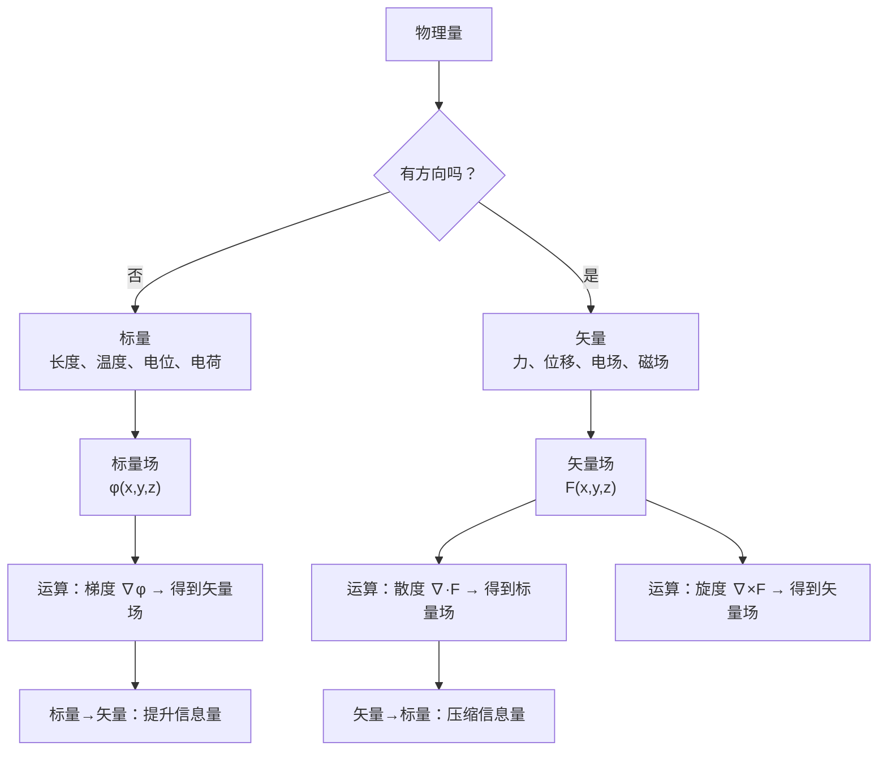

# 标量与矢量的定义及区别
**关键词**：标量与矢量

## 概念定义

**标量**是仅具有大小特征的量，**矢量**是同时具有大小和方向特征的量。

在电磁场理论中，几乎所有重要的物理量都可以归入这两类：标量构成**标量场**（空间中每点一个数值），矢量构成**矢量场**（空间中每点一个箭头）。从信息论的角度看，三维空间中的一个矢量等价于三个标量——这正是矢量运算比标量运算高效的根本原因。

## 类比与直觉

**标签类比**：
- 标量像温度标签：每个城市贴一个温度值（25°C），只要一个数就够了。这就是"标量场"——空间中每个点赋一个数值。
- 矢量像风向标：每个城市不仅要标风速大小，还要标风**吹向**哪里。这就是"矢量场"——空间中每个点挂一个箭头。

**超市购物类比**：
- 标量 = 商品价格（只要知道"多少钱"）
- 矢量 = 快递配送（需要知道"送多少"+"送到哪栋楼几号房"）

**地图导航类比**：GPS 告诉你两样信息：距离还有多远（标量）+ 往哪个方向走（方向信息）。合起来就是位移矢量。只说"还有500米"（标量）而不说方向，你根本无法到达目的地。

## 核心表示

### 矢量的三种表示方式

| 表示方式 | 写法 | 说明 |
|---------|------|------|
| 代数符号 | $\vec{A}$$ 或 $$\mathbf{A}$ | 黑斜体或加箭头，表示这是一个矢量 |
| 分量形式 | $A_x\hat{x} + A_y\hat{y} + A_z\hat{z}$ | 分解到三个坐标轴上 |
| 几何表示 | 有向线段 | 长度 = 大小（模），指向 = 方向 |

### 矢量的模和单位矢量

任一矢量可以分解为"大小"和"方向"两部分的乘积：

$$\vec{A} = |\vec{A}| \cdot \hat{e}_A$$

其中 $$|\vec{A}| = \sqrt{A_x^2 + A_y^2 + A_z^2}$$ 是矢量的**模**（大小），$$\hat{e}_A = \frac{\vec{A}}{|\vec{A}|}$$ 是**单位矢量**（模为1，仅代表方向）。

### 方向余弦

$$\hat{e}_A = \cos\alpha \cdot \hat{x} + \cos\beta \cdot \hat{y} + \cos\gamma \cdot \hat{z}$$

其中 α, β, γ 分别是矢量与 x, y, z 轴的夹角。

## 从标量到矢量场的飞跃

在三维空间中，**一个矢量等价于三个标量**。这不是简单的简化，而是深刻的结构关系：

- 标量场：$$f(x,y,z) \in \mathbb{R}$$ —— 每个点一个实数
- 矢量场：$$\vec{F}(x,y,z) = (F_x, F_y, F_z)$$ —— 每个点三个实数

这意味着，任何一个矢量方程本质上等价于三个标量方程。例如矢量等式 ∇×E = 0 实际上是三个偏微分方程合写在一起。

但三个任意的标量并不能随便凑成一个有意义的矢量——它们必须是矢量在某个坐标系下的三个坐标分量。这就是标量和矢量之间本质的数学约束。

## 电磁场中的标量与矢量对照

| 类别 | 标量场 | 矢量场 |
|------|--------|--------|
| 电场相关 | 电位 φ (V) | 电场强度 E (V/m) |
| 电场相关 | 电荷 q (C) | 电位移矢量 D (C/m²) |
| 电场相关 | 电容 C (F) | 极化强度 P (C/m²) |
| 磁场相关 | 磁标位 φ_m (A) | 磁通密度 B (T) |
| 磁场相关 | 磁通 Φ (Wb) | 磁场强度 H (A/m) |
| 能量相关 | 电场能量 W_e (J) | 坡印亭矢量 S (W/m²) |
| 电流相关 | 电动势 ε (V) | 电流密度 J (A/m²) |

**核心规律**：标量描述"势"和"源"，矢量描述"流"和"力"。电位是标量——它在空间中分布形成"势"；电场强度是矢量——它决定了正电荷受力的方向和大小。

## 推导演绎

关键洞见：梯度将标量场"升级"为矢量场（增加了方向信息），散度将矢量场"降级"为标量场（压缩为源强度信息），旋度从一个矢量场生成另一个矢量场（提取旋转特征信息）。

## 常矢与变矢

- **常矢量**：大小和方向均不随空间坐标变化的矢量。如均匀电场。
- **变矢量**：大小或方向随空间坐标变化的矢量。绝大多数实际电磁场矢量都是变矢量。

## 常见误区

1. **标量加方向不等于矢量**：不是所有加个箭头的物理量都是矢量。矢量必须满足特定的变换规则（如坐标旋转时分量按余弦规律变换）。温度和"温度梯度"是不同性质的量。

2. **矢量的大小（模）是标量**：一个矢量只有一个模，但不同方向上的投影大小各不相同。模是"最大投影"。

3. **单位矢量不带单位**：单位矢量无量纲，只有方向信息。物理矢量的单位全部"集中"在模上。

4. **"三个标量 = 一个矢量"有条件**：三个标量必须是同一物理量在同一坐标系下的三个分量。电位 φ、电荷 q、温度 T 这三个标量不能随便拼凑成一个有意义的矢量。

5. **零矢量 ≠ 没有信息**：零矢量明确了"该点场量为零"，这本身是重要的物理信息（如导体内部 E = 0）。

## 费曼检验

1. 为什么静电场的电位 φ 是标量，但电场强度 E 是矢量？两者之间通过什么数学运算相联系？

2. 给出一个标量场的例子和一个矢量场的例子，说明为什么其中一个只需要大小而另一个同时需要大小和方向才能完备描述物理现象。

## 概念导航

- 前置概念：[[向量与标量的本质区别]]
- 后续概念：[[矢量的几何表示与单位矢量]]、[[矢量的标积和矢积 MOC]]
- 关联概念：[[标量场的方向导数与梯度]]、[[亥姆霍兹定理：矢量场的分解]]

> 📖 **教科书参考**：§1-1, p.1
