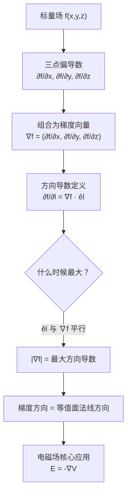

# 梯度的物理意义：标量场最大变化率方向
**关键词**：梯度, ∇, 方向导数, 标量场, 最大变化率, nabla

## 概念定义

**梯度告诉你：站在标量场中的任意一点，往哪个方向走，值变得最快——以及变得有多快。**

梯度是一个**向量**，其方向是标量场在该点变化率最大的方向（即最陡的上升方向），其大小等于该方向上的方向导数（变化率）。在数学上，梯度是标量场对所有空间坐标的偏导数组成的向量。

## 类比与直觉

**登山类比**：想象你在一座山上：

- 山的**高度** = 标量场 h(x, y)（每个地点的海拔）
- **梯度 ∇h** = 你脚下**最陡上坡的方向**
  - 方向：正对山顶的上坡方向
  - 大小：坡度有多陡（每走一米高度变化多少米）

**温度场类比**：冬天供暖房间里，暖气管旁温度最高，靠窗温度最低。温度标量场 T(x,y,z) 的梯度指向温度**升高**最快的方向。从暖气片到窗户，梯度的方向大致是从热源指向冷区。

**地图等高线类比**：地形图上的等高线越密，说明地形越陡。梯度方向始终**垂直于等高线**（即垂直于等值面），指向数值增大的方向。等高线密集处，梯度模长大，意味着地势变化剧烈。

## 核心公式

### 直角坐标系

$$\nabla f = \frac{\partial f}{\partial x}\hat{x} + \frac{\partial f}{\partial y}\hat{y} + \frac{\partial f}{\partial z}\hat{z}$$

### 圆柱坐标系

$$\nabla f = \frac{\partial f}{\partial r}\hat{r} + \frac{1}{r}\frac{\partial f}{\partial \phi}\hat{\phi} + \frac{\partial f}{\partial z}\hat{z}$$

### 球坐标系

$$\nabla f = \frac{\partial f}{\partial r}\hat{r} + \frac{1}{r}\frac{\partial f}{\partial \theta}\hat{\theta} + \frac{1}{r\sin\theta}\frac{\partial f}{\partial \phi}\hat{\phi}$$

### 方向导数与梯度的关系

$$\frac{\partial f}{\partial l} = \nabla f \cdot \hat{e}_l = |\nabla f| \cos\theta$$

其中 θ 是梯度方向与指定方向 l 的夹角。当 θ = 0 时（即沿梯度方向），方向导数取最大值 |∇f|。

### 梯度运算规则

$$\nabla C = 0 \quad \text{(常数的梯度为零)}$$

$$\nabla(Cf) = C\nabla f$$

$$\nabla(f + g) = \nabla f + \nabla g$$

$$\nabla(fg) = f\nabla g + g\nabla f$$

$$\nabla\left(\frac{f}{g}\right) = \frac{g\nabla f - f\nabla g}{g^2}$$

| 符号 | 含义 |
|------|------|
| ∇ (nabla/del) | 梯度算子: $$e_x\frac{\partial}{\partial x} + e_y\frac{\partial}{\partial y} + e_z\frac{\partial}{\partial z}$ |
| ∇f | f 的梯度（向量） |
| ∂f/∂x | f 在 x 方向的偏导数（变化率） |
| $\hat{e}_l$ | 指定方向 l 上的单位向量 |
| $\frac{\partial f}{\partial l}$ | f 沿 l 方向的方向导数 |

## 推导脉络



## 电磁场的关键应用

$$E = -\nabla V$$

**电场强度 = 电位的负梯度**

- 电位 V 相当于一座"电压山"：山顶高电位 (+10V)，山谷低电位 (0V)
- 正电荷天然地从高电位"滑向"低电位，正如小球从山坡滚下
- 电场 E 指向电位**下降**最快的方向（负号 = 反方向 = 下山方向）
- 这就是为什么电场线总是从高电位指向低电位，且电场线始终垂直于等位面

等位面密集处，电位变化剧烈，|∇V| 大，故电场强度大。均匀电场对应等间距的等位面族。

## MATLAB 可视化提示词

```
请生成完整的 MATLAB 代码，实现以下功能：

1. **3D 标量场可视化**
   - 定义标量场 f(x,y) = x^2 + y^2（旋转抛物面）
   - x, y 范围 [-2, 2]，网格密度 30×30
   - 使用 surf 绘制彩色曲面，添加 colorbar

2. **梯度场计算与绘制**
   - 使用 gradient() 函数计算 ∂f/∂x 和 ∂f/∂y
   - 用 quiver3 在曲面上叠加梯度向量箭头
   - 箭头位置在曲面上方适当偏移，确保可见

3. **关键展示**
   - 箭头始终指向"上山方向"（函数值增大方向）
   - 在原点 (0,0) 处梯度为 0，标注为"极小值点"
   - 远离原点处箭头变长（坡度变大），展示梯度模与"陡峭程度"的关系
   - 添加等值线投影到 xy 平面（contour），展示梯度垂直于等值线

4. **输出要求**
   - 图形窗口大小 1000×800
   - 视角可旋转：view(45, 30)
   - 标题：梯度场可视化 —— ∇f 始终指向最陡上升方向
   - 坐标轴标签：X, Y, f(x,y)
```

## 常见误区

1. **梯度是向量而非标量**：结果同时包含方向和大小两个信息。方向的物理意义比大小更关键。

2. **梯度不一定指向全局最大值**：梯度只保证是**局部**最快上升方向。在山腰上梯度指向的是附近的局部山脊方向，不一定是主峰方向。

3. **E = -∇V 中的负号不可省略**：电场指向电位**下降**方向。正电荷在电场中受力方向与 E 一致，所以正电荷从高电位自发移向低电位。

4. **梯度大小 ≠ 函数值大小**：函数值大的地方梯度不一定大。例如在均匀斜坡上梯度处处相等，但函数值各不相同。

5. **常数的梯度为零**：等值面上 ∇f 不一定为零（只有函数取恒定值时才为零），但梯度方向总是垂直于通过该点的等值面。

## 费曼检验

1. 如果在一个标量场中，某点的梯度向量为零向量，这意味着什么？该点的函数值有什么几何特征？（提示：山顶、山谷或鞍点）

2. 为什么等位面越密集的区域电场强度越大？请用梯度概念结合 E = -∇V 解释。

## 概念导航

- 前置概念：[[偏导数：把其他变量当常数的导数]]、[[方向导数的定义与计算公式]]
- 后续概念：[[散度的定义：矢量场的源强度]]、[[电位与电场强度的梯度关系]]
- 关联概念：[[梯度在三种坐标系中的表达式]]、[[无旋场与标量位]]、[[旋度的定义与方向判定]]

> 📖 **教科书参考**：§1-4, p.5

## 可视化图表

```wavedrom
{
  "signal": [
    {"name": "f(x,y)=x²+y² 标量场高度", "wave": "z", "period": 4, "data": ["f=0", "f=1", "f=4", "f=9", "f=16", "f=9", "f=4", "f=1"]},
    {"name": "∇f 梯度方向(最陡上升)", "wave": "x", "period": 4, "data": ["→", "↗", "↑", "↖", "←", "↙", "↓", "↘"]},
    {"name": "沿-x方向(非最陡)", "wave": "x", "period": 4, "data": ["→", "→", "→", "→", "→", "→", "→", "→"]},
    {"name": "等高线切线(∇f⊥)", "wave": "x", "period": 4, "data": ["↑", "↗", "→", "↘", "↓", "↙", "←", "↖"]}
  ],
  "head": {
    "text": "梯度方向: ∇f ⟂ 等高线, 指向函数增长最快方向 §1-5",
    "tick": 0
  },
  "foot": {
    "text": "|∇f|最大=方向导数最大 | ∇f·u=∂f/∂u 方向导数"
  },
  "edge": ["↗", "↘", "↖", "↙", "↑", "↓", "←", "→"]
}

```


```vega-lite
{
  "$schema": "https://vega.github.io/schema/vega-lite/v5.json",
  "description": "梯度大小的3D曲面: f(x,y)=x²+y² 梯度|∇f|=2√(x²+y²)",
  "width": 400,
  "height": 300,
  "layer": [
    {
      "mark": {"type": "line", "color": "#1f77b4"},
      "encoding": {
        "x": {"field": "r", "type": "quantitative", "title": "距离 r=√(x²+y²)"},
        "y": {"field": "gradMag", "type": "quantitative", "title": "|∇f|=2r"},
        "description": {"field": "desc", "type": "nominal"}
      }
    },
    {
      "mark": {"type": "point", "color": "#ff7f0e", "filled": true},
      "encoding": {
        "x": {"field": "r", "type": "quantitative"},
        "y": {"field": "gradMag", "type": "quantitative"},
        "description": {"field": "label", "type": "nominal"}
      }
    }
  ],
  "data": {
    "values": [
      {"r": 0.0, "gradMag": 0.0, "desc": "原点: 鞍点, |∇f|=0", "label": "∇f=0"},
      {"r": 0.5, "gradMag": 1.0, "desc": "梯度缓", "label": ""},
      {"r": 1.0, "gradMag": 2.0, "desc": "梯度中等", "label": "∇f=2"},
      {"r": 1.5, "gradMag": 3.0, "desc": "梯度陡", "label": ""},
      {"r": 2.0, "gradMag": 4.0, "desc": "梯度很陡: 快速爬升", "label": "∇f=4"},
      {"r": 2.5, "gradMag": 5.0, "desc": "非常陡", "label": ""},
      {"r": 3.0, "gradMag": 6.0, "desc": "极陡: 径向增大最快", "label": "∇f=6"}
    ]
  },
  "title": "标量场f(x,y)=x²+y²的梯度大小 |∇f|=2r §1-5"
}

```
