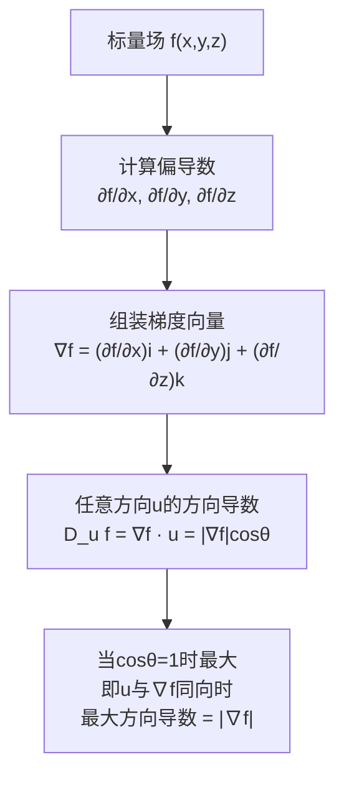

# 梯度

## 📌 一句话本质
梯度描述的是"山坡上最陡的上坡方向"——它是一个向量，指向函数增长最快的方向，其大小告诉我们这个方向有多陡。

## 🏷️ 重要度
🔴核心 | 考试：★★★ | 题型：计算题（必出）

## 🔧 工程/实际场景
设计PCB散热时：热量从芯片流向散热器，梯度决定了热流方向。如果梯度计算错误（方向反了），散热路径设计反了，芯片会过热烧毁。天线设计中，梯度用于优化方向图——梯度方向就是场强变化最快的方向。

## 🧠 口诀/类比
**类比**：梯度就像地图上的等高线——站在山上，梯度指向最陡的上坡方向。水往低处流是负梯度方向，梯度本身告诉我们在哪里"往上爬"最费力。
**口诀**："梯度指向最陡增，方向导数最大值"

## 📖 课程定位
章节：§1-4（第一章 矢量分析）
前置概念：[[方向导数]] → 梯度 → 后续概念：[[等值面]]
关联：[[散度]]（梯度场的散度就是拉普拉斯）、[[旋度]]（梯度场必无旋：∇×∇f = 0）

## ⚠️ 常见误区
1. **混淆梯度与方向导数** — 梯度是向量，方向导数是标量；方向导数是梯度在某个方向上的投影
2. **忘记是偏导数之和** — ∇f = (∂f/∂x, ∂f/∂y, ∂f/∂z)，是三个偏导组成的向量，不是某一个偏导
3. **坐标系搞混** — 直角坐标/柱坐标/球坐标的梯度公式完全不同，考试时看清坐标系
4. **符号记反** — 梯度指向增大的方向，负梯度（-∇f）才指向减小的方向

## ❓ 费曼检验
1. "给一个12岁小孩解释：梯度是什么？不准用任何公式或专业术语"
2. "$f(x,y) = x^2 + y^2$ 在点 (1,2) 的梯度是多少？梯度的大小是多少？"
3. "为什么梯度必然垂直于等值面？用直觉解释，不要推导"

## ✂️ 可跳过
- 梯度在不同坐标系中的推导过程（记住结果公式即可，期末不会让你推导柱坐标下的梯度）
- 梯度算子的并矢形式（∇∇，研究生课程内容）
- 方向导数最大值等于梯度模的证明（知道结论即可）

## 💻 验证/练习
- **MATLAB仿真**: 用 quiver 函数绘制 $f(x,y)=x^2+y^2$ 的梯度场，观察箭头方向是否指向函数值增大的方向
- **Python练习**: 用 numpy.gradient 计算 $z = \sin(x)\cos(y)$ 的数值梯度，与解析解对比误差
- **费曼法**: 找一张地形等高线图，用手指指出梯度方向，解释为什么

## 🔗 关联概念
- 前置：[[方向导数]] — 梯度是方向导数的"总指挥"，方向导数是梯度在特定方向的投影
- 横向：[[散度]] — 散度描述源头/汇点（通量密度），梯度描述变化方向（变化率向量）
- 横向：[[旋度]] — 梯度场恒无旋（∇×∇f=0），这是"保守场"的数学表达
- 后续：[[等值面]] — 梯度处处垂直于等值面，就像等高线垂直于最陡方向

## 推导流程



## MATLAB可视化提示词

```matlab
% 绘制 f(x,y) = x^2 + y^2 的梯度场
[x, y] = meshgrid(-2:0.2:2, -2:0.2:2);
f = x.^2 + y.^2;
[px, py] = gradient(f, 0.2, 0.2);  % 数值梯度
contour(x, y, f, 20); hold on;      % 等高线
quiver(x, y, px, py);               % 梯度箭头（垂直于等高线）
xlabel('x'); ylabel('y');
title('\nabla(x^2+y^2) 梯度场 — 箭头垂直于等高线');
axis equal;
```
