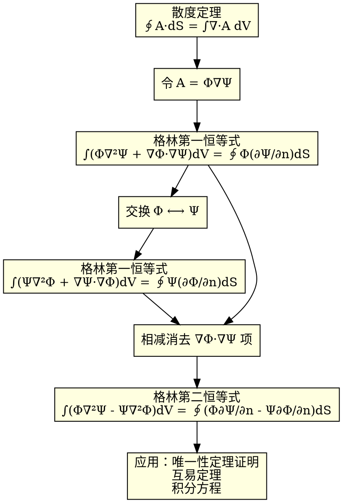

# 格林第二恒等式
**关键词**：格林定理

## 教科书原文

> 📖 参见：[[§1-8 格林定理]]

## 从第一到第二恒等式的逻辑推导

```graphviz
digraph G {
    rankdir=TB;
    node [shape=box, style=filled, fillcolor=lightyellow];
    A [label="散度定理\n∮A·dS = ∫∇·A dV"];
    B [label="令 A = Φ∇Ψ"];
    C [label="格林第一恒等式\n∫(Φ∇²Ψ + ∇Φ·∇Ψ)dV = ∮Φ(∂Ψ/∂n)dS"];
    D [label="交换 Φ ⟷ Ψ"];
    E [label="格林第一恒等式\n∫(Ψ∇²Φ + ∇Ψ·∇Φ)dV = ∮Ψ(∂Φ/∂n)dS"];
    F [label="相减消去 ∇Φ·∇Ψ 项"];
    G [label="格林第二恒等式\n∫(Φ∇²Ψ - Ψ∇²Φ)dV = ∮(Φ∂Ψ/∂n - Ψ∂Φ/∂n)dS"];
    H [label="应用：唯一性定理证明\n互易定理\n积分方程"];
    A -> B;
    B -> C;
    C -> D;
    D -> E;
    C -> F;
    E -> F;
    F -> G;
    G -> H;
}
```

> 📖 参见：[[§1-8 格林定理]]
