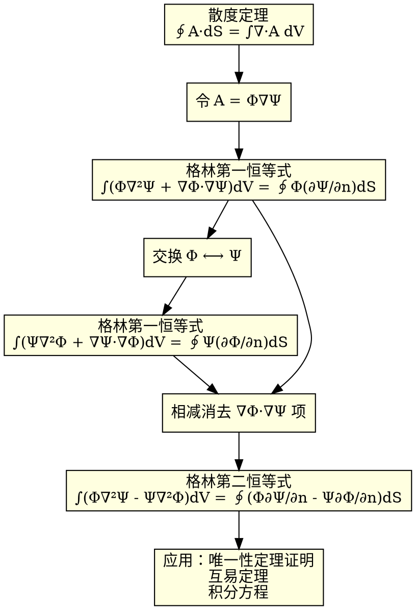

# 格林第二恒等式
**关键词**：格林定理

📌 **一句话本质**：格林第二恒等式 = 第一恒等式减去交换变量后的自身——消去 ∇φ·∇ψ 项后得到对称形式，用来证明电磁场中的互易定理和唯一性定理。

🏷️ **重要度**：🟡 | 考试：★★ | 题型：简

## 🧠 类比与直觉

如果把格林第一恒等式比作"∫f·(g')² + ∫f'·g' = 边界项"，第二恒等式就是把 f 和 g 交换位置再写一遍，然后两式相减消掉共同的 f'·g' 项。结果是一个对称的漂亮公式：∫(f∇²g - g∇²f)dV = 边界对称差。这就像两兄弟互相"举证"——用函数的交叉关系消除中间量，直击边界。

**口诀**："第一恒等减自身，对称形式证唯一"

## 教科书原文

> 📖 参见：[[§1-8 格林定理]]

## 从第一到第二恒等式的逻辑推导

## ✂️ 可跳过
- graphviz 推导流程图帮助理解推理链，考试只需记住第二恒等式是第一恒等式的对称化结果
- 互易定理的应用在后续章节详述

> 📖 参见：[[§1-8 格林定理]]
