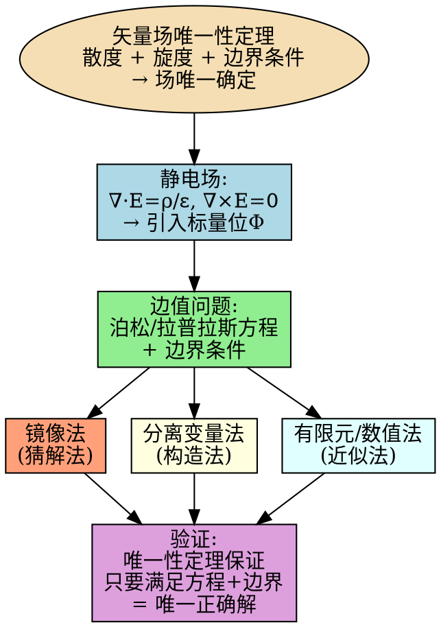

# 矢量场唯一性定理在边值问题中的应用
**关键词**：矢量场的惟一性定理

📌 **一句话本质**：唯一性定理是电磁场求解的"免检通行证"——镜像法、分离变量法、有限元法之所以敢"猜"或"凑"答案，正是因为定理保证：只要满足方程和边界条件，无论方法多取巧，结果都是唯一正确的。

🏷️ **重要度**：🟡 | 考试：★ | 题型：简

## 🧠 类比与直觉

唯一性定理给求解方法"背书"。就像高考数学题——不管你是用代数推导、几何构造还是猜答案反代验证，只要最后结果满足题目所有条件，评分标准必须给你满分。镜像法就是"猜一个等效电荷配置"，分离变量法就是"用级数拼出一个解"，有限元法就是"用计算机把区域切成小块近似算"。三种方法天差地别，但唯一性定理保证它们给出的结果完全等价。

**口诀**："方程边界两满足，猜凑数值皆等效"

## 教科书原文

> 📖 参见：[[§1-9 矢量场的惟一性定理]]

## 唯一性定理↔求解方法的逻辑链

## ✂️ 可跳过
- graphviz 逻辑链图为理解辅助，考试只需记住三种求解方法（镜像、分离变量、有限元）都依赖唯一性定理
- 具体求解方法在后续章节（镜像法在第3章、分离变量法在第4章）详述

> 📖 参见：[[§1-9 矢量场的惟一性定理]]
