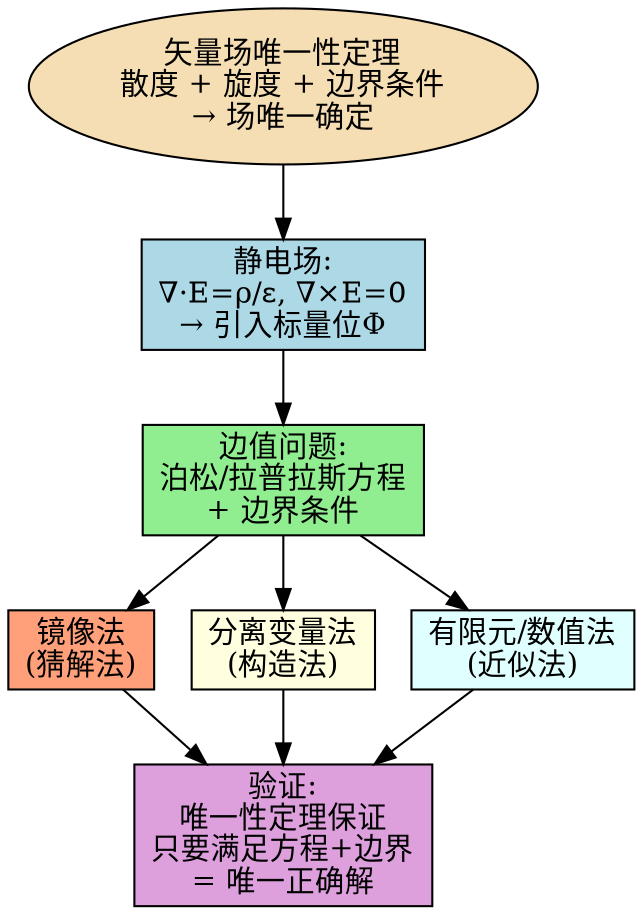

# 矢量场唯一性定理在边值问题中的应用
**关键词**：矢量场的惟一性定理

## 教科书原文

> 📖 参见：[[§1-9 矢量场的惟一性定理]]

## 唯一性定理↔求解方法的逻辑链

```graphviz
digraph G {
    rankdir=TB;
    node [shape=box, style=filled];

    U [label="矢量场唯一性定理\n散度 + 旋度 + 边界条件\n→ 场唯一确定", shape=ellipse, fillcolor=wheat];
    E [label="静电场:\n∇·E=ρ/ε, ∇×E=0\n→ 引入标量位Φ", fillcolor=lightblue];
    B [label="边值问题:\n泊松/拉普拉斯方程\n+ 边界条件", fillcolor=lightgreen];
    M1 [label="镜像法\n(猜解法)", fillcolor=lightsalmon];
    M2 [label="分离变量法\n(构造法)", fillcolor=lightyellow];
    M3 [label="有限元/数值法\n(近似法)", fillcolor=lightcyan];
    V [label="验证:\n唯一性定理保证\n只要满足方程+边界\n= 唯一正确解", fillcolor=plum];

    U -> E;
    E -> B;
    B -> M1;
    B -> M2;
    B -> M3;
    M1 -> V;
    M2 -> V;
    M3 -> V;
}
```

> 📖 参见：[[§1-9 矢量场的惟一性定理]]
