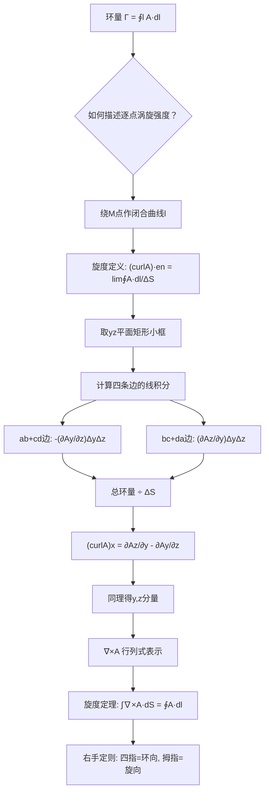

# 旋度的定义与方向判定
**关键词**：旋度, ∇×, 环量, 斯托克斯定理, 右手定则, 矢量场

## 概念定义

**旋度（curl）描述矢量场在某一点"转不转"——以及绕哪个方向转、转得多厉害。它是一个矢量，其方向是使环量强度达到最大的方向，其大小等于该方向上的最大环量强度（即单位面积的环量）。**

- $$\nabla \times \mathbf{A} \neq 0$$：场在该点有**旋转**（涡旋场），如水流中的漩涡、导线周围的磁场
- $$\nabla \times \mathbf{A} = 0$$：场在该点**无旋转**（无旋场/保守场），如静电场、重力场

## 类比与直觉

**类比一：河中放一片小树叶**

在河中放一片轻飘飘的小树叶。如果树叶**原地打转**——说明该处水流有旋度（漩涡核心处）。如果树叶**沿直线平稳漂走**——说明该处水流旋度为零。注意：树叶走曲线不等于有旋度！水流整体拐弯（像河道弯曲处）时，树叶可能只是跟着弯但自己并不旋转。**旋度衡量的是局部旋转，不是路径的弯曲。**

**类比二：微型风车实验**

想象你拿着一个极小的手持风车，把它伸到矢量场中不同的位置和方向：
- 风车**高速旋转** → 该点、该方向的旋度分量很大
- 风车**完全不动** → 该方向上的旋度分量为零
- 慢慢转动风车的朝向，找到使风车**转速最大**的方向 → 那就是旋度矢量的方向！
- 那个最大转速 → 就是旋度矢量的大小

**类比三：电磁场的"旋转接力"**

在麦克斯韦方程组中，旋度是电场和磁场相互转化的"引擎"：
- 变化的磁场产生涡旋电场（法拉第定律：$$\nabla \times \mathbf{E} = -\partial \mathbf{B}/\partial t$$）——变压器原理
- 变化的电场和传导电流产生涡旋磁场（安培-麦克斯韦定律：$$\nabla \times \mathbf{H} = \mathbf{J} + \partial \mathbf{D}/\partial t$$）
- 这两个旋度方程相互耦合，形成电磁波在空间中传播的物理机制

## 教科书推导：逐步拆解

### 第1步：环量 —— 闭合路径上的"旋转总量"

矢量场 $$\mathbf{A}$$ 沿有向闭合曲线 $$l$$ 的线积分称为环量：

$$\Gamma = \oint_l \mathbf{A} \cdot d\mathbf{l} \quad \text{(1-6-1)}$$

若闭合曲线上 $$\mathbf{A}$$ 的方向处处与线元 $$d\mathbf{l}$$ 同向，则 $$\Gamma > 0$$；处处反向则 $$\Gamma < 0$$。教科书以真空中磁通密度 $$\mathbf{B}$$ 为例：$$\oint_l \mathbf{B} \cdot d\mathbf{l} = \mu_0 I$$，电流方向与 $$d\mathbf{l}$$ 方向构成右旋关系。环量表示闭合曲线包围的总源强度（在此例中是总电流 $$I$$），但**无法显示源的分布特性**。

### 第2步：旋度的极限定义 —— 从"总环量"到"环量密度"

围绕空间中一点 $$M$$ 作一条有向闭合曲线 $$l$$，其包围面积为 $$\Delta S$$，令 $$\mathbf{e}_n$$ 为 $$\Delta S$$ 的法向单位矢量，与 $$l$$ 的方向构成**右旋关系**。定义极限：

$$\lim_{\Delta S \to 0} \frac{\oint_l \mathbf{A} \cdot d\mathbf{l}}{\Delta S}$$

这一极限称为矢量场 $$\mathbf{A}$$ 对于方向 $$\mathbf{e}_n$$ 的**环量强度**。在同一点上，不同方向的环量强度可能不相等。

**旋度矢量**是这样一个矢量：
- 其**方向**：使矢量 $$\mathbf{A}$$ 具有**最大**环量强度的方向
- 其**大小**：等于对该矢量方向的最大环量强度

用公式表达：

$$(curl \mathbf{A}) \cdot \mathbf{e}_n = \lim_{\Delta S \to 0} \frac{\oint_l \mathbf{A} \cdot d\mathbf{l}}{\Delta S} \quad \text{(1-6-2)}$$

式中 $$\mathbf{e}_n$$ 为旋度方向上的单位矢量。该式表明：**旋度的大小等于包围单位面积的闭合曲线的最大环量**。

教科书强调：旋度代表源的强度（涡旋源强度），在无旋涡源的区域中旋度必为零。这与散度的物理意义形成对比——散度表示发散源，旋度表示涡旋源，亥姆霍兹定理告诉我们，任何矢量场的源只有这两种类型。

### 第3步：旋度定理（斯托克斯定理）

将闭合曲线 $$l$$ 包围的区域分成两个小区域，其周界分别为 $$l_1$$ 和 $$l_2$$。由于相邻边界方向相反，沿 $$l$$ 的环量等于沿 $$l_1$$ 和 $$l_2$$ 的环量之和。依此类推，将面积 $$S$$ 分割为许多面元 $$d\mathbf{S}$$：

$$\int_S (curl \mathbf{A}) \cdot d\mathbf{S} = \oint_l \mathbf{A} \cdot d\mathbf{l} \quad \text{(1-6-3)}$$

这就是**旋度定理**（斯托克斯定理，Stokes' Theorem）：
- **数学上**：将面积分化为线积分（或反之）
- **物理上**：建立了区域中场的旋度与区域边界上场的关系

用 $$\nabla$$ 算子表示：$$\int_S (\nabla \times \mathbf{A}) \cdot d\mathbf{S} = \oint_l \mathbf{A} \cdot d\mathbf{l}$$ (1-6-9)

### 第4步：直角坐标系中旋度的推导 —— 矩形小框法

旋度是矢量，在直角坐标中可分为三个分量：

$$curl \mathbf{A} = \mathbf{e}_x (curl \mathbf{A})_x + \mathbf{e}_y (curl \mathbf{A})_y + \mathbf{e}_z (curl \mathbf{A})_z$$

**计算 $$(curl \mathbf{A})_x$$ 分量：** 围绕点 $$M(x,y,z)$$ 作一个平行于 $$x = 0$$ 平面（即 yz 平面）的矩形小框，边长分别为 $$\Delta y$$ 和 $$\Delta z$$。计算沿此矩形框的环量：

$$\oint_l \mathbf{A} \cdot d\mathbf{l} = \int_a^b \mathbf{A} \cdot d\mathbf{l} + \int_b^c \mathbf{A} \cdot d\mathbf{l} + \int_c^d \mathbf{A} \cdot d\mathbf{l} + \int_d^a \mathbf{A} \cdot d\mathbf{l}$$

**ab边**（沿 y 方向，z = z − Δz/2）：

$$\int_a^b \mathbf{A} \cdot d\mathbf{l} = \int_a^b \mathbf{A} \cdot \mathbf{e}_y dl = A_y\!\left(x, y, z - \frac{\Delta z}{2}\right) \Delta y$$

**cd边**（沿 −y 方向，z = z + Δz/2）：

$$\int_c^d \mathbf{A} \cdot d\mathbf{l} = -A_y\!\left(x, y, z + \frac{\Delta z}{2}\right) \Delta y$$

对 $$A_y$$ 函数在点 $$M$$ 处作泰勒展开：

$$A_y\!\left(x, y, z - \frac{\Delta z}{2}\right) = A_y(x,y,z) - \frac{\Delta z}{2}\left(\frac{\partial A_y}{\partial z}\right)_M$$

$$A_y\!\left(x, y, z + \frac{\Delta z}{2}\right) = A_y(x,y,z) + \frac{\Delta z}{2}\left(\frac{\partial A_y}{\partial z}\right)_M$$

代入并求和，得 ab 边 + cd 边的贡献：

$$\int_a^b + \int_c^d = -\left(\frac{\partial A_y}{\partial z}\right)_M \Delta y \Delta z \quad \text{(1-6-5)}$$

**同理**，bc边 + da边的贡献：

$$\int_b^c + \int_d^a = \left(\frac{\partial A_z}{\partial y}\right)_M \Delta y \Delta z \quad \text{(1-6-6)}$$

### 第5步：旋度分量的最终表达式

矩形框总环量除以 $$\Delta S = \Delta y \Delta z$$，得 x 分量：

$$(curl \mathbf{A})_x = \frac{\partial A_z}{\partial y} - \frac{\partial A_y}{\partial z}$$

**同理可得**其余两个分量：

$$(curl \mathbf{A})_y = \frac{\partial A_x}{\partial z} - \frac{\partial A_z}{\partial x}$$

$$(curl \mathbf{A})_z = \frac{\partial A_y}{\partial x} - \frac{\partial A_x}{\partial y}$$

### 第6步：行列式表示与 $$\nabla$$ 算子形式

旋度在直角坐标系中可用行列式简洁表示：

$$\nabla \times \mathbf{A} = \begin{vmatrix} \mathbf{e}_x & \mathbf{e}_y & \mathbf{e}_z \\[3pt] \frac{\partial}{\partial x} & \frac{\partial}{\partial y} & \frac{\partial}{\partial z} \\[3pt] A_x & A_y & A_z \end{vmatrix} \quad \text{(1-6-7)}$$

利用 $$\nabla$$ 算子和矢积的定义，旋度可写成：

$$curl \mathbf{A} = \nabla \times \mathbf{A} \quad \text{(1-6-8)}$$

旋度运算遵循的规则：

$$\nabla \times (\mathbf{A} \pm \mathbf{B}) = \nabla \times \mathbf{A} \pm \nabla \times \mathbf{B} \quad \text{(1-6-10)}$$

$$\nabla \times (C\mathbf{A}) = C \nabla \times \mathbf{A} \quad (C\text{为常数}) \quad \text{(1-6-11)}$$

$$\nabla \times (\varphi \mathbf{A}) = \varphi \nabla \times \mathbf{A} + \nabla \varphi \times \mathbf{A} \quad \text{(1-6-12)}$$

### 第7步：右手定则判定旋度方向

教科书明确指出：面元 $$d\mathbf{S}$$ 的方向与曲线 $$l$$ 的方向构成**右旋关系**。这意味着：

- 右手四指弯曲指向闭合曲线的环绕方向
- 右手拇指指向面元的法线方向（即旋度方向）

在电磁场中，这一法则至关重要：
- 安培环路定律中，电流正方向与磁场环流方向构成右旋关系
- 法拉第定律中，变化的磁通正方向与感应电场环流方向构成右旋关系（但前面有负号！）

## Mermaid推导流程图



## 教科书例题

**例1-6-1** 证明 $$\nabla \times (\mathbf{C} \times \mathbf{r}) = 2\mathbf{C}$$，其中 $$\mathbf{C}$$ 为常矢量，$$\mathbf{r}$$ 为位置矢量。

证法：令 $$\mathbf{C} = C_x\mathbf{e}_x + C_y\mathbf{e}_y + C_z\mathbf{e}_z$$，$$\mathbf{r} = x\mathbf{e}_x + y\mathbf{e}_y + z\mathbf{e}_z$$。先算 $$\mathbf{C} \times \mathbf{r}$$ 各分量，再取旋度，逐项合并得 $$2(C_x\mathbf{e}_x + C_y\mathbf{e}_y + C_z\mathbf{e}_z) = 2\mathbf{C}$$。

**例1-6-2** 证明矢量旋度定理：$$\int_V (\nabla \times \mathbf{A}) dV = -\oint_S \mathbf{A} \times d\mathbf{S}$$ (1-6-13)

此为斯托克斯定理的三维推广。证法：引入任意常矢量 $$\mathbf{C}$$，利用恒等式 $$\nabla \cdot (\mathbf{C} \times \mathbf{A}) = -\mathbf{C} \cdot (\nabla \times \mathbf{A})$$ 和散度定理，最终由 $$\mathbf{C}$$ 的任意性得证。

## MATLAB可视化提示词

- **功能描述**：绘制二维矢量场 $$\mathbf{F} = (-y, x)$$ 的旋度可视化图（该场为纯旋转场，旋度恒为 $$(0,0,2)$$），用 quiver 绘制矢量箭头，用 pcolor/contour 标注旋度的 z 分量，并叠加环量积分路径。
- **输入参数**：空间坐标范围 x, y ∈ [-2, 2]，网格分辨率 20×20，可选闭合积分路径（圆形或矩形）。
- **输出要求**：两个子图——(a) quiver 矢量箭头图展示旋转场，(b) pcolor/contourf 伪彩色图标出旋度值（红色=旋度正值，蓝色=旋度零或负），用黑色线条叠加积分路径，添加 colorbar。
- **代码结构**：meshgrid 生成网格 → 计算矢量场分量 → `curl` 函数计算数值旋度 → subplot 绘图 → 叠加闭合路径并标注环量值。
- **注释要求**：中文标注每个步骤，注明旋度公式和斯托克斯定理，在图上标注环量数值验证旋度定理。
- **错误处理**：检查网格分辨率，若旋度全为零输出"此场为无旋场"。

## 常见误区

1. **旋度是矢量而非标量**：旋度有大小（旋转强度）和方向（旋转轴方向）。散度是标量（只有一个数值），旋度是矢量（三个分量）。不可混淆。

2. **场线弯曲不等于场有旋度**：这是最常见的误解！散度场 $$\mathbf{F} = (x, y)$$ 的场线是向外辐射的直线，旋度为零但却不是闭合曲线。相反，圆形矢量场 $$\mathbf{F} = (-y, x)$$ 的场线是同心圆，旋度为常量 2。关键在于场**沿闭合路径的环量**是否为零，而非场线的形状。

3. **静电场旋度处处为零**：$$\nabla \times \mathbf{E} = 0$$ 意味着静电场是保守场（无旋场），可以定义标量电位 $$\varphi$$（且 $$\mathbf{E} = -\nabla \varphi$$）。正是因为这个性质，我们才能谈论"电压"——两点之间的电位差与路径无关。

4. **旋度方向由右手定则确定**：四指弯曲方向 = 场的旋转方向，拇指所指 = 旋度矢量的方向。注意法拉第定律中的负号：$$\nabla \times \mathbf{E} = -\partial \mathbf{B}/\partial t$$，意味着感应电场的方向"反抗"磁通量的变化（楞次定律）。

5. **旋度定理 = 二维版散度定理**：散度定理将体积分与面积分联系，旋度定理将面积分与线积分联系。两者都是"将边界上的总量与内部微分量的积分联系起来的数学工具"，只是维度不同。

## 费曼检验

1. 如果 $$\mathbf{A} = (yz, zx, xy)$$，计算其旋度 $$\nabla \times \mathbf{A}$$。这个场有旋吗？（提示：代入行列式逐项计算，得到的旋度是 $$\mathbf{0}$$——这意味着虽然 $$\mathbf{A}$$ 的表达式看起来"交叉"，但它实际上是无旋场。）

2. 为什么在静电学中可以使用标量电位 $$\varphi(\mathbf{r})$$，而在时变电磁场中却不能单独使用标量电位？（提示：$$\nabla \times \mathbf{E} = 0$$ 仅对静电场成立，时变场中 $$\nabla \times \mathbf{E} = -\partial \mathbf{B}/\partial t \neq 0$$，因此电场不再是纯无旋场，需要同时引入矢量磁位 $$\mathbf{A}$$。）

3. 斯托克斯定理说：$$\int_S (\nabla \times \mathbf{A}) \cdot d\mathbf{S} = \oint_l \mathbf{A} \cdot d\mathbf{l}$$。如果曲面 $$S$$ 的面积恒定但形状不同（例如一个鼓起的半球面和一个扁平圆盘），等式两边的值会改变吗？（提示：不会，因为两者有相同的边界 $$l$$，而旋度的面积分仅取决于边界上的环量。）

## 概念导航

- 前置概念：[[环量的定义与物理背景]]、[[矢量积（叉积）的右手定则]]、[[矢量场的通量、散度与散度定理/散度的定义：矢量场的源强度]]
- 后续概念：[[斯托克斯定理的物理理解]]、[[无旋场的定义与性质]]、[[法拉第电磁感应定律的旋度形式]]
- 关联概念：[[亥姆霍兹定理：矢量场的唯一分解]]、[[麦克斯韦方程组/四大方程的积分形式与微分形式]]

> 📖 **教科书参考**：§1-6, p.13-17

## 可视化图表

```vega-lite
{
  "$schema": "https://vega.github.io/schema/vega-lite/v5.json",
  "description": "旋度矢量场: F=(-y,x,0) 旋度∇×F=2k",
  "width": 400,
  "height": 300,
  "mark": "point",
  "encoding": {
    "x": {"field": "x", "type": "quantitative", "scale": {"domain": [-3, 3]}, "title": "x"},
    "y": {"field": "y", "type": "quantitative", "scale": {"domain": [-3, 3]}, "title": "y"},
    "angle": {"field": "angle", "type": "quantitative", "title": "方向角"},
    "size": {"field": "magnitude", "type": "quantitative", "title": "矢量长度"},
    "color": {"field": "curlZ", "type": "quantitative", "scale": {"scheme": "redblue", "domain": [-1, 3]}, "title": "旋度z分量"},
    "description": {"field": "desc", "type": "nominal"}
  },
  "data": {
    "values": [
      {"x": 0, "y": 0, "angle": 1.5708, "magnitude": 0, "curlZ": 2, "desc": "中心: ∇×F=(0,0,2)"},
      {"x": 1, "y": 1, "angle": 0.7854, "magnitude": 28, "curlZ": 2, "desc": "F=(-1,1,0)"},
      {"x": -1, "y": 1, "angle": 2.3562, "magnitude": 28, "curlZ": 2, "desc": "F=(-1,-1,0)"},
      {"x": 1, "y": -1, "angle": -0.7854, "magnitude": 28, "curlZ": 2, "desc": "F=(1,1,0)"},
      {"x": -1, "y": -1, "angle": -2.3562, "magnitude": 28, "curlZ": 2, "desc": "F=(1,-1,0)"},
      {"x": 2, "y": 2, "angle": 0.7854, "magnitude": 40, "curlZ": 2, "desc": "边界外缘"},
      {"x": -2, "y": 0, "angle": 2.0944, "magnitude": 20, "curlZ": 2, "desc": ""},
      {"x": 2, "y": 0, "angle": 0.3218, "magnitude": 20, "curlZ": 2, "desc": ""},
      {"x": 0, "y": 2, "angle": 1.2490, "magnitude": 20, "curlZ": 2, "desc": ""},
      {"x": 0, "y": -2, "angle": 1.8925, "magnitude": 20, "curlZ": 2, "desc": ""}
    ]
  },
  "title": "旋度矢量场: F=(-y,x,0) 各处∇×F=(0,0,2)恒定 §1-7"
}

```


```wavedrom
{
  "signal": [
    {"name": "∇×F>0 正旋度(逆时针涡)", "wave": "3", "period": 4, "data": ["→", "↗", "←", "↙"]},
    {"name": "∇×F=0 无旋(保守场)", "wave": "2", "period": 4, "data": ["→", "→", "→", "→"]},
    {"name": "∇×F<0 负旋度(顺时针涡)", "wave": "13", "period": 4, "data": ["→", "↘", "←", "↖"]},
    {"name": "环量Γ=∮F·dl", "wave": "z", "period": 4, "data": ["Γ>0", "Γ≈max", "Γ=0", "Γ<0"]}
  ],
  "head": {
    "text": "旋度: 矢量场的旋转强度与方向 §1-7",
    "tick": 0
  },
  "foot": {
    "text": "curl F = lim(S→0) (1/S)∮F·dl  n方向  斯托克斯定理"
  },
  "edge": ["↗", "↘", "↖", "↙"]
}

```
