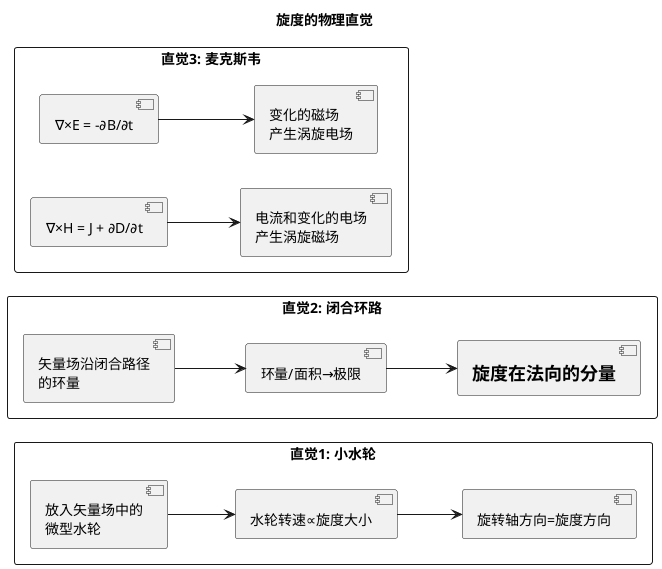

# 环量的定义与物理背景
**关键词**：旋度, ∇×, 环量, 斯托克斯定理, 右手定则, 矢量场

📌 **一句话本质**：环量就是沿着一条闭合路径走一圈，看场"推了"你多少——正环量表示场在顺着你走的方向推，环量越大闭合路径里包裹的"漩涡"越多。

🏷️ **重要度**：🔴 | 考试：★★★ | 题型：计

🔧 **工程/实际场景**：感应电机转子设计——通过安培环路定律 ∮B·dl = μ₀I 计算绕组产生的磁场环量来确定转矩。如果环量积分路径取反（逆时针vs顺时针方向），计算出的驱动电流相差一个负号，电机控制器会输出错误的相序，导致电机堵转或烧毁。

## 🧠 类比与直觉

想象你绕操场跑一圈——每一步，风要么推你一把（顺风，正贡献），要么挡你一下（逆风，负贡献）。跑完一整圈的"净推力"就是环量。如果操场中心有个大风扇（漩涡源），你绕圈跑时大部分路段都会被推着走，环量为正。环量本质就是：闭合路径内包裹了多少"旋转驱动力"。

**口诀**："闭合路径走一圈，场推做功环量判"

## 教科书原文

> 📖 参见：[[§1-6 矢量场的环量旋度与旋度定理]]

## 环量的物理直觉加深

环量不一定要闭合的电流回路。在流体力学中，环量描述涡旋强度——取一个闭合路径，计算流体速度沿路径的环量再除以面积取极限，就是旋度。类比：搅动杯中的咖啡，表面的泡沫在涡旋处旋转最快（旋度最大），边缘处只是平移（旋度为零）。

## 旋度的三种视角

## ✂️ 可跳过
- plantuml 图表辅助理解旋度的三种视角，考试只需记住环量/面积→极限 = 旋度这一条
- 流体力学中涡旋强度的类比为理解性内容，不影响考试

> 📖 参见：[[§1-6 矢量场的环量旋度与旋度定理]]
