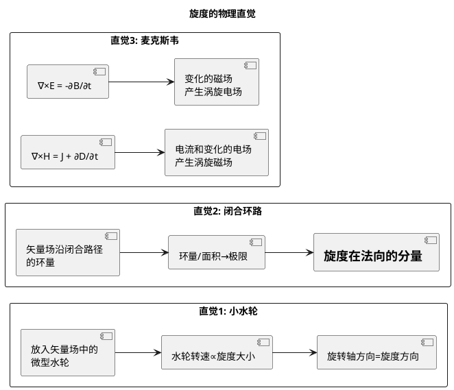

# 环量的定义与物理背景
**关键词**：旋度, ∇×, 环量, 斯托克斯定理, 右手定则, 矢量场

## 教科书原文

> 📖 参见：[[§1-6 矢量场的环量旋度与旋度定理]]

## 环量的物理直觉加深

环量不一定要闭合的电流回路。在流体力学中，环量描述涡旋强度——取一个闭合路径，计算流体速度沿路径的环量再除以面积取极限，就是旋度。类比：搅动杯中的咖啡，表面的泡沫在涡旋处旋转最快（旋度最大），边缘处只是平移（旋度为零）。

## 旋度的三种视角

> 📖 参见：[[§1-6 矢量场的环量旋度与旋度定理]]
