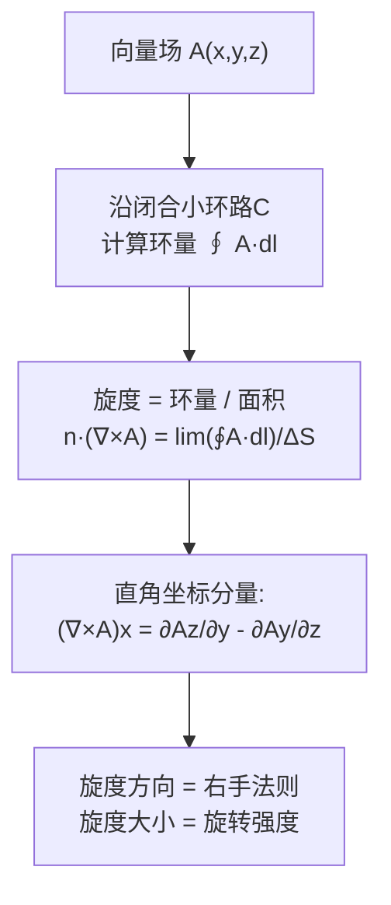

# 环量与旋度

## 📌 一句话本质
旋度描述"这个点有没有漩涡"——把一个小桨叶放在流场里，它会转起来的地方就是旋度不为零的地方。

## 🏷️ 重要度
🔴核心 | 考试：★★★ | 题型：计算题（必出）

## 🔧 工程/实际场景
电机设计中，转子槽内的电流产生的磁场旋度直接决定转矩大小。如果旋度计算错误（漏了一相绕组的贡献），电机会产生脉动转矩，导致振动和噪音——严重时电机无法正常启动。

## 🧠 口诀/类比
**类比**：站在河流里放一个小桨叶——如果桨叶打转，那里的旋度不为零（有漩涡）。直直流淌的河水里桨叶不转（旋度为零）。但注意——即使河水在弯曲河道里走，只要水流本身不旋转，桨叶也不转！
**口诀**："旋度正处左旋转，右手法则定指尖，无旋必有势函数"

## 📖 课程定位
章节：§1-6（第一章 矢量分析）
前置概念：[[环量]] → 旋度 → 后续概念：[[斯托克斯定理]]
关联：[[散度]]（旋度场恒无散）、[[梯度]]（梯度场恒无旋）

## ⚠️ 常见误区
1. **旋度是向量，不是标量** — 旋度输出的是旋转轴的方向（右手法则）和旋转强度
2. **弯曲 ≠ 有旋** — 河水可以弯弯曲曲地流但旋度为零（只要水流自己不转）
3. **旋度为零 ≠ 场为零** — 均匀场旋度为零，场不为零
4. **∇×∇f = 0** — 任何标量场的梯度场都是无旋的（数学恒等式）

## ❓ 费曼检验
1. "用一杯咖啡里的漩涡来解释：什么是旋度？咖啡搅拌和咖啡杯旋转有什么区别？"
2. "$A = (-y, x, 0)$ 和 $A = (y, x, 0)$ 的旋度分别是多少？哪个场有'漩涡'？"
3. "为什么静电场可以写成 E = -∇φ？这和 ∇×E = 0 有什么关系？"

## ✂️ 可跳过
- 旋度在曲线坐标系中的完整表达式（记结论，不推导）
- 斯托克斯定理的数学证明

## 💻 验证/练习
- **MATLAB仿真**: 绘制 $A = (-y, x)$ 的向量场和旋度场，观察旋转方向
- **Python练习**: 验证 ∇×(∇f) = 0（对任意标量场成立）
- **费曼法**: 解释"为什么龙卷风的中心旋度最大，外围反而小？"

## 🔗 关联概念
- 前置：[[环量]] — 环量是旋度在曲面上的积分
- 横向：[[散度]] — Helmholtz分解：任何向量场 = 无散分量 + 无旋分量
- 横向：[[梯度]] — 对标量场梯度的旋度恒为零：∇×(∇f) = 0
- 后续：[[斯托克斯定理]] — 曲面上的旋度积分 = 边界上的环量

## 推导流程

