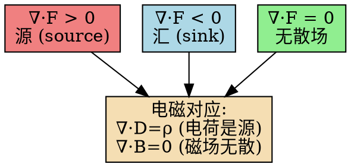

# 散度的定义：矢量场的源强度
**关键词**：散度, ∇·, 通量, 源, 高斯散度定理, 矢量场

## 教科书原文

> 📖 参见：[[§1-5 矢量场的通量散度与散度定理]]

## 散度的三种等价定义

1. **通量密度极限**：$\nabla\cdot\mathbf{F} = \lim_{V\to 0}\frac{1}{V}\oint_S \mathbf{F}\cdot d\mathbf{S}$
2. **分量偏导数和**：$\nabla\cdot\mathbf{F} = \frac{\partial F_x}{\partial x} + \frac{\partial F_y}{\partial y} + \frac{\partial F_z}{\partial z}$
3. **源密度的量度**：正散度 = 有"源"（通量从该点发散），负散度 = 有"汇"

> 📖 参见：[[§1-5 矢量场的通量散度与散度定理]]

## 更多费曼检验
1. 用散度的"淋浴喷头"模型解释为什么∇·(∇×A)=0在任何光滑矢量场A处成立。
2. 在圆柱坐标中计算位置矢量r的散度——验证∇·r=3（直角坐标）和∇·r=3（球坐标）的结果一致。
