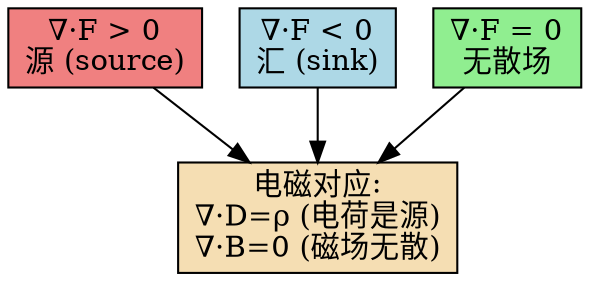

# 散度的定义：矢量场的源强度
**关键词**：散度, ∇·, 通量, 源, 高斯散度定理, 矢量场

📌 **一句话本质**：散度就是看矢量场在一点上是"喷出来"还是"吸进去"的标量强度——偏导数之和决定正负，正值是源、负值是汇。

🏷️ **重要度**：🔴 | 考试：★★★ | 题型：计

🔧 **工程/实际场景**：CFD（计算流体力学）仿真中的不可压缩流——求解纳维-斯托克斯方程时，如果某点速度场的散度不严格为零（违反 ∇·v = 0 的不可压缩条件），流体会在该点"凭空消失或产生"，导致整个压力场算错，飞机翼型的气动升力预测完全失效。

## 🧠 类比与直觉

想象浴室里的淋浴喷头和地漏——喷头往外喷水（正散度，源），地漏往里吸水（负散度，汇），连接两者的水管里水流过但没增减（散度为零）。散度就是每个点的"净出水率"。

**口诀**："散度正处源发散，负处汇点来吞咽"

## 教科书原文

> 📖 参见：[[§1-5 矢量场的通量散度与散度定理]]

## 散度的三种等价定义

1. **通量密度极限**：$\nabla\cdot\mathbf{F} = \lim_{V\to 0}\frac{1}{V}\oint_S \mathbf{F}\cdot d\mathbf{S}$
2. **分量偏导数和**：$\nabla\cdot\mathbf{F} = \frac{\partial F_x}{\partial x} + \frac{\partial F_y}{\partial y} + \frac{\partial F_z}{\partial z}$
3. **源密度的量度**：正散度 = 有"源"（通量从该点发散），负散度 = 有"汇"

> 📖 参见：[[§1-5 矢量场的通量散度与散度定理]]

## ❓ 更多费曼检验
1. 用散度的"淋浴喷头"模型解释为什么∇·(∇×A)=0在任何光滑矢量场A处成立。
2. 在圆柱坐标中计算位置矢量r的散度——验证∇·r=3（直角坐标）和∇·r=3（球坐标）的结果一致。

## ✂️ 可跳过
- graphviz 流程图帮助理解三态（源/汇/无散），考试只需记住符号判据
- 费曼检验第2题（坐标系间验证）为加深理解题，非考试重点
