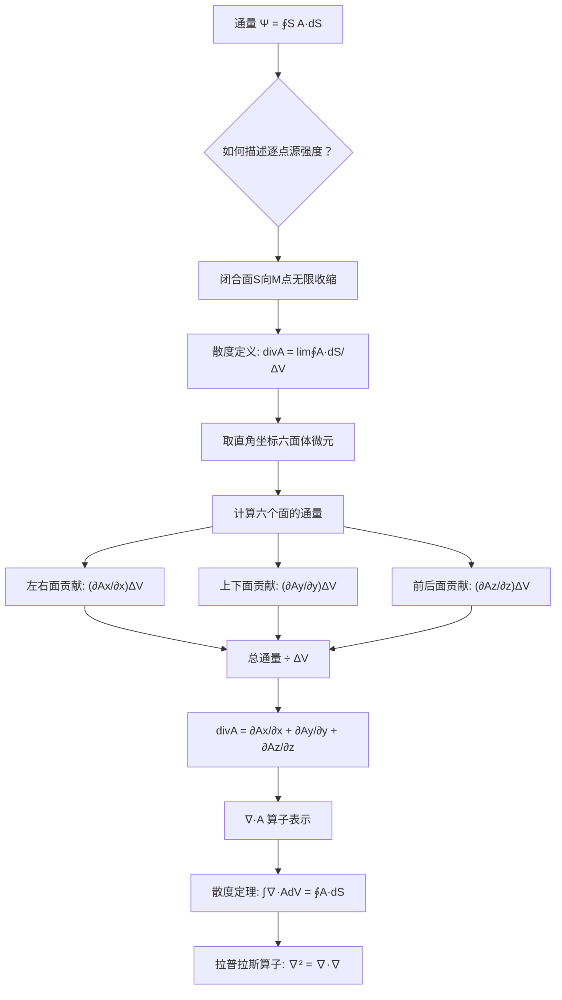

# 散度的定义：矢量场的源强度
**关键词**：散度, ∇·, 通量, 源, 高斯散度定理, 矢量场

📌 **一句话本质**：散度就是在每个点上开个"流量统计器"，看净流出多少——正值说明有"源头"在往外冒，负值说明有"漏斗"在往里吸，零说明只是路过。

🏷️ **重要度**：🔴 | 考试：★★★ | 题型：计

🔧 **工程/实际场景**：手机散热仿真——设计手机时用热传导方程（含散度项）计算芯片热量如何在机身内扩散。如果某点的散热散度算偏了（比如把向外散热算成了向内吸热），散热工程师会错误定位热点，导致手机某处过热、芯片降频甚至永久损坏。

## 概念定义

**散度（divergence）描述矢量场在空间中某一点是"向外发散"还是"向内汇聚"——以及发散或汇聚的强度。它是一个标量，代表通过包围该点的单位体积闭合面的通量。**

- $$\nabla \cdot \mathbf{A} > 0$$：该点存在**正源**（场从此点向外发散，如正电荷发出电场线）
- $$\nabla \cdot \mathbf{A} < 0$$：该点存在**负源/汇**（场向此点汇聚，如负电荷吸收电场线）
- $$\nabla \cdot \mathbf{A} = 0$$：该点**无源无汇**（场仅仅流过，如磁场线永远是闭合的）

## 🧠 类比与直觉

**类比一：淋浴间的喷头与地漏**

想象你站在淋浴间里。打开花洒喷头，水从一个个小孔中**向外喷出**——每一个喷水孔就是一个"正源"（散度 > 0）。地板上的地漏则相反，水向地漏**汇聚流下**——地漏就是一个"负源"或"汇"（散度 < 0）。而在连接喷头和地漏的水管中，水流过但既不被创造也不被消灭——水管内的任意点散度为零。这个类比直接对应静电学：正电荷是电场的"喷头"，负电荷是电场的"地漏"，无电荷区域就是"水管"。

**类比二：商场的人流统计**

想象你在商场入口处统计净进出人数。如果在一个小区域内，每分钟走出的人数持续大于进入的人数，该区域就有正散度——有人在里面向外"驱赶"人流。反过来，如果净进入大于净走出，该区域就有负散度——像是有人在里面对外"吸收"人流。散度本质上就是对这种"净流出率"的逐点度量。通量是整层楼的"总净流量"，而散度告诉你每平方米的"人流密度源"在哪。

**类比三：正在放气的气球**

一个扎了孔的气球——气球内部每一点的空气都在向气球外流动，气球表面区域的空气分子离开的速度大于进入的速度，因此气球内部有正散度源。但当气球完全瘪掉后，整个房间里的空气只是随机流动，任何一点的净流出都为零——散度处处为零，但空气分子仍然在运动（场值不为零）。

**口诀**："正源发散负源汇，零散只过不积堆"

## 教科书推导：逐步拆解

### 第1步：从通量出发 —— 闭合面上的净流出

矢量场 $$\mathbf{A}$$ 通过有向闭合曲面 $$S$$ 的**通量**定义为面积分：

$$\Psi = \oint_S \mathbf{A} \cdot d\mathbf{S} \quad \text{(1-5-1)}$$

按照教科书规定，闭合面的方向取**外法线方向**。若面元 $$d\mathbf{S}$$ 处处与 $$\mathbf{A}$$ 的方向垂直，通量为零；若面元处处与 $$\mathbf{A}$$ 同向，通量 > 0；处处反向，通量 < 0。因此：
- 通量 > 0：矢量总体**穿出**闭合面 → 面内存在正源
- 通量 < 0：矢量总体**进入**闭合面 → 面内存在负源（汇）
- 通量 = 0：穿出等于穿入 → 面内净源为零

教科书用真空中的电场强度 $$\mathbf{E}$$ 作为关键实例：$$\oint_S \mathbf{E} \cdot d\mathbf{S} = q / \varepsilon_0$$。当闭合面内存在正电荷时通量为正，负电荷时通量为负，无电荷时通量为零。若正负电荷量恰好相等，净通量也等于零——这说明"通量为零"并不意味着"面内没有电荷"，可能只是正负抵消。

然而，**通量只能表示闭合面内源的总量，无法描述源的分布特性**。欲知空间中每一点的"源密度"，需要将闭合面无限缩小，聚焦到一个几何点。

### 第2步：散度的极限定义 —— 从"总量"到"密度"

让闭合面 $$S$$ 向空间中某一点 $$M$$ 无限收缩，定义：

$$div \mathbf{A} = \lim_{\Delta V \to 0} \frac{\oint_S \mathbf{A} \cdot d\mathbf{S}}{\Delta V} \quad \text{(1-5-2)}$$

这就是散度的**不变形式定义**——单位体积的净通量。式中 $$\Delta V$$ 为闭合面 $$S$$ 包围的体积。散度是标量，它把"包围整个体积的净流出"转化为"空间中每一点的源强度"。教科书强调：既然是源强度，那么在**无源区中，各点的散度必等于零**。

这一极限定义与坐标系无关，是散度概念的核心。

### 第3步：散度定理 —— 从微观积分到宏观闭合面

教科书利用区域分割法推导散度定理。将闭合面 $$S$$ 包围的体积 $$V$$ 分割为许多体积元 $$dV$$，每个 $$dV$$ 都有自己的小闭合面。相邻体积元的公共面上的法线方向恰好相反（一个向外、一个向内），因此在这些公共面上，通量相互抵消。于是所有体积元通量之和等于最外表面 $$S$$ 的总通量。利用每个 $$dV$$ 的散度定义，得：

$$\int_V div \mathbf{A} \, dV = \oint_S \mathbf{A} \cdot d\mathbf{S} \quad \text{(1-5-3)}$$

这就是**散度定理**（高斯-奥斯特罗格拉茨基定理）。它有两个深远含义：
- **数学上**：将矢量函数的面积分转化为标量函数的体积分（或反过来），极大简化了计算
- **物理上**：建立了区域内部场与区域边界上场之间的定量联系——这是场论中最基本的关系之一

### 第4步：直角坐标系中散度的推导 —— 六面体微元法

这是教科书 §1-5 的核心推导。在矢量场中取一个长方体微元，中心点 $$M(x,y,z)$$，边长分别为 $$\Delta x, \Delta y, \Delta z$$，六个面分别平行于坐标面。

**x方向（左右面）的通量贡献：**

左端面 $$S_1$$ 的外法线方向为 $$-\mathbf{e}_x$$，通过 $$S_1$$ 的通量为：

$$\int_{S_1} \mathbf{A} \cdot d\mathbf{S}_1 = \int_{S_1} \mathbf{A} \cdot (-\mathbf{e}_x) dS_1 = -\int_{S_1} A_x dS_1$$

由于六面体很小，$$S_1$$ 上各点的 $$A_x$$ 可认为相等，则：

$$\int_{S_1} \mathbf{A} \cdot d\mathbf{S}_1 = -A_x\!\left(x - \frac{\Delta x}{2}, y, z\right) \Delta y \Delta z \quad \text{(1-5-4)}$$

同理，右端面 $$S_2$$（外法线方向 $$\mathbf{e}_x$$）的通量为：

$$\int_{S_2} \mathbf{A} \cdot d\mathbf{S}_2 = A_x\!\left(x + \frac{\Delta x}{2}, y, z\right) \Delta y \Delta z \quad \text{(1-5-5)}$$

将这两个函数在中心点 $$M$$ 按**泰勒级数展开**，略去高次项：

$$A_x\!\left(x - \frac{\Delta x}{2}, y, z\right) = A_x(x,y,z) - \frac{\Delta x}{2}\left(\frac{\partial A_x}{\partial x}\right)_M$$

$$A_x\!\left(x + \frac{\Delta x}{2}, y, z\right) = A_x(x,y,z) + \frac{\Delta x}{2}\left(\frac{\partial A_x}{\partial x}\right)_M$$

代入通量表达式并求和，x方向净通量：

$$\int_{S_1+S_2} \mathbf{A} \cdot d\mathbf{S} = \left(\frac{\partial A_x}{\partial x}\right)_M \Delta x \Delta y \Delta z$$

**同理可得** y方向（上下面）和z方向（前后面）的贡献分别为：

$$\left(\frac{\partial A_y}{\partial y}\right)_M \Delta x \Delta y \Delta z, \quad \left(\frac{\partial A_z}{\partial z}\right)_M \Delta x \Delta y \Delta z$$

### 第5步：直角坐标系散度公式的最终形式

将三个方向的通量贡献相加，得六面体表面总通量：

$$\oint_S \mathbf{A} \cdot d\mathbf{S} = \left(\frac{\partial A_x}{\partial x} + \frac{\partial A_y}{\partial y} + \frac{\partial A_z}{\partial z}\right)_M \Delta x \Delta y \Delta z \quad \text{(1-5-6)}$$

代入散度定义式 (1-5-2)（$$\Delta V = \Delta x \Delta y \Delta z$$），得：

$$div \mathbf{A} = \frac{\partial A_x}{\partial x} + \frac{\partial A_y}{\partial y} + \frac{\partial A_z}{\partial z} \quad \text{(1-5-7)}$$

这就是**直角坐标系中散度的计算式**——三个分量各自"在自己方向上的空间变化率"之和。它是标量：$$+$$ 表示向外发散，$$-$$ 表示向内汇聚。

### 第6步：用 $$\nabla$$ 算子表示散度

利用 $$\nabla = \mathbf{e}_x \frac{\partial}{\partial x} + \mathbf{e}_y \frac{\partial}{\partial y} + \mathbf{e}_z \frac{\partial}{\partial z}$$ 和矢量标积定义，散度可写为：

$$div \mathbf{A} = \nabla \cdot \mathbf{A} \quad \text{(1-5-8)}$$

散度定理也可用算子表示为：

$$\int_V \nabla \cdot \mathbf{A} \, dV = \oint_S \mathbf{A} \cdot d\mathbf{S} \quad \text{(1-5-9)}$$

散度运算满足以下规则：

$$\nabla \cdot (\mathbf{A} \pm \mathbf{B}) = \nabla \cdot \mathbf{A} \pm \nabla \cdot \mathbf{B} \quad \text{(1-5-10)}$$

$$\nabla \cdot (C\mathbf{A}) = C \nabla \cdot \mathbf{A} \quad (C\text{为常数}) \quad \text{(1-5-11)}$$

$$\nabla \cdot (\varphi \mathbf{A}) = \varphi \nabla \cdot \mathbf{A} + \mathbf{A} \cdot \nabla \varphi \quad \text{(1-5-12)}$$

### 第7步：拉普拉斯算子的引出

由梯度和散度的组合运算 $$\nabla \cdot (\nabla \varphi)$$，在直角坐标系中展开：

$$\nabla \cdot \nabla \varphi = \frac{\partial^2 \varphi}{\partial x^2} + \frac{\partial^2 \varphi}{\partial y^2} + \frac{\partial^2 \varphi}{\partial z^2}$$

定义**拉普拉斯算子**：

$$\nabla^2 = \frac{\partial^2}{\partial x^2} + \frac{\partial^2}{\partial y^2} + \frac{\partial^2}{\partial z^2} \quad \text{(1-5-14)}$$

于是 $$\nabla \cdot \nabla \varphi = \nabla^2 \varphi$$。拉普拉斯算子也可对矢量进行运算 $$\nabla^2 \mathbf{A}$$，但此时已失去"梯度的散度"的原始概念，仅是一种符号运算——在直角坐标系中就是对各分量分别作用 $$\nabla^2$$。

## Mermaid推导流程图



## 教科书例题

**例1-5-1** 求空间任一点 $$(x,y,z)$$ 的位置矢量 $$\mathbf{r} = x\mathbf{e}_x + y\mathbf{e}_y + z\mathbf{e}_z$$ 的散度。

解：$$\nabla \cdot \mathbf{r} = \frac{\partial x}{\partial x} + \frac{\partial y}{\partial y} + \frac{\partial z}{\partial z} = 1 + 1 + 1 = 3$$

位置矢量的散度恒为3——这意味着位置矢量场在空间中每一点都像"从原点向外辐射"的源。

**例1-5-2** 计算 $$\nabla^2(1/R)$$，其中 $$R = |\mathbf{r} - \mathbf{r}'|$$。

解：当 $$R \neq 0$$ 时，逐项求偏导得 $$\nabla^2(1/R) = 0 \ (R \neq 0)$$。当 $$R = 0$$ 时函数出现奇点，利用包含原点的球体积分和散度定理求得：

$$\nabla^2\left(\frac{1}{R}\right) = -4\pi\delta(R) \quad \text{(1-5-19)}$$

这是电磁场理论中推导电位方程和格林函数的基础关系式。

## 💻 MATLAB可视化提示词

- **功能描述**：生成三维空间中的矢量场 $$\mathbf{F} = (x, y, 0)$$ 的可视化，该场的散度为常量2（处处为正源），用 quiver3 绘制矢量箭头，并用 scatter3 标注各点的散度值，同时绘制闭合球面及其上的净通量分布。
- **输入参数**：空间坐标范围 x, y, z ∈ [-2, 2]，网格分辨率 15×15×15，可选散度阈值范围用于颜色映射。
- **输出要求**：三个子图——(a) quiver3 矢量箭头图展示场的方向和大小，(b) scatter3 散度值彩色散点图（红色=正散度 > 0.5，蓝色=零散度附近），(c) 闭合球面上的法向通量分布（用 surf 绘制球面并用向量场着色）。
- **代码结构**：先 `meshgrid` 生成均匀网格 → 计算矢量场三个分量 → 数值计算散度 `div = diff(Fx)/dx + diff(Fy)/dy` → 分三个 `subplot` 绘图 → 添加 `colorbar`, `title`, `xlabel/ylabel/zlabel`。
- **注释要求**：每个计算步骤用中文注释说明物理含义，标注散度公式和散度定理，关键变量注明单位或物理意义。
- **错误处理**：检查网格点数是否合理（超出内存警告），若散度全为零则输出"此矢量场为无散场"提示信息。

## ⚠️ 常见误区

1. **散度是标量而非矢量**：散度只有一个数值（没有方向），表示源的"强度"。初学者常把它和梯度混淆——梯度作用于标量得矢量，散度作用于矢量得标量。记住"梯散旋"的对应关系：梯度（标→矢）、散度（矢→标）、旋度（矢→矢）。

2. **散度为零不等于场为零**：例如均匀流 $$\mathbf{A} = C\mathbf{e}_x$$ 的散度为零（流入等于流出），但场值本身不为零。更重要的例子是磁场：$$\nabla \cdot \mathbf{B} = 0$$ 是实验事实（没有磁单极子），但不代表磁场不存在——磁铁周围的磁场可以非常强。

3. **通量是宏观量，散度是微观量**：通量衡量的是有限闭合面内的总源强度，而散度是逐点定义的局部量。两者通过散度定理联系：通量 = 散度的体积分。因此，局部处处无散 ⇒ 任何闭合面的总通量为零，但总通量为零 ⇏ 局部处处无散（正源和负源可能相互抵消）。

4. **"div"和"∇·"是同一个运算的对象写法**：div A ≡ ∇·A，在直角坐标下展开形式相同。但在曲线坐标系（圆柱坐标、球坐标）中，散度公式包含度量系数，需要特别注意。

5. **∇² 作用于矢量时已非"梯度的散度"**：教科书明确指出，以 $$\nabla^2 \mathbf{A}$$ 的形式对矢量运算时，只是在直角坐标下对各分量分别作用 $$\nabla^2$$，已失去原有的"先梯度后散度"的微分含义。

## ❓ 费曼检验

1. 如果 $$\mathbf{A} = (x^2, y^2, z^2)$$，在点 $$(1,1,1)$$ 处的散度是多少？该点是源还是汇？（提示：$$\nabla \cdot \mathbf{A} = 2x + 2y + 2z$$）

2. 为什么说散度定理是"从局部信息推断全局信息"的数学工具？如果某个矢量场在空间中除原点外散度处处为零，通过包围原点的球面的总通量为 $$\Phi$$，那么通过不包围原点的任意闭合曲面的通量是多少？

3. 在静电场中 $$\nabla \cdot \mathbf{E} = \rho/\varepsilon_0$$。如果一个区域中 $$\rho = 0$$（没有电荷），该区域中各点的 E 散度是否一定为零？穿过该区域中一个闭合曲面的电通量是否也一定为零？（提示：考虑闭合面是否包含了区域外的电荷）

## 🔗 概念导航

- 前置概念：[[梯度的物理意义：标量场最大变化率方向]]、[[通量的物理意义与计算]]、[[矢量场的环量、旋度与旋度定理/旋度的定义与方向判定]]
- 后续概念：[[高斯散度定理的物理理解]]、[[无散场的定义与性质]]、[[拉普拉斯方程与泊松方程]]
- 关联概念：[[亥姆霍兹定理：矢量场的唯一分解]]、[[高斯定律的对称性应用技巧]]

## ✂️ 可跳过
- 第1至第3步的"从通量到散度"动机叙述考试不直接考查，只需记住极限定义式 (1-5-2)
- 泰勒展开的中间推导过程（第4步）考试不要求默写，只需记住最终结果式 (1-5-7)
- ∇²(1/R) = -4πδ(R) 的详细证明过程（例1-5-2）在首次学习时可跳过，但结论必须记住

> 📖 **教科书参考**：§1-5, p.8-12

## 可视化图表

```wavedrom
{
  "signal": [
    {"name": "∇·F>0 正散度(源)", "wave": "23", "period": 4, "data": ["0|", "1↗", "2↑", "3↖", "0|", "1↗", "2↑", "3↖"]},
    {"name": "∇·F=0 零散度(无源)", "wave": "2", "period": 4, "data": ["0|", "1|", "1|", "1|", "0|", "1|", "1|", "1|"]},
    {"name": "∇·F<0 负散度(汇)", "wave": "23", "period": 4, "data": ["0|", "1↘", "2↓", "3↙", "0|", "1↘", "2↓", "3↙"]},
    {"name": "通量Φ=∮F·dS", "wave": "z", "period": 4, "data": ["Φ>0", "Φ>0", "Φ=0", "Φ=0", "Φ<0", "Φ<0", "Φ=0", "Φ=0"]}
  ],
  "head": {
    "text": "散度: 正(源)/零(管量场)/负(汇) §1-6",
    "tick": 0
  },
  "foot": {
    "text": "div F = lim(V→0) (1/V)∮F·dS  高斯散度定理"
  },
  "edge": ["↗", "↘", "↖", "↙"]
}

```
